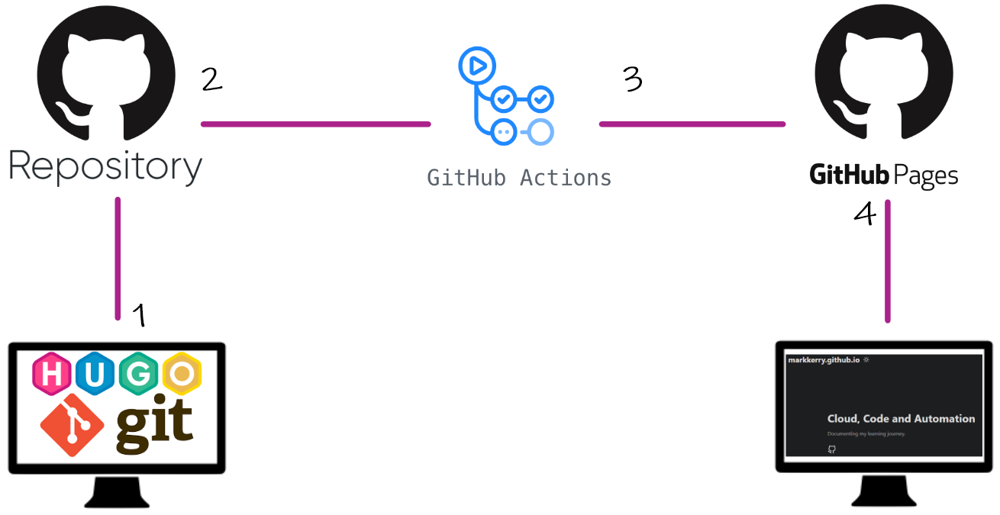

The following series of posts will walk through the process I used to create and build this HUGO site, hosted in GitHub Pages. Everything required in the following posts is free. HUGO/templates, GitHub Pages, GitHub Actions is all free to use.

 

### What is HUGO?

[HUGO](https://gohugo.io/) is an open source static site generator written in GO. I chose HUGO because it looked simple to get started, all posts are written in [markdown](https://markkerry.github.io/posts/2021/02/markdown/), and was compatible with GitHub pages. It also offers [300+ themes](https://themes.gohugo.io/) and is a fun way to get started creating content for free.

 

### What is GitHub Pages?

[GitHub Pages](https://pages.github.com/) allows you to build websites and host them directly from a GitHub repository. As long as you have a GitHub account, create a repo called _username_.github.io, and push some form of an index.html, you then have a website available as follows: _username_.github.io

 

### What is GitHub Actions?

[GitHub Actions](https://docs.github.com/en/actions) is the CI/CD service I use to build my HUGO code committed to one repo, then automatically push the built site to my GitHub Pages repo.

 

### What These Posts Will Cover

There are already great docs out there to get you started with HUGO and GitHub Pages, but not all of them cover automating the build and deployment of the site. When I got started using HUGO, it took me a couple of attempts to get my head around the build part, and knowing exactly what needs to be deployed to GitHub Pages. I will attempt to explain that in more detail in part 3 of these posts.

 

### What You Need to Get Started

1. Git installed locally
2. Hugo installed locally
3. A GitHub Account
4. GitHub Desktop (helps to be signed in with you github account)
5. GitHub repo called _username_-hugo
6. GitHub repo called _username_.github.io

 

### High-level Overview

1. The local repo _username_-hugo is developed locally, changes committed and pushed to the remote repo in GitHub.
2. When the remote repo receives the new commit, it starts a GitHub action to build the site.
3. Once the GitHub Action completes the build, it deploys the built site to the _username_.github.io repo.
4. The site is then available by browsing https://username.github.io.

 

### Next Parts

* [Part 2: Create the Site](https://markkerry.github.io/posts/2021/04/hugo-and-github-pages-part2/)
* [Part 3: Build and Deploy](https://markkerry.github.io/posts/2021/04/hugo-and-github-pages-part3/)
