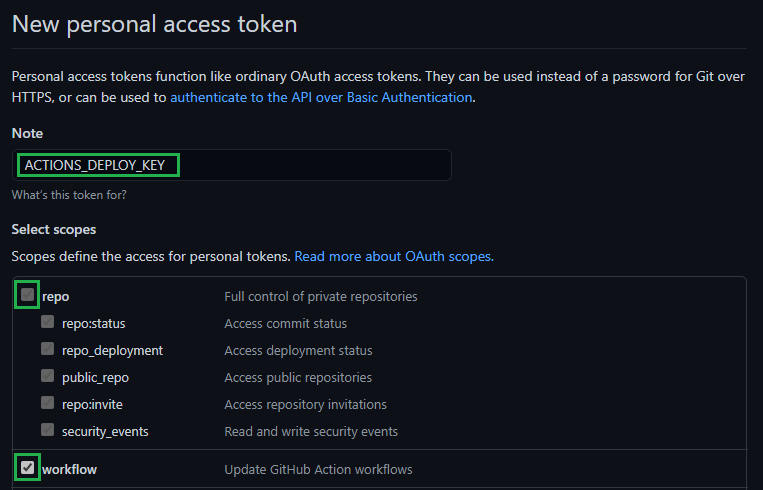
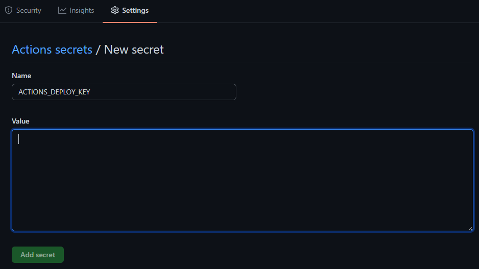
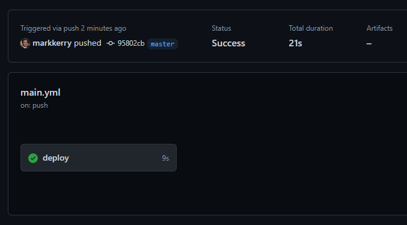
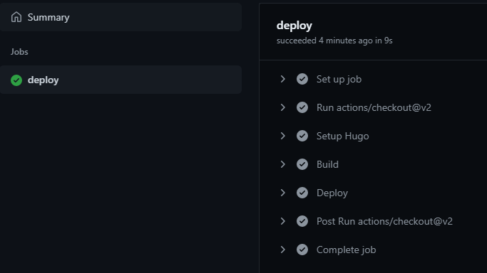

Now that we've created our site and first post, we can start creating the repos to build, deploy and host the static site.

<br>

### Create the Two GitHub Repositories

Browse to GitHub and create two new repos. More info on how to do this can be found [here](https://markkerry.github.io/posts/2021/03/git-basics/#create-the-github-repository)

The two repos will be named as follows:

* _username_-hugo (mine is markkerry-hugo)
* _username_.github.io (mine is markkerry.github.io)

The _username_-hugo repo is where we are going to commit our site to. Then we'll create GitHub action in this repo which will install HUGO, build the site, and push it to the other _username_.github.io repo after each commit/push.

<br>

### Create the GitHub Action

The following GitHub action was created by [peaceiris](https://github.com/peaceiris). In your local username-hugo repo, create the following directories

```terminal
mkdir .github
cd .github
mkdir workflows
cd workflows
```

Now create a `main.yml` file. Mine looks like this `C:\git\repos\markkerry-hugo\.github\workflows\main.yml`. Copy the content below and paste into your main.yml file, but be sure to change `external_repository: username/username.github.io` to your GitHub username and repo.

```yaml
name: github pages

on:
  push:
    branches:
      - main  # Set a branch name to trigger deployment

jobs:
  deploy:
    runs-on: ubuntu-18.04
    steps:
      - uses: actions/checkout@v2
        with:
          submodules: true  # Fetch Hugo themes (true OR recursive)
          fetch-depth: 0    # Fetch all history for .GitInfo and .Lastmod

      - name: Setup Hugo
        uses: peaceiris/actions-hugo@v2
        with:
          hugo-version: '0.79.1'

      - name: Build
        run: hugo --minify

      - name: Deploy
        uses: peaceiris/actions-gh-pages@v3
        with:
          personal_token: ${{ secrets.ACTIONS_DEPLOY_KEY }}
          external_repository: username/username.github.io
          publish_branch: gh-pages  # default: gh-pages
          publish_dir: ./docs
```

Notice the Build section with `run: hugo --minify`? This is where the action uses the HUGO binaries to build your site. In the next two sections we will setup the `personal_token: ${{ secrets.ACTIONS_DEPLOY_KEY }}` from the Action and set the publishDir `publish_dir: ./docs` from the action.

<br>

### Create a GitHub Personal Access Token

We need to create a GitHub secret as one repo will commit code to another one. Even though they are both repos within the same GitHub account.

Browse to your GitHub account, select your account > __Settings__ > __Developer settings__ > __Personal access tokens__ > __Generate new token__

* Enter the __Note__ as: ACTIONS_DEPLOY_KEY
* Ensure you tick __repo__ and __workflow__
* Click __Generate token__



Now it's important you copy the token. Only save it in a secure password manager if you want to, but you should only need this copied in your clipboard temporarily.

Head back to your newly created _username_.github.io repo in GitHub and click __Settings__

* Select __Secrets__ > __New repository secret__
* Enter __Name__ as ACTIONS_DEPLOY_KEY
* Value: Paste in the token you just copied
* Click __Add secret__



<br>

### Configure the Publish Dir

Now that the remote GitHub repos and access token is all configured, it's time to edit the `config.toml` and set the publishDir. We will be setting it to "docs" which is the directory the built site will be created in by the GitHub action. Looking back at the main.yml file you can see `publish_dir: ./docs`. This is the directory the action will push to the remote repo. open the `config.toml` in the root of your site and add the last line.

```terminal
baseURL = "http://example.org/"
languageCode = "en-us"
title = "My New Hugo Site"
theme = "PaperMod"
publishDir = "docs"
```

<br>

### Commit and Push the Site to GitHub

Finally, we can commit the changes in our local repo, push them to the remote GitHub repo (username-hugo) and watch the GitHub action automatically build the site to the docs folder, then publish docs folder to the other repo (username.github.io)

```terminal
cd c:\git\repos\username-hugo
git add *
git commit -m "initial commit"
git remote add origin https://github.com/username/username-hugo.git
git push -u origin main
```

Browse to your username-hugo repo on GitHub and select __Actions_. Select the workflow and the workflow run which will show you then status.



Select __deploy__ to see the status of each job within the Action



<br>

### Check the Live Site

Browse to https://username.github.io to see your newly built GitHub Pages site, which you developed locally, then built and deployed by GitHub Actions.

Hopefully there is enough useful information in these posts to get you started. If I choose to change the name of my site to a custom domain, I'll post about the process at a later date.
