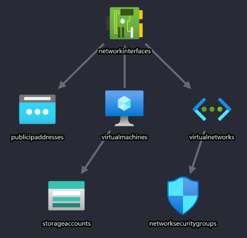
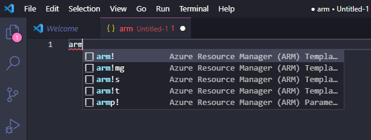
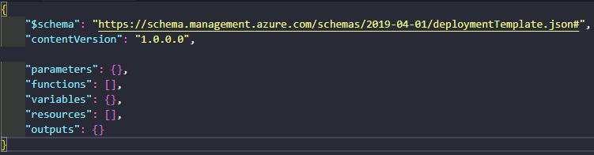
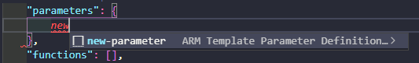
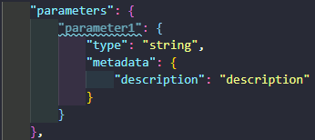
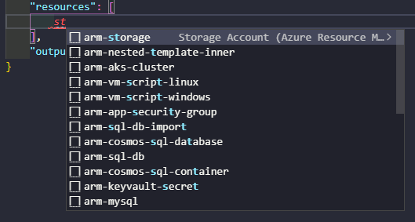

In the first of this three part series of posts, I will breakdown the components of an Azure ARM template, and the tools used to develop one. Then in part two I will cover testing an ARM template. And finally in part three, I will cover deploying the resources in the ARM template to Azure.

The ARM template will consist of the following resources:

* Windows VM
* Network Interface
* Public IP
* Virtual Network
* Network Security Group
* Storage Account



## Getting Started

Before looking at Bicep, Terraform or Pulumi, I think it's important to get to know the process of developing Azure ARM templates from scratch. Check out [Sam Cogan's ARM Template Masterclass](https://www.youtube.com/watch?v=9EpBiud48Ao&list=PLeh9xH-kbPPY9aXCmZfvh1l3lYn3R4PLu) YouTube series on developing ARM templates. This was an invaluable resource when I got started.

I use the following tools to complete the development, testing and deployment of ARM Templates:

* [VS Code](https://code.visualstudio.com/) to author the templates
* VS Code Extension: [Azure Resource Manager (ARM) Tools](https://marketplace.visualstudio.com/items?itemName=msazurermtools.azurerm-vscode-tools) for ARM snippets and auto-completion
* VS Code Extension: [ARM Template Viewer](https://marketplace.visualstudio.com/items?itemName=bencoleman.armview)
* [Pester](https://pester.dev/) PowerShell module used for when creating manual tests
* [Arm-ttk](https://github.com/Azure/arm-ttk) PowerShell module for analysing and testing ARM templates against coding best practice
* [Az](https://www.powershellgallery.com/packages/Az/6.1.0) PowerShell module or [Azure CLI](https://docs.microsoft.com/en-us/cli/azure/install-azure-cli-windows?tabs=azure-cli) for deploying the templates

## ARM Components

Using VS Code and with the Azure Resource Manager (ARM) Tools extension installed, create a new `json` file and start typing `arm`.



Select `arm!`. This will create the basic framework of an ARM template.



I will go through each section of the ARM template for creating the resources above.

### Parameters

> TIP: Hit return in the parameters braces, start typing `new` and select `new-paramter`.



> The extension will create the basic parameter configuration for you



In the template, the __prefix__ parameter is simply a string which I am adding to each resource name. Using an ARM template function called _concat_, I can combine multiple string values to create a concatenated string. String concatenation is simply joining two strings together to make a new string.

```json
"prefix": {
    "type": "string",
    "metadata": {
        "description": "Prefix used for naming resources."
    }
},
```

The __location__ parameter is used to specify the location of the resources. You will quite commonly see `"[resourceGroup().location]"` specified as the location of each resource. However, the arm-ttk (next post) complains about this when validating the template. So the location will be stored in the parameters file.

```json
"location": {
    "type": "string",
    "metadata": {
        "description": "Location of the resources"
    }
},
```

The __vmSize__ parameter will specify the size of the Azure Virtual machine.

```json
"vmSize": {
    "type": "string",
    "metadata": {
        "description": "Size of VM to deploy."
    }
},
```

The __windowsOSVersion__ parameter will have a default value of _2016-Datacenter_, which is what will be selected if the parameter value is empty during the time of deployment. Notice the list of _allowedValues_. This means only these three OS values are allowed as a parameter.

```json
"windowsOSVersion": {
    "type": "string",
    "defaultValue": "2016-Datacenter",
    "allowedValues": [
        "2016-Nano-Server",
        "2016-Datacenter",
        "2019-Datacenter"
    ],
    "metadata": {
        "description": "The Windows version for the VM."
    }
},
```

The __adminUsername__ parameter is used to specify the name of the local admin user to be created on the VM.

```json
"adminUsername": {
    "type": "string",
    "metadata": {
        "description": "Username for the VM."
    }
},
```

And finally, the __adminPassword__ parameter is a secure string to set the password of the newly created admin user. You can either enter this password at deployment time, store it in plain text in your parameter file, or retrieve the secret from Azure Key Vault.

```json
"adminPassword": {
    "type": "securestring",
    "metadata": {
        "description": "Password for the adminUsername."
    }
}
```

### Variables

Variables allow you to re-use expressions throughout a template without re-writing them. Only one variable is used in this template which is __storageAccountName__. As you may know every Azure Storage Account must have a unique name, so a pretty good way of creating a unique one without checking first is by using some built-in string functions. In the example below the first _toLower_ function is setting every alphabetic character to lower case. Then the _concat_ function will join the _prefix_ parameter together with _'stg'_ (short for storage), along with a 13 character, random string.

```json
"variables": {
    "storageAccountName": "[toLower(concat(parameters('prefix'),'stg',uniqueString(resourceGroup().id)))]"
},
```

Let's say for example the _prefix_ is set to "DEVTEST":

"devtest" + "stg" + "sh5ysh38jr74j"

The storage account will be named as follows:

"devteststgsh5ysh38jr74j"

### Resources

> TIP: Hit return in the resources braces, start typing `st` and select `arm-storage`. The config snippet for a Storage Account will be generated for you. You can select any resource and the snippets will generate an example configuration.



The first resource in the template is the __Storage Account__. The variable `storageAccountName` defined earlier is used for the _name_ and _displayName_ tag. The _sku_ defined is Standard_LRS.

```json
{
    "name": "[variables('storageAccountName')]",
    "type": "Microsoft.Storage/storageAccounts",
    "apiVersion": "2019-06-01",
    "location": "[parameters('location')]",
    "tags": {
        "displayName": "[variables('storageAccountName')]"
    },
    "sku": {
        "name": "Standard_LRS"
    },
    "kind": "Storage"
},
```

The next resource is the __Public IP__. Notice the name is a concatenated string of the `prefix` parameter and `-PublicIP`. This naming convention is used on all other resources in the template.

```json
{
    "name": "[concat(parameters('prefix'),'-PublicIP')]",
    "type": "Microsoft.Network/publicIPAddresses",
    "apiVersion": "2019-11-01",
    "location": "[parameters('location')]",
    "tags": {
        "displayName": "[concat(parameters('prefix'),'-PublicIP')]"
    },
    "properties": {
        "publicIPAllocationMethod": "Dynamic",
        "dnsSettings": {
            "domainNameLabel": "[toLower(parameters('prefix'))]"
        }
    }
},
```

The __Network Security Group__ (NSG) specifies an inbound allow rule on TCP port 3389 for RDP access. Any source address is allowed so it can be accessed over the internet.

```json
{
    "name": "[concat(parameters('prefix'),'-nsg')]",
    "type": "Microsoft.Network/networkSecurityGroups",
    "apiVersion": "2018-08-01",
    "location": "[parameters('location')]",
    "properties": {
        "securityRules": [
            {
                "name": "nsgRule1",
                "properties": {
                    "description": "description",
                    "protocol": "Tcp",
                    "sourcePortRange": "*",
                    "destinationPortRange": "3389",
                    "sourceAddressPrefix": "*",
                    "destinationAddressPrefix": "*",
                    "access": "Allow",
                    "priority": 100,
                    "direction": "Inbound"
                }
            }
        ]
    }
},
```

The __Virtual Network__ (VNet) has a `dependsOn` element set for the NSG above. Usually resources are created in parallel, but this means the VNet will not be created until the NSG has.

The VNet will also be created with an address space of `10.0.0.0/16` and a subnet, called _subnet1_, with an address prefix of `10.0.0.0/24`. The subnet is being assigned the NSG, hence the reason why the NSG must exist before the creation of the VNet.

```json
{
    "name": "[concat(parameters('prefix'),'-VirtualNetwork')]",
    "type": "Microsoft.Network/virtualNetworks",
    "apiVersion": "2019-11-01",
    "location": "[parameters('location')]",
    "dependsOn": [
        "[resourceId('Microsoft.Network/networkSecurityGroups', concat(parameters('prefix'),'-nsg'))]"
    ],
    "tags": {
        "displayName": "[concat(parameters('prefix'),'-VirtualNetwork')]"
    },
    "properties": {
        "addressSpace": {
            "addressPrefixes": [
                "10.0.0.0/16"
            ]
        },
        "subnets": [
            {
                "name": "Subnet01",
                "properties": {
                    "addressPrefix": "10.0.0.0/24",
                    "networkSecurityGroup": {
                        "id": "[resourceId('Microsoft.Network/networkSecurityGroups', concat(parameters('prefix'),'-nsg'))]"
                    }
                }
            }
        ]
    }
},
```

The __Network Interface__ (NIC) resource has two `dependsOn` elements; the Public IP and VNet resources. This is because the NIC will be assigned a public IP and to the newly created subnet, so the resources must exist before the NIC.

```json
{
    "name": "[concat(parameters('prefix'),'-NetworkInterface')]",
    "type": "Microsoft.Network/networkInterfaces",
    "apiVersion": "2019-11-01",
    "location": "[parameters('location')]",
    "dependsOn": [
        "[resourceId('Microsoft.Network/publicIPAddresses', concat(parameters('prefix'),'-PublicIP'))]",
        "[resourceId('Microsoft.Network/virtualNetworks', concat(parameters('prefix'),'-VirtualNetwork'))]"
    ],
    "tags": {
        "displayName": "[concat(parameters('prefix'),'-NetworkInterface')]"
    },
    "properties": {
        "ipConfigurations": [
            {
                "name": "ipConfig1",
                "properties": {
                    "privateIPAllocationMethod": "Dynamic",
                    "publicIPAddress": {
                        "id": "[resourceId('Microsoft.Network/publicIPAddresses', concat(parameters('prefix'),'-PublicIP'))]"
                    },
                    "subnet": {
                        "id": "[resourceId('Microsoft.Network/virtualNetworks/subnets', concat(parameters('prefix'),'-VirtualNetwork'), 'Subnet01')]"
                    }
                }
            }
        ]
    }
},
```

Finally, the last resource in the template is the __Virtual Machine__ (VM). Another two `dependsOn` elements are defined; the Storage account and the NIC resources. This is because the VM is assigned a NIC and boot diagnostics is enabled in the Storage Account specified.

Other areas of note are the vmSize, adminUsername, adminPassword, and windowsOSVersion parameters are all referenced.

```json
{
    "name": "[concat(parameters('prefix'),'-VM')]",
    "type": "Microsoft.Compute/virtualMachines",
    "apiVersion": "2019-07-01",
    "location": "[parameters('location')]",
    "dependsOn": [
        "[resourceId('Microsoft.Storage/storageAccounts', variables('storageAccountName'))]",
        "[resourceId('Microsoft.Network/networkInterfaces', concat(parameters('prefix'),'-NetworkInterface'))]"
    ],
    "tags": {
        "displayName": "[concat(parameters('prefix'),'-VM')]"
    },
    "properties": {
        "hardwareProfile": {
            "vmSize": "[parameters('vmSize')]"
        },
        "osProfile": {
            "computerName": "windowsVM1",
            "adminUsername": "[parameters('adminUsername')]",
            "adminPassword": "[parameters('adminPassword')]"
        },
        "storageProfile": {
            "imageReference": {
                "publisher": "MicrosoftWindowsServer",
                "offer": "WindowsServer",
                "sku": "[parameters('windowsOSVersion')]",
                "version": "latest"
            },
            "osDisk": {
                "name": "[concat(parameters('prefix'),'-VMOSDisk')]",
                "caching": "ReadWrite",
                "createOption": "FromImage"
            }
        },
        "networkProfile": {
            "networkInterfaces": [
                {
                    "id": "[resourceId('Microsoft.Network/networkInterfaces', concat(parameters('prefix'),'-NetworkInterface'))]"
                }
            ]
        },
        "diagnosticsProfile": {
            "bootDiagnostics": {
                "enabled": true,
                "storageUri": "[reference(resourceId('Microsoft.Storage/storageAccounts/', variables('storageAccountName'))).primaryEndpoints.blob]"
            }
        }
    }
}
```

### Outputs

The final section of the ARM template is __outputs__. You can use outputs when you need to return values from the deployed resources. After deploying this template (future post) the VM DNS Name and the VM's private IP values will be displayed.

```json
"outputs": {
    "VMDNSName": {
        "type": "string",
        "value": "[reference(concat(parameters('prefix'),'-PublicIP')).dnsSettings.fqdn]"
    },
    "VMPrivateIP": {
        "type": "string",
        "value": "[reference(concat(parameters('prefix'),'-NetworkInterface')).ipConfigurations[0].properties.privateIPAddress]"
    }
}
```

## Parameters File

You can create a separate JSON file that contains the parameter values, rather than passing them in at the time of deployment. Here is an example of the parameters file I used when deploying the template.

```json
{
    "$schema": "https://schema.management.azure.com/schemas/2019-04-01/deploymentParameters.json#",
    "contentVersion": "1.0.0.0",
    "parameters": {
        "prefix": {
            "value": "mkarmdev"
        },
        "location": {
            "value": "west europe"
        },
        "vmSize": {
            "value": "Standard_A2_v2"
        },
        "windowsOSVersion": {
            "value": "2016-Datacenter"
        },
        "adminUsername": {
            "value": "azureuser"
        },
        "adminPassword": {
            "reference": {
                "keyVault": {
                    "id": "/subscriptions/<ID>/resourceGroups/<RG>/providers/Microsoft.KeyVault/vaults/<NAME>"
                },
                "secretName": "vmAdminPassword"
            }
        }
    }
}
```

## Complete Template on GitHub

You can find the [complete template](https://github.com/markkerry/arm-templates/blob/main/NewVM/NewVM.json) and [parameters file](https://github.com/markkerry/arm-templates/blob/main/NewVM/NewVM.parameters.json) on [GitHub](https://github.com/markkerry/arm-templates).

## Summary

Finally, save the ARM template as you wish. You will commonly see `azuredeploy.json` but I saved mine as `NewVM.json`, and the parameters file as `NewVM.parameters.json`.

Hopefully the above information is clear. In the next two posts I will walk through testing and deploying the template.
