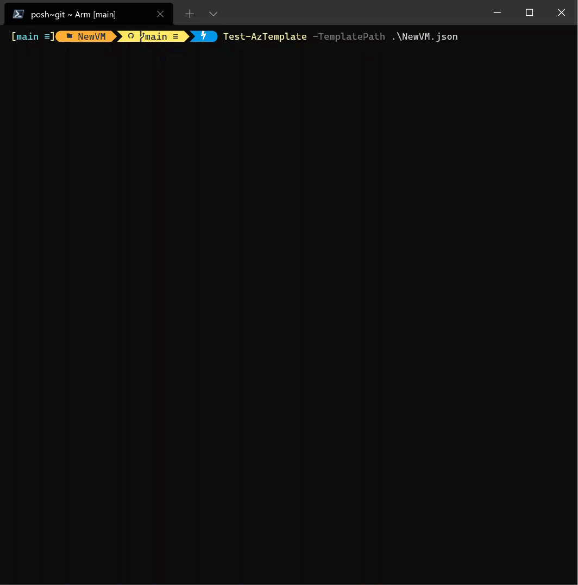

Following on from authoring the [Azure ARM Templates - Part 1: Development](https://markkerry.github.io/posts/2021/06/azure-arm-templates-part-1-development/) post, in this one I will cover testing the ARM template.

Two potential ways to test the ARM templates is by manually building a [Pester](https://pester.dev/docs/quick-start) test, and another is by using Microsoft's [Azure Resource Manager Template Toolkit](https://github.com/Azure/arm-ttk) (arm-ttk) module.

You can run local tests against ARM templates using PowerShell - which I will demonstrate in the post - but most commonly template testing and validating is used during a CI pipeline.

## Pester

Pester is designed for testing and mocking PowerShell code, and is really commonly used in CI pipelines. But that's not what we are using it for here. If something can be achieved in PowerShell, then you can use Pester to evaluate the results to see if they match what you are expecting. So essentially we are asking Pester to get the content of the json file using PowerShell, and then validate the elements, resources, file format etc, to ensure they are all what we are expecting.

In the same directory as your ARM template and parameters file, create a new file called `NewVM.test.ps1`. Then paste the contents of the code below into the NewVM.test.ps1 file.

```powershell
Describe 'ARM Template Validation' {

    BeforeAll {
        $TemplatePath = "C:\git\repos\arm-templates\NewVM\NewVM.json"
        $templateRaw = Get-Content -Path $TemplatePath -Raw -ErrorAction SilentlyContinue
        $template = ConvertFrom-Json -InputObject $templateRaw -ErrorAction SilentlyContinue
    }

    Context 'File Validation' {
        It 'Template ARM file exists' {
            Test-Path $TemplatePath -Include "*.json" | Should -Be $true
        }
        It 'Is a valid JSON file' {
            $templateRaw | ConvertFrom-Json -ErrorAction SilentlyContinue | Should -Not -Be $null
        }
    }

    Context 'Template Content Validation' {
        It 'Contains all required elements' {
            $elements = '$schema',
                        'contentVersion',
                        'functions',
                        'outputs',
                        'parameters',
                        'resources',
                        'variables'
            $templateElements = $template | Get-Member -MemberType NoteProperty | ForEach-Object Name
            $templateElements | Should -Be $elements
        }
        It 'Creates the expected resources' {
            $resources = 'Microsoft.Storage/storageAccounts',
                        'Microsoft.Network/publicIPAddresses',
                        'Microsoft.Network/networkSecurityGroups',
                        'Microsoft.Network/virtualNetworks',
                        'Microsoft.Network/networkInterfaces',
                        'Microsoft.Compute/virtualMachines'
            $templateResources = $template.resources.type
            $templateResources | Should -Be $resources
        }
    }
}
```

Use the following commands to import the already installed Pester module and run the tests.

```powershell
# Change directory to the location of the pester file and ARM template
cd "c:\git\repos\Arm\NewVM"

# Import the Pester module
Import-Module -Name Pester

# Run invoke-pester to run every *.test.ps1 file in the current directory
Invoke-Pester -Output Detailed
```

The pester test breaks down as follows:

* Before each test it gets the content of the json and converts it from json
* First test validates the json file exists
* Second test checks it is valid json format
* Third test checks all required elements exist in the template
* Fourth test ensures all resources we want to deploy are specified in the template

As you can see below the all four tests pass successfully.


## Azure Resource Manager Template Toolkit

The arm-ttk is a much more enterprise ready solution with active open source development. The following is from the [Azure Resource Manager Template Toolkit (arm-ttk)](https://github.com/Azure/arm-ttk#philosophy) GitHub repo.

_A little bit about the tests... These are the tests that are used to validate templates for the Azure QuickStart Repo and the Azure Marketplace. The purpose is to ensure a standard or consistent set of coding practices to make it easier to develop expertise using the template language (easy to read, write, debug)._

More examples of using the arm-ttk can be found [here](https://github.com/Azure/arm-ttk/blob/master/arm-ttk/README.md)

To get started, browse to https://github.com/Azure/arm-ttk and select __Code__ and then __Download ZIP__. Then extract the contents of the ZIP to the directory of your choosing.


Open PowerShell and run the following commands to import the module and run the tests.

```powershell
# download the module from github and extract to directory of choice
cd "c:\git\src\arm-ttk"

# Import the arm-ttk module
Import-Module .\arm-ttk.psd1 -Force

# Change directory to the location of the ARM template
cd "c:\git\repos\Arm\NewVM"

# Run the arm-ttk 
Test-AzTemplate -TemplatePath .\NewVM.json

# Run the test again only this time show the failures
$x = Test-AzTemplate -TemplatePath .\NewVM.json
$x | ? { -not $_.passed }

# You can skip certain failures you are not concerned about
Test-AzTemplate -TemplatePath .\NewVM.json -skip apiVersions-Should-Be-Recent, ResourceIds-should-not-contain 
```

You can see the results of the above commands below:



## Summary

The above solutions are two ways to validate the contents of your ARM templates locally. In the next post I will cover deploying the ARM template using the PowerShell Azure Az module.
