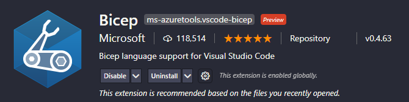
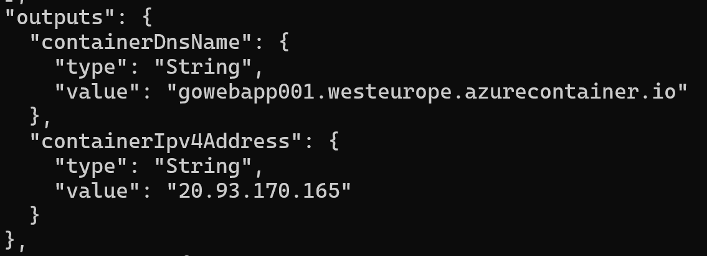
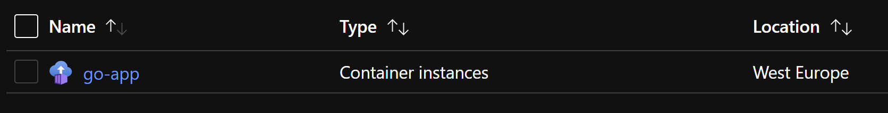
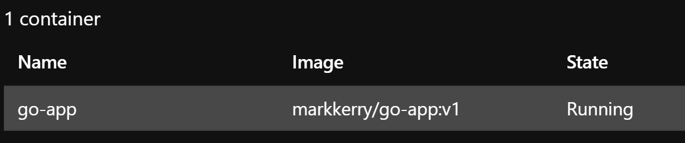
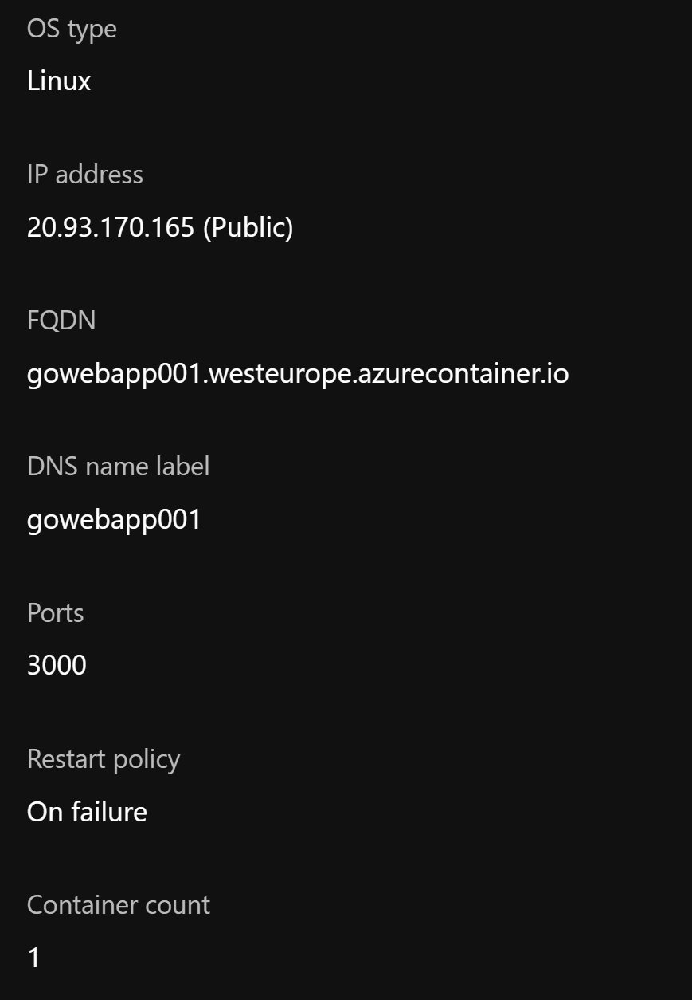
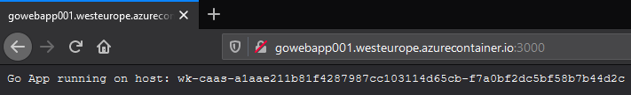

Using the Go container created in a [previous post](https://markkerry.github.io/posts/2021/03/docker-go-web-app/), in the post I will detail the steps to author and deploy an Azure Container Instance using Azure Bicep. Hosted in a Linux container, the image will be pulled from Docker Hub.

## What are Azure Container Instances

Azure Container Instances provides basic container functionality for simple solutions with no orchestration. They can be deployed with public accessibility (public IP and FQDN), or deployed to a VNet for private network access.

## What is Azure Bicep

Azure Bicep is a domain-specific language (DSL), designed to improve the experience of authoring ARM templates and deploying Azure resources. It uses a declarative syntax, which means you declare how you want the resources and their properties to look and Azure takes care of the sequence of events during deployment.

More information on [Azure Bicep can be found here](https://docs.microsoft.com/en-us/azure/azure-resource-manager/bicep/overview).

## Install Bicep

Azure Bicep can easily be installed from Azure CLI.

```bash
# Check your version of Azure CLI
az version

# If it is out of date, upgrade it with
az upgrade  

# Install bicep as follows
az bicep install

# If Bicep is already installed you can ensure it is on the latest version with
az bicep upgrade
az bicep vesion
```

To make authoring bicep files even easier, download and install the VS Code extension.



## Create the Bicep File

With everything installed I can get started creating the Bicep file. The basic structure is as follows:

### Parameters

Notice in the parameters section the container name is 'go-app', the image will be pulled from the docker registry 'markkerry/go-app:v1', and the DNS name is 'gowebapp001'.

### Resource

There is only one resource which is the container. It's a Linux container exposing port 3000.

### Outputs

The outputs which will be displayed upon completion of deployment is the IPv4 address and DNS name.

To begin, create a new file with the .bicep extension and paste in the below:

```bicep
param containerName string = 'go-app'
param location string = 'westeurope'
param imageName string = 'markkerry/go-app:v1'
param cpuCores int = 1
param memoryInGb int = 1
param dnsName string = 'gowebapp001'

resource containerGroup 'Microsoft.ContainerInstance/containerGroups@2019-12-01' = {
  name: containerName
  location: location
  properties: {
    containers: [
      {
        name: containerName
        properties: {
          image: imageName
          resources: {
            requests: {
              cpu: cpuCores
              memoryInGB: memoryInGb
            }
          }
          ports: [
            {
              protocol: 'TCP'
              port: 3000
            }
          ]
        }
      }
    ]
    restartPolicy: 'OnFailure'
    osType: 'Linux'
    ipAddress: {
      type: 'Public'
      dnsNameLabel: dnsName
      ports: [
        {
          protocol: 'TCP'
          port: 3000
        }
      ]
    }
  }
}

output containerIpv4Address string = containerGroup.properties.ipAddress.ip
output containerDnsName string = containerGroup.properties.ipAddress.fqdn
```

Save the file and now it's time to build the bicep file into json.

## Build the Bicep File

In your terminal, change directory to the location of the bicep file and run the following Az CLI command to build the json ARM template.

```terminal
az bicep build --file .\containerInstance.bicep  
```

Notice this has gone from a 48 line bicep file to a 90 line json. You can find the [json file here](https://github.com/markkerry/basic-go-container/blob/main/IaC/containerInstance.json).

## Deploy the ARM Template

Now it's time to deploy the resource. Start by authenticating to Azure and creating a resource group.

```bash
# Connect to Azure
az login

# Create the Resource Group
az group create --name rg-eu-dinst --location westeurope
```

Then create a resource group deployment to the new resource group with the ARM template.

```bash
# Deploy the resources using the template file
az deployment group create --resource-group rg-eu-dinst --template-file containerInstance.json
```

Notice the outputs section in the terminal returns the container's DNS name and IPv4 address. We can use either of these to connect to the container later.



In the Azure portal you will see the new resource in the resource group.



If you select the resource you will see it is running and the name of the image which we specified in the Bicep file.



And if you select the Properties of the resource you will see it's a Linux container, networking information and the TCP port.



## Connect to the Container Instance

Now it's time to connect to the container. Simply browse to `gowebapp001.westeurope.azurecontainer.io:3000`. The container simply returns the hostname of the container which is running.



## Clean-up Resources

To clean-up the resources after you are done with them, and to avoid any unnecessary spend, delete the Resource Group (and it's contents) as follows:

```bash
az group delete --name rg-eu-dinst
```
