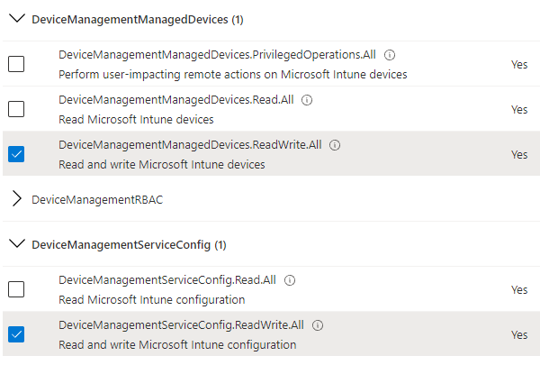
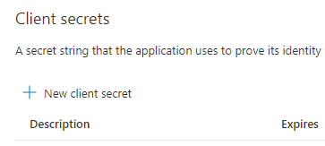
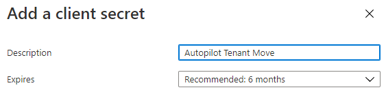
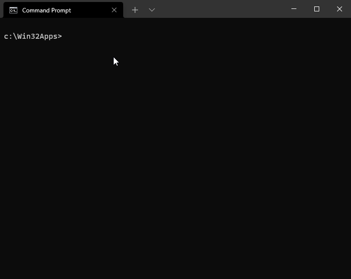

Following on from my previous post, this one provides a far simpler process to automatically de-register your Windows Autopilot devices from one tenant, and provision them in another tenant. It's not exactly a "part 2", rather a different, simpler approach.

I came across a great post on [MsEndpointMgr](https://msendpointmgr.com/2019/06/01/intune-tenant-to-tenant-migration-with-autopilot/) which details the steps to extract your Autopilot profile in the new tenant, and copy to the machines in the old tenant ready for them to be wiped. But the process was missing an automated way to delete the Intune Managed Device, delete the current Autopilot registration and then wipe the device. This post will cover those gaps so the end-to-end process is fully automated.

Throughout the post the old tenant will be referred to as "Tenant A" and the new tenant "Tenant B".

## Overview

Here is a high-level overview of the process:

1. From the Company Portal, the process begins when the PowerShell script (packaged as a Win32 app) is invoked.
2. The script will copy Tenant B's Autopilot configuration file (AutopilotConfigurationFile.json) to `C:\Windows\Provisioning\Autopilot` on the local machine. The json file is in the same app package as the script.
3. Using MS Graph and an App Registration in Tenant A, the script will gather the local machines "Managed Device" and delete it from Intune, then delete the Autopilot Registered Device, and finally sync the Autopilot Registration Service in Tenant A.
4. A function within the PowerShell script will wipe the device via WMI/CIM. Note: The `C:\Windows\Provisioning\Autopilot` and it's content remains intact during a device reset.
5. After the device completes it's reset the user will be presented with the Autopilot registration for Tenant B.

Assuming Tenant B is fully provisioned and ready to go, the following is required:

## App Registration in Tenant A

First we need to create the App registration in Tenant A, which has all the relevant permissions to delete an Intune Manage Device and Autopilot device registration.

* Open Azure Active Directory
* Click __App Registration__
* Click __New registration__
* Give it a name of __AutopilotTenantMove__
* Under __Support account types__ select __Accounts in this organizational directory only__


* Click __Register__
* In the newly created App Registration, select __API permissions__
* Click __Add a permission__


* Under Microsoft APIs, select __Microsoft Graph__


* Click __Application permissions__


* Scroll down to __DeviceManagementManagedDevices__, expand it and tick the box for __DeviceManagementManagedDevices.ReadWrite.All__.

> _This is required to delete Intune Managed device_

* Scroll down to __DeviceManagementServiceConfig__, expand it and tick the box for __DeviceManagementServiceConfig.ReadWrite.All__.

> _This is required to delete the Autopilot device registration_

* Then select __Add permissions__



* Back on the API permissions page, select __Grant consent__ for the tenant.

> _Note: Here you can also remove __User.Read__ as this is not required and the default permission when creating an app registration_


* Under __Manage__ of the App Registration, click __Certificates & secrets__.
* Click __New client secret__



* Give it a description of __Autopilot Tenant Move__ and Expires in __6 months__
* Click __Add__



* IMPORTANT: He you need to save the __Value__ of the Client secret somewhere save to be used in the PowerShell script later.


* Finally, now may also be a good time to click the __Overview__ page of the App registration and copy the __Application (client) ID__ which will be needed along with the client secret in the PowerShell script.

## Autopilot Profile from Tenant B

In this part we will extract the Autopilot profile from Tenant B in the form of a json file, which will be used later to add to the `C:\Windows\Provisioning\Autopilot` directory of the devices before they are deleted and reset. Perform the following:

* Run PowerShell as admin
* Type `Install-Module WindowsAutopilotIntune -Force`
* Authenticate to MS Graph by typing `Connect-MSGraph`. Enter your credentials for Tenant B
* If you have multiple Autopilot profiles, type `Get-AutopilotProfile` and gather the `Id` of the one you want. You will need to type `Get-AutopilotProfile -Id <AutopilotID>` in the next part
* Then extract and convert the Autopilot profile to json using the following command:

```PowerShell
# You will need to specify the path to extract the file to. I selected C:\Temp
Get-AutopilotProfile | ConvertTo-AutopilotconfigurationJSON | Out-File -FilePath C:\Temp\AutopilotConfigurationFile.json -Encoding ASCII
```

You will need the AutopilotConfigurationFile for the next part when you create the Intune Win32 App.

## PowerShell Script and Win32 App in Tenant A

In this section we will modify the PowerShell script with the Application (client) ID and secret of the app registration, and package the script and AutopilotConfigurationFile.json as an Intune Win32 App.

* In the following [GitHub Repo](https://github.com/markkerry/automated-autopilot-tenant-move-simplified), download `Install.cmd`, `Invoke-AutopilotTenantMove.ps1`, and `Uninstall.cmd` into a directory called `C:\Win32Apps\AutopilotTenantMove`.

* Open `Invoke-AutopilotTenantMove.ps1` and edit lines 171, 172 and 173 with your app registration's Client ID, Secret and your tenant name (e.g. contoso.com). Then save the file. Note: these are variables below:

```powershell
$clientID = ''
$clientSecret = ''
$tenantID = ''
```

* Copy the `AutopilotConfigurationFile.json` you created earlier to the same directory. The contents of the directory should look as follows:

```cmd
C:\Win32Apps\AutopilotTenantMove
    |__AutopilotConfigurationFile.json
    |__Install.cmd
    |__Invoke-AutopilotTenantMove.ps1
    |__Uninstall.cmd
```

* Now create a new directory called `C:\Win32Apps\AutopilotTenantMoveOutput`

* Open the [Microsoft Win32 Content Prep Tool](https://github.com/Microsoft/Microsoft-Win32-Content-Prep-Tool) repo and download the `IntuneWinAppUtil.exe` binary to `C:\Win32Apps`.

* Now we can package the scripts into an `.intune.wim` file. Open the Command Prompt and run the following:

```cmd
cd C:\Win32Apps

IntuneWinAppUtil.exe -c C:\Win32Apps\AutopilotTenantMove -s Invoke-AutopilotTenantMove.ps1 -o C:\Win32Apps\AutopilotTenantMoveOutput
```

* If you browse to `C:\Win32Apps\AutopilotTenantMoveOutput` you'll see the new `Invoke-AutopilotTenantMove.intunewin` package which needs uploading to Intune.



## Upload the Win32 App to Intune in Tenant A

Finally we can upload the `intunewin` file to MEM.

* Open the __Microsoft Endpoint Manager__ portal.
* Click __Apps__
* Click __Windows__
* Click __Add__
* Under __App type__, in the drop-down list select __Windows app (Win32)__
* Then click __Select__
* Click __Select app package file__
* Under __App package file__ , click the blue folder icon and browse to and select `C:\Win32Apps\AutopilotTenantMoveOutput\Invoke-AutopilotTenantMove.intunewin`
* Click __OK__
* In the __App information__ tab, file in the details as you wish. Below is an example.


* The contents of the __Description__ box is written in markdown as follows with the following syntax:

```markdown
# WARNING

## Only run this app when instructed by a member of the IT department.

* Running this app will wipe your device, de-registering from Tenant A and registering with Tenant B.
* Ensure you have backed up all of your files before you proceed.
* Ensure your laptop is plugged into the power supply.
```

> _Note: for the logo, I used the Intune.png file from the [GitHub repo.](https://github.com/markkerry/automated-autopilot-tenant-move-simplified)_

* Click __Next__
* On the __Program__ tab, put __Install.cmd__ as the __Install command__
* The __Uninstall command__ is __Uninstall.cmd__
* For __Install behaviour__ select __System__
* Click __Next__


* On the __Requirements__ tab select whatever suits your needs. I have selected 64-bit OS and the oldest supported OS at the time of writing.
* Click __Next__


* On the __Detection rules__ tab, click the __Rules format__ drop-down list and select __Manually configure detection rules__
* Click __Add__
* In the __Rule type__ drop-down list, select __File__
* Put the path as __C:\Users\Public\Documents\IntuneDetectionLogs__
* Put the __File or folder__ as __AutopilotTenantMove.log__
* Set the __Detection method__ as __File or folder exists__
* Leave __Associated with a 32-bit app on 64-bit clients__ as __No__


* Click __OK__
* Click __Next__
* CLick __Next__ on the __Dependencies__ tab
* Click __Next__ on the __Supersedence (preview)__ tab
* Finally, on the __Assignments__ tab, under __Available for enrolled devices__, select __Add group__ and select a test/pilot group of users.

> _NOTE: You do not want to set as required or apply to all without testing. Device wipe will occur at the end of the script._


* Click __Next__
* On the __Review + create__ page, check you are happy with everything and click __Create__


## Run the App

Now we can test the process. Using a test user from the group you made the app available from, open the Company Portal app. You should see the newly packaged app where you can test the process.

> _NOTE: To troubleshoot any problems, open C:\Users\Public\Documents\IntuneDetectionLogs\AutopilotTenantMove.log_

