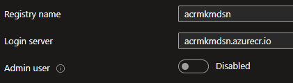
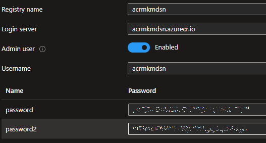
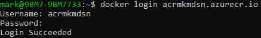
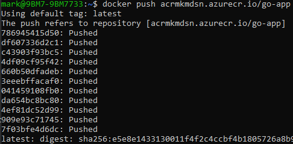
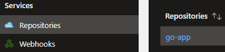
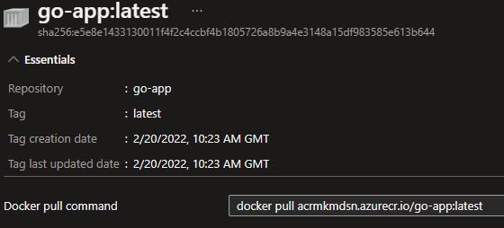
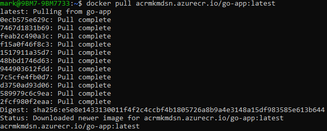
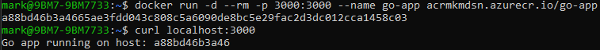
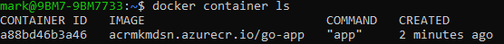

In this post I will detail the quick steps to push and pull a Docker container image from an Azure Container Registry.

Using my [Go app](https://markkerry.github.io/posts/2021/03/docker-go-web-app/), I stopped at building the container and continued from here:

## Create the Azure Container Registry

In the Azure portal, browse to the resource group of your choice or create a new one.

Select Create > Containers > Container Registry

I specified the following:

* Subscription
* Resource group
* Registry Name: acrmkmdsn
* Location: UK South
* Availability zones: Disabled
* SKU: Standard

Leave the rest as default and continue on to __Create__.

Go to the newly created resource and note the __Login server__ is `acrmkmdsn.azurecr.io`

## Create an Admin User for the Container Registry

Open the resource and under __Settings__ select __Access Keys__



Change the __Admin user__ from Disabled to __Enabled__. Copy the username and one of the passwords.



## Login to the Container Registry

To login to the container registry from Docker, I ran the following:

```terminal
docker login acrmkmdsn.azurecr.io
```

Enter the username and password from the previous step.



## Build and Tag the Container

In the root directory of the `dockerfile`, I built the container image.

```terminal
docker build -t go-app .
```

I then tagged it with the name of `go-app` and the new container registry

```terminal
docker tag go-app acrmkmdsn.azurecr.io/go-app
```

## Push the Container to the Registry

To push the container to the registry, complete as follows

```terminal
docker push acrmkmdsn.azurecr.io/go-app
```



Back in the Azure portal, under __Services__ select __Repositories__. Here you can see the newly pushed `go-app` repo.



And if you select it you can see the `go-app:latest` image.



## Pull the Container Images from the ACR

To pull the image from the Azure Container Registry:

```terminal
docker pull acrmkmdsn.azurecr.io/go-app:latest
```



I can then run the container (and remove on stop) as follows:

```terminal
docker run -d --rm -p 3000:3000 --name go-app acrmkmdsn.azurecr.io/go-app
```

Can test it is running as expected:

```teminal
curl localhost:3000
```



I then ran the following to see that it is running from the ACR image:

```terminal
docker container ls
```



And finally, I can stop the container (which will also remove the container but not the local image) as follows:

```terminal
docker container stop go-app
```
