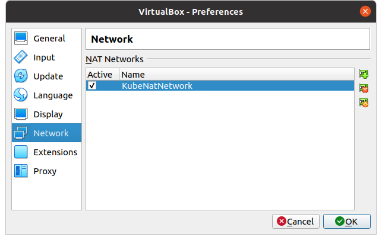
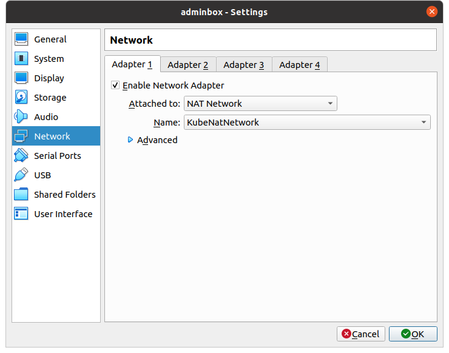
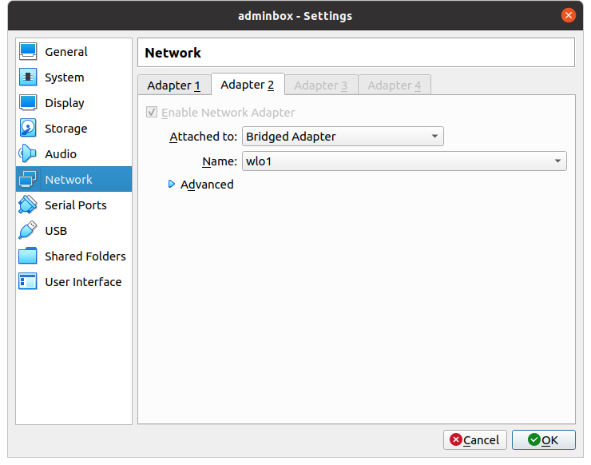
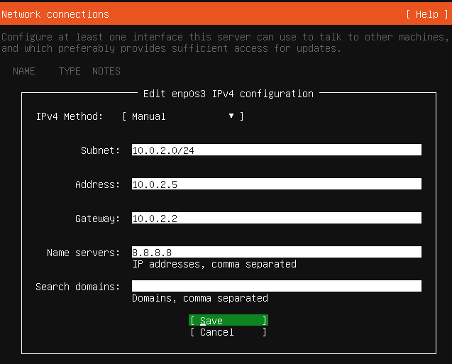
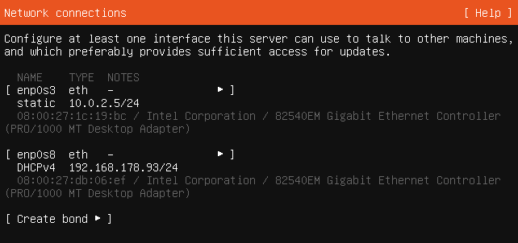

This is a follow on from my old [Centos 8 post](https://markkerry.github.io/posts/2021/05/centos8-setup/), but this time I will be using Ubuntu LTS servers running on a Linux host with VirtualBox. I had a lot of problems with the previous configuration of Hyper-V which was too much of a pain to rectify each time I went back to it.

The lab environment is designed to be used for any of the following:

* General Linux sysadmin
* Kubernetes cluster
* Ansible configuration management

This post will cover of the following:

* Installing & configuring VirtualBox
* Installing & configuring the adminbox server

The adminbox server will have a bridged adapter to the host and will be used to SSH onto the other VMs via the VirtualBox NAT network. The whole solution will eventually consist of the following:

* network address: 10.0.2.0/24
* default gateway: 10.0.2.2
* 7 virtual machines

| server    | ip addr   | comment                                                      |
| --------- | --------- | ------------------------------------------------------------ |
| adminbox  | 10.0.2.5  | Jump box from host with SSH access to all on the Nat network |
| ctrlplane | 10.0.2.10 | Kubernetes Control Plane server                              |
| node1     | 10.0.2.11 | Kubernetes worker node 1                                     |
| node2     | 10.0.2.12 | Kubernetes worker node 2                                     |
| lb1       | 10.0.2.20 | Load Balancer configured by Ansible                          |
| web1      | 10.0.2.21 | Web Server 1 configured by Ansible                           |
| web2      | 10.0.2.22 | Web Server 2 configured by Ansible                           |

## Install VirtualBox 6.1

To install VirtualBox on an Ubuntu host, open the terminal and enter the following:

```bash
wget -q https://www.virtualbox.org/download/oracle_vbox_2016.asc -O- | sudo apt-key add -

sudo add-apt-repository "deb [arch=amd64] http://download.virtualbox.org/virtualbox/debian $(lsb_release -cs) contrib"

sudo apt update && sudo apt install virtualbox-6.1 -y
```

## Configure VirtualBox

First I had to create a Nat Network by opening VirtualBox, selecting Tools > Preferences > Network. And then click the add new nat network button.

I named mine **KubeNatNetwork** as I plan to use it for a Kubernetes cluster.



Create a new Virtual Machine with the following:

* **Name**: adminbox
* Select the machine folder or leave as default
* **Type**: Linux
* **Version**: Ubuntu (64-bit)
* **Memory size**: 2048
* **Hard disk file type**: VDI
* **Storage on Physical hard disk**: Dynamically allocated
* **Size**: 20 GB

Once you have created adminbox, select it and click Settings > Network > **Adapter 1**

* **Attached to**: NAT Network
* **Name**: KubeNatNetwork



Settings > Network > **Adapter 2**

* **Attached to**: Bridged adapter
* **Name**: wlo1



## Install Ubuntu

Download the latest version of Ubuntu server from [here](https://ubuntu.com/download/server), and then complete the following:

* Power on **adminbox** and when prompted, browse to the Ubuntu iso you just downloaded and click **Start**
* Select the language
* Choose whether to update to the new installer or not (I do)
* Select the keyboard layout
* The ethernet adapter enp0s3, we'll want to set a static IP for. You can complete this now or later. To do now continue as follows
  * Edit IPv4 > Manual
  * **Subnet**: 10.0.2.0/24
  * **Address**: 10.0.2.5
  * **Gateway**: 10.0.2.2
  * **Name servers**: 8.8.8.8
  * **Search Domains**: *Leave blank*
  
  
* Leave the proxy address blank
* Leave the Mirror address as is
* Select to use the entire disk and confirm to contine the install process
* Enter your name
* The server name of **adminbox**
* And then enter a username and password
* Select to **Install OpenSSH server**
* Do not select any other Feature Server Snaps
* Reboot the server once complete

> Note: You may want to shutdown the server upon first boot due to unmount /cdrom errors.

## Update Ubuntu

Once you have booted up and logged into Ubuntu for the first time, update it as follows:

```bash
sudo apt update && sudo apt install -y
```

## Set Static IP

If you skipped the part to configure the static IP in the setup, it can be done from within the Ubuntu terminal as follows:

```bash
# Get the name of the adapter
ip link

# Get the name of the yml in netplan
ls /etc/netplan

# Get the contents of it
cat /etc/netplan/00-installer-config.yml
```

This is what the yml file will show if it is set to dhcp. Adapter enp0s3 is the Nat adapter and enp0s8 is the adapter which is bridged to the host.

```yml
# This is the network config written by 'subiquity'
network:
  ethernets:
    enp0s3:
      dhcp4: true
    enp0s8:
      dhcp4: true
  version: 2
```

Change it with vi, vim, or nano

```bash
sudo vi /etc/netplan/00-installer-config.yml
```

And fill in as follows (Be careful to use proper indentation):


```yml
# This is the network config written by 'subiquity'
network:
  ethernets:
    enp0s3:
      addresses:
      - 10.0.2.5/24
      gateway4: 10.0.2.2
      nameservers:
        addresses:
        - 8.8.8.8
        - 8.8.8.8
        search: []
    enp0s8:
      dhcp4: true
  version: 2
```

Save and exit the text editor, then type the following to apply the changes:

```bash
sudo netplan apply
```

Get the ip addresses by typing the following command:

```bash
ip addr show
```

## Update the hosts File

Updating the hosts files on your local machine allows for communication over hostname rather than IP address. Change the hosts file on your local machine as follows:

```terminal
sudo vi /etc/hosts
```

Add the ip address for your enp0s8 adapter which you can get from the `ip addr show` command:

```terminal
# adminbox ip
192.168.178.93    adminbox
```

## Generate a SSH Key Pair

To enable us to easily access the adminbox from the host OS for system administration, we can easily setup a SSH key-pair as follows:

From the host OS, create the ssh key-pair as follows:

```terminal
ssh-keygen -t rsa -b 4096
```

Press Enter to accept the key to be saved in `~/.ssh` and do not specify a passphrase. Then use the following command to copy to adminbox:

```termial
ssh-copy-id mark@adminbox
```

> Note: mark is my username

Test by connecting to the machine via SSH:

```terminal
ssh mark@adminbox
```

## Summary

We've now successfully built the adminbox server in VirtualBox, have updated it and can SSH onto it. This will allow us access from the host machine, access to the internet, and access to future VMs created in the NAT network.

That concludes part 1 of this series.
