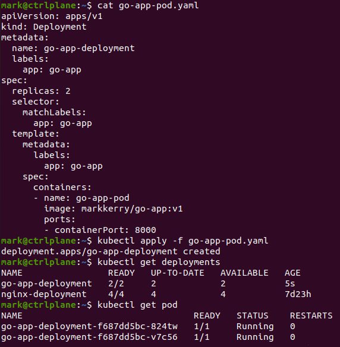
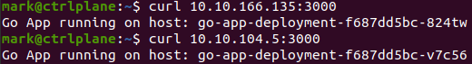

A while back I created a Go container which returns the hostname of the container its running on - [markkerry.github.io - Running a Local Go Web App in Docker](https://markkerry.github.io/posts/2021/03/docker-go-web-app/). Running this container from a Kubernetes cluster was what I had in mind when I created it. In this post I will walk through the steps I completed to create the Kubernetes deployment with an image pulled from Docker Hub.

I will be using the same Ubuntu server lab running on VirtualBox - [markkerry.github.io - Ubuntu Server 20.04 LTS Lab](https://markkerry.github.io/posts/2022/02/ubuntu-server-lab/). And the same Kubernetes cluster built from this post - [markkerry.github.io - Running a Kubernetes Cluster on Ubuntu and VirtualBox](https://markkerry.github.io/posts/2022/03/ubuntu-kubernetes-virtualbox/)

The official Kubernetes docs is what I used for reference - [kubernetes.io - Pull an Image from a Private Registry](https://kubernetes.io/docs/tasks/configure-pod-container/pull-image-private-registry/).

## Pull an Image from Docker Hub

From the Control Plan server I logged into Docker Hub.

```terminal
docker login
```

This created `~/.docker/config.json`

Then I had to copy the credential into Kubernetes:

```terminal
kubectl create secret generic regcred \
    --from-file=.dockerconfigjson=/home/mark/.docker/config.json \
    --type=kubernetes.io/dockerconfigjson
```

(Optional) View the secret in YAML format:

```terminal
kubectl get secret regcred --output=yaml
```

## Create Deployment

Next I created a `yaml` file for the deployment of the Go app and specified the docker id:

```terminal
touch ~/go-app-pod.yaml
```

I edited the file with the contents below:

```yaml
apiVersion: apps/v1
kind: Deployment
metadata:
  name: go-app-deployment
  labels:
    app: go-app
spec:
  replicas: 2
  selector:
    matchLabels:
      app: go-app
  template:
    metadata:
      labels:
        app: go-app
    spec:
      containers:
      - name: go-app-pod
        image: markkerry/go-app:v1
        ports:
        - containerPort: 3000
```

I only specified 2 replicas. Note the `image` is my Docker ID and the app.

## Apply Deployment

After saving the file it was time to apply to the pods:

```terminal
kubectl apply -f go-app-pod.yaml

kubectl get deployments

kubectl get pod
```

```terminal
NAME                                READY   STATUS    RESTARTS        AGE
go-app-deployment-f687dd5bc-824tw   1/1     Running   0               13s
go-app-deployment-f687dd5bc-v7c56   1/1     Running   0               13s
```

As below:



## Test Deployments

The following command will show the IP of each pod and the node it is running on:

```terminal
kubectl get pod -o wide
```

```terminal
NAME                                READY   STATUS    RESTARTS        AGE     IP              NODE        NOMINATED NODE   READINESS GATES
go-app-deployment-f687dd5bc-824tw   1/1     Running   0               21s     10.10.166.135   node1       <none>           <none>
go-app-deployment-f687dd5bc-v7c56   1/1     Running   0               21s     10.10.104.5     node2       <none>           <none>
```

And finally can `curl` each one which will return the host name of the pod:

```terminal
curl 10.10.166.135:3000
curl 10.10.104.5:3000
```

