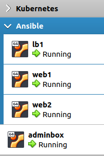
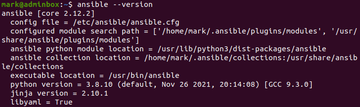
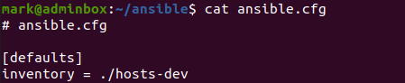
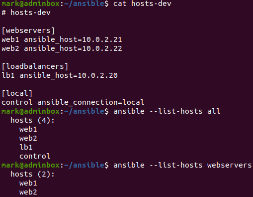
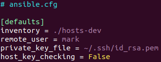
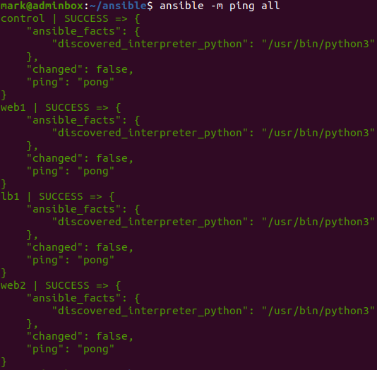
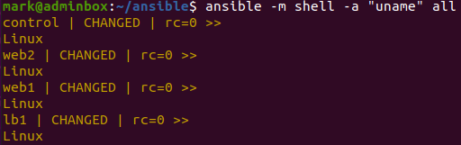

This is part one in a three part Ansible series, which will demonstrate how you can get started learning Ansible. The complete list of posts in this series are:

1. Ansible Part 1: Setup and Configure on Ubuntu and VirtualBox (This post)
2. [Ansible Part 2: Playbooks](https://markkerry.github.io/posts/2022/04/ansible-part-2/)
3. [Ansible Part 3: Variables, Vault and Roles](https://markkerry.github.io/posts/2022/04/ansible-part-3/)

All code in these posts can be found on [GitHub - ubuntu-config/ansible](https://github.com/markkerry/ubuntu-config/tree/main/ansible)

## Getting Started

I used the adminbox VM connected to the KubeNatNetwork (10.0.2.0/24) from a [previous post](https://markkerry.github.io/posts/2022/02/ubuntu-server-lab/). I will be using the same server in this post as the Ansible Control server, where the configuration and commands will be coming from.

| server   | ip addr  | comment                |
| ---------| -------- | ---------------------- |
| adminbox | 10.0.2.5 | Ansible Control server |

Following the same process I have created a further 3 VMs also connected to the KubeNatNetwork. Note: these only have one network adapter.

* network address: 10.0.2.0/24
* default gateway: 10.0.2.2

| server    | ip addr   | ram | vcpu | comment                             |
| --------- | --------- | --- | ---- | ----------------------------------- |
| lb1       | 10.0.2.20 | 2GB | 2    | Load Balancer configured by Ansible |
| web1      | 10.0.2.21 | 2GB | 2    | Web Server 1 configured by Ansible  |
| web2      | 10.0.2.22 | 2GB | 2    | Web Server 2 configured by Ansible  |



## Install Ansible

Ansible will only be installed on my adminbox server and not on the load balancer or web servers. I installed Ansible on Ubuntu as follows:

```terminal
sudo apt update
sudo apt install software-properties-common
sudo add-apt-repository --yes --update ppa:ansible/ansible
sudo apt install ansible
```

Once complete check which version is installed and notice that the `config file` is pointing to `/etc/ansible/ansible.csg`. This will be changed to another `.cfg` file in the next section

```terminal
ansible --version
```



Then I created a directory to keep the Ansible inventory and changed to that directory. I will be working from this directory for the rest of the guide.

```terminal
mkdir ~/ansible && cd ~/ansible
```

Create the inventory and new cfg file.

```termnial
touch ansible.cfg
touch hosts-dev
```

## Create a Local ansible.cfg File

Edit the ansible.cfg as follows:

```terminal
vim ansible.cfg
```

Populate it with the below which specifies the new inventory file:

```terminal
# ansible.cfg

[defaults]
inventory = ./hosts-dev
```



## Create an Ansible Inventory File

An inventory file contains the server information, which lists the host names and groups. The file can be `ini` for `yaml` formats, and the hosts can specify non-standard ssh ports and aliases.

I edited the new inventory file as follows:

```terminal
vim hosts-dev
```

Then populated it with the 3 three server's IP addresses:

```terminal
# hosts-dev

[webservers]
web1 ansible_host=10.0.2.21
web2 ansible_host=10.0.2.22

[loadbalancers]
lb1 ansible_host=10.0.2.20

[local]
control ansible_connection=local
```

Note that web1 and web2 are aliases for their IP addresses. They are also grouped so you can run ansible tasks and playbooks against single or groups of machines.

I can run this to return all the servers listed in the inventory:

```terminal
ansible --list-hosts all
```

Or only the web servers

```terminal
ansible --list-hosts webservers
```



This shows the new `~/ansible/ansible.cfg` file is being used and reading from the `~/ansible/hosts-dev` inventory file.

## Ansible Tasks

Ansible tasks allow you to run one-off commands against the inventory in a single line command. The commands are in ansible modules which will be sepcified as part of the command

e.g. ansible module moduleName inventory

Before I can run any remote tasks I first have to edit the `~/ansible/ansible.cfg` file with user and ssh information. The ssh `.pem` file is the same one I created in [part one](https://markkerry.github.io/posts/2022/02/ubuntu-server-lab/).

```terminal
vim ansible.cfg
```

Edit as required:

```terminal
# ansible.cfg

[defaults]
inventory = ./hosts-dev
remote_user = mark
private_key_file = ~/.ssh/id_rsa.pem
host_key_checking = False
```



Now we can see if the adminbox can successfully run an Ansible task on each of the servers in the inventory. Let's start by doing a simple ping:

```bash
ansible -m ping all
```



Each server returned it's `ping` with a `pong`.

And finally, I can run a shell command on each each server. I specified the `uname` command:

```terminal
ansible -m shell -a "uname" all
```



Each server returned `Linux`. Also notice `rc=0`. This means return code equals 0, success.

That's Ansible installed and connectivity to each machine was successful. In the next post I will configure the load balancer and web servers using Ansible Playbooks.
