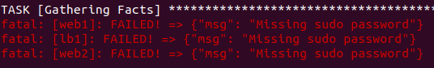

In this post I'll be going over Ansible Playbooks. The complete list of posts in this series are:

1. [Ansible Part 1: Setup and Configure on Ubuntu and VirtualBox](https://markkerry.github.io/posts/2022/04/ansible-part-1/)
2. Ansible Part 2: Playbooks (This post)
3. [Ansible Part 3: Variables, Vault and Roles](https://markkerry.github.io/posts/2022/04/ansible-part-3/)

All code in these posts can be found on [GitHub - ubuntu-config/ansible](https://github.com/markkerry/ubuntu-config/tree/main/ansible)

## Playbooks

Playbooks allow us to write ordered process and manage configurations in the form of yaml syntax. These can then be used to build out remote systems. "Configuration as code" means the playbook yaml files can sit in source control and be integrated with CI/CD pipelines.

You need to create a Playbook listing everything you want to apply to each instance. And since playbooks run from top to bottom, they need to be in a logically defined order. 

Playbooks are made of up "plays" so we can include the "tasks" performed in part 1 as plays in the playbook.

For example the ping task: `ansible -m ping all` can be written as a play in a playbook as follows

```yaml
# ping.yaml
---
  - hosts: all
    tasks:
    - name: Ping all servers
      action: ping
```

This can then be invoked with `ansible-playbook ping.yaml`

## Create a playbook

Now let's create some playbooks.

```terminal
mkdir ~/ansible/playbooks
```

Can update the apt repos with the following playbook. 

```terminal
vim playbooks/apt-update.yaml
```

Then populate

```yaml
# apt-update.yaml
---
  - hosts: webservers:loadbalancers
    become: true
    tasks:
      - name Update apt packages
        apt: name=* state=latest
```

Notice the `become: true`. This means become root (sudo), as the `apt` commands require sudo. Without it the playbook would run as follows.



So with `become: true` defined it's time to run the playbook as follows:

```terminal
ansible-playbook playbooks/apt-update.yaml -K
```

The `-K` means "ask for become password".


## Setup the servers

Now it's time to configure the Ubuntu servers; one load balancer and two web servers. All three servers will require Apache installed, however the load balancer will require the following Apache Modules which to be installed manually would be:

```terminal
sudo a2enmod proxy
sudo a2enmod proxy_http
sudo a2enmod lbmethod_byrequests
sudo a2enmod proxy_balancer
sudo systemctl restart apache2
```

But I will incorporate the Apache Modules required for a load balancer in the playbook. Also the web servers will require php in order to be able to host the custom `index.php` file I'll be deploying to them. Create the playbook as follows:

```terminal
vim playbooks/install-services.yaml
```

The `install-services.yaml` looks as follows:

```yaml
# install-services.yaml
---
  - hosts: loadbalancers
    become: true
    tasks:
      - name: Installing apache
        apt: name=apache2 state=present
      - name: Ensure apache starts
        service: name=apache2 state=started enabled=yes
      - name: Enable lbmethod_byrequests apache module
        community.general.apache2_module:
          state: present
          name: lbmethod_byrequests
      - name: Enable proxy_balancer apache module
        community.general.apache2_module:
          state: present
          name: proxy_balancer
      - name: Enable proxy_http apache module
        community.general.apache2_module:
          state: present
          name: proxy_http
      - name: Enable proxy apache module
        community.general.apache2_module:
          state: present
          name: proxy

  - hosts: webservers
    become: true
    tasks:
      - name: Installing apache
        apt: name=apache2 state=present
      - name: Install software-properties-common
        apt: name=software-properties-common
      - name: Add repo php
        apt_repository: repo="ppa:ondrej/php"
      - name: Updating the repo
        apt: update_cache=yes
      - name: Installing php
        apt: name=php state=present
      - name: Ensure apache starts
        service: name=apache2 state=started enabled=yes
```

And once saved it is time to test it:

```terminal
ansible-playbook playbooks/install-services.yaml -K
```


Now that all three servers have the required applications installed it is time to configure them.

## Configure the Load Balancer

I'll start by creating a new directory to host any configuration files:

```terminal
mkdir ~/ansible/config && cd ~/ansible/config
```

Then create a new "jinger2" syntax file which will will be deployed to the load balancer to configure it.

```terminal
vim lb-config.j2
```

The contents of `lb-config.j2` file are below. Notice there is some "for loop" logic which is going through each "webserver" host in the `hosts-dev` file. This means the servers do not need to be hard coded in this file and the file does not need to be updated when any web servers are added or deleted.

```bash
ProxyRequests off
<Proxy balancer://webcluster >
  
    BalancerMember http://{{hostvars[hosts]['ansible_host']}}
  
    ProxySet lbmethod=byrequests
</Proxy>

# Optional
<Location /balancer-manager>
  SetHandler balancer-manager
</Location>

ProxyPass /balancer-manager !
ProxyPass / balancer://webcluster/
```

Now that the `lb-config.j2` file has been created, we can create a playbook to deploy it the the load balancer, set the permissions and then restart Apache.

```terminal
vim ./playbooks/lb-setup.yaml
```

Here is the contents of `lb-setup.yaml`

```yaml
---
  - hosts: loadbalancers
    become: true
    tasks:
      - name: Creating template
        template:
          src: ../config/lb-config.j2
          dest: /etc/apache2/conf-enabled/lb.conf
          owner: root
          group: root
          mode: 064
      - name: restart apache
        service: name=apache2 state=restarted
```

Run the playbook:

```terminal
ansible-playbook playbooks/lb-setup.yaml -K
```


That's all that is required to configure the load balancer.

## Configure the Web Servers

To configure the web servers, I'm simply going to deploy an `index.php` file and delete the `index.html` from the default Apache `/var/www/html/` directory.

Create the php file in the ansible directory as follows:

```terminal
vim index.php
```

The `index.php` file will simply use a function to gather the webservers hostname, print in bold that the site has been configured by Ansible, then display the hostname. This way we can prove the load balancer is working correctly:

```php
<?php
  $hostname = gethostname();
  echo "<h1>Site configured by Ansible</h1>";
  echo "<h2>Webserver: $hostname</h2>";
?>
```

Now that the `index.php` file has been created, we can create a playbook to deploy it the the web servers, set the permissions, delete the old `index.html`, and then restart Apache.

```terminal
vim ./playbooks/app-setup.yaml
```

The content of the `app-setup.yaml` file is below. Notice the `notify` and `handlers` section. This means that if anything is changed in the the `name` play then to notify the handler. This particular handler will restart Apache if notified.

```yaml
# app-setup.yaml
---
  - hosts: webservers
    become: true    
    tasks:
      - name: Copy app files
        copy:
          src: ../index.php
          dest: /var/www/html
          mode: 0755
        notify: restart apache
          
      - name: Delete index.html
        ansible.builtin.file:
          path: /var/www/html/index.html
          state: absent
        notify: restart apache
    
    handlers:
      - name: restart apache
        service: name=apache2 state=restarted
```

Run the playbook:

```terminal
ansible-playbook playbooks/app-setup.yaml -K
```


And that is all that is required to configure the web servers.

## Run All Playbooks

That's quite a few playbooks created in the post. We can combine them all together and deploy them in one playbook using `import_playbook`. I created a new playbook as follows:

```terminal
vim playbooks/all-playbooks.yaml
```

Then listed the order in which I wanted the playbooks to be executed.

```yaml
# all-playbooks.yaml
---
  - import_playbook: ping.yaml
  - import_playbook: apt-update.yaml
  - import_playbook: install-services.yaml
  - import_playbook: app-setup.yaml
  - import_playbook: lb-setup.yaml
```

Save the playbook and run it:

```terminal
ansible-playbook playbooks/all-playbooks.yaml -K
```


## Test the Loadbalancer

Finally I can test the load balancer is working by browsing to the local IP


Note that it returned it was using **web1**. If I connect again this time it used **web2**


And can get some info on the balancer manager page


That concludes this post. In the next post in the series I will go over variables, debugging playbooks and Ansible Vault.
