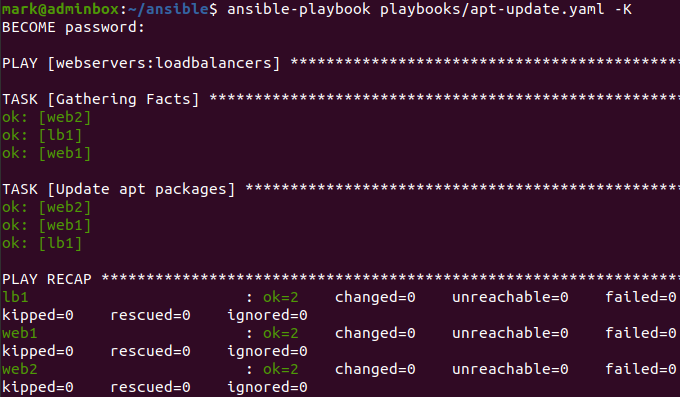
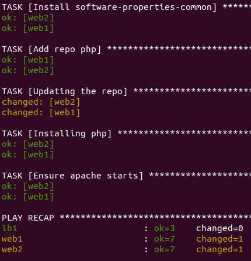
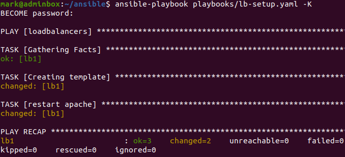
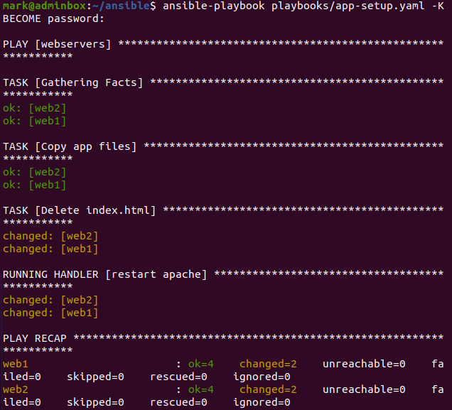
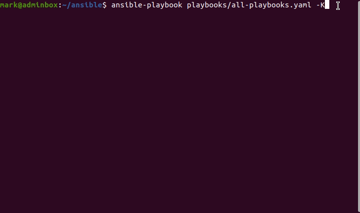
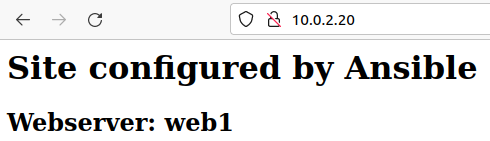
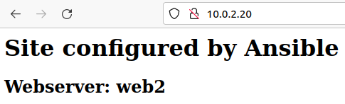
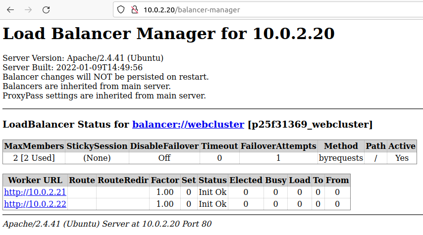

Playbooks allow us to write ordered process and manage configurations in the form of yaml syntax. These can then be used to build out remote systems. "Configuration as code" means the playbook yaml files can sit in source control and be integrated with CI/CD pipelines.

You need to create a Playbook listing everything you want to apply to each instance. And since playbooks run from top to bottom, they need to be in a logically defined order. 

Playbooks are made of up "plays" so we can include the "tasks" performed in part 1 as plays in the playbook.

For example the ping task: `ansible -m ping all` can be written as a play in a playbook as follows

```yaml
# ping.yaml
---
  - hosts: all
    tasks:
    - name: Ping all servers
      action: ping
```

This can then be invoked with `ansible-playbook ping.yaml`

## Create a playbook

Now let's create some playbooks.

```terminal
mkdir ~/ansible/playbooks
```

Can update the apt repos with the following playbook. 

```terminal
vim playbooks/apt-update.yaml
```

Then populate

```yaml
# apt-update.yaml
---
  - hosts: webservers:loadbalancers
    become: true
    tasks:
      - name Update apt packages
        apt: name=* state=latest
```

Notice the `become: true`. This means become root (sudo), as the `apt` commands require sudo. Without it the playbook would run as follows.

Run it

```terminal
ansible-playbook apt-update.yaml -K
```

The `-K` means "ask for become password".



## Setup the servers

on lb1

```terminal
sudo a2enmod proxy
sudo a2enmod proxy_http
sudo a2enmod lbmethod_byrequests
sudo a2enmod proxy_balancer
sudo systemctl restart apache2
```

Text

```terminal
vim ./playbooks/install-services.yaml
```

Paste in here the `install-services.yaml`

```yaml
# install-services.yaml
---
  - hosts: loadbalancers
    become: true
    tasks:
      - name: Installing apache
        apt: name=apache2 state=present
      - name: Ensure apache starts
        service: name=apache2 state=started enabled=yes
      - name: Enable lbmethod_byrequests apache module
        community.general.apache2_module:
          state: present
          name: lbmethod_byrequests
      - name: Enable proxy_balancer apache module
        community.general.apache2_module:
          state: present
          name: proxy_balancer
      - name: Enable proxy_http apache module
        community.general.apache2_module:
          state: present
          name: proxy_http
      - name: Enable proxy apache module
        community.general.apache2_module:
          state: present
          name: proxy

  - hosts: webservers
    become: true
    tasks:
      - name: Installing apache
        apt: name=apache2 state=present
      - name: Install software-properties-common
        apt: name=software-properties-common
      - name: Add repo php
        apt_repository: repo="ppa:ondrej/php"
      - name: Updating the repo
        apt: update_cache=yes
      - name: Installing php
        apt: name=php state=present
      - name: Ensure apache starts
        service: name=apache2 state=started enabled=yes
```

run it

```terminal
ansible-playbook playbooks/install-services.yaml -K
```




## Configure Load balancer


```terminal
mkdir ~/ansible/config && cd ~/ansible/config
vim lb-config.j2
```

contents of lb-config.j2

```bash
ProxyRequests off
<Proxy balancer://webcluster >
  
    BalancerMember http://{{hostvars[hosts]['ansible_host']}}
  
    ProxySet lbmethod=byrequests
</Proxy>

# Optional
<Location /balancer-manager>
  SetHandler balancer-manager
</Location>

ProxyPass /balancer-manager !
ProxyPass / balancer://webcluster/
```

```terminal
vim ./playbooks/lb-setup.yaml
```

here the `lb-setup.yaml`

```yaml
---
  - hosts: loadbalancers
    become: true
    tasks:
      - name: Creating template
        template:
          src: ../config/lb-config.j2
          dest: /etc/apache2/conf-enabled/lb.conf
          owner: root
          group: root
          mode: 064
      - name: restart apache
        service: name=apache2 state=restarted
```

run it

```terminal
ansible-playbook playbooks/lb-setup.yaml -K
```



## Configure the webservers

Now to deploy a `index.php` and delete the `index.html`

```php
<?php
  $hostname = gethostname();
  echo "<h1>Site configured by Ansible</h1>";
  echo "<h2>Webserver: $hostname</h2>";
?>
```

```terminal
vim ./playbooks/app-setup.yaml
```

looks like this. Write about handler

```yaml
# app-setup.yaml
---
  - hosts: webservers
    become: true    
    tasks:
      - name: Copy app files
        copy:
          src: ../index.php
          dest: /var/www/html
          mode: 0755
        notify: restart apache
          
      - name: Delete index.html
        ansible.builtin.file:
          path: /var/www/html/index.html
          state: absent
        notify: restart apache
    
    handlers:
      - name: restart apache
        service: name=apache2 state=restarted
```



## Run all playbooks

Create a playbook called... 

In there I also have a few other 

```yaml
# all-playbooks.yaml
---
  - import_playbook: ping.yaml
  - import_playbook: apt-update.yaml
  - import_playbook: install-services.yaml
  - import_playbook: app-setup.yaml
  - import_playbook: lb-setup.yaml
```



## Test the Loadbalancer

Finally I can test the load balancer is working by browsing to the local IP



Note that it returned it was using **web1**. If I connect again this time it used **web2**



And can get some info on the balancer manager page



## Next Post

In the next post in the series I will go over variables, debugging playbooks and Ansible Vault.
