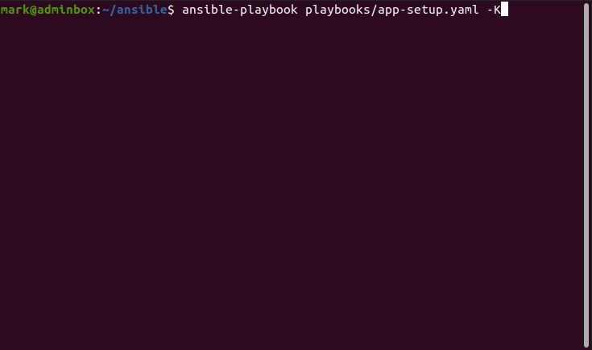
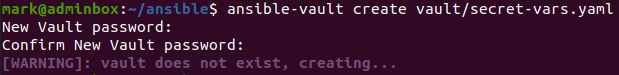
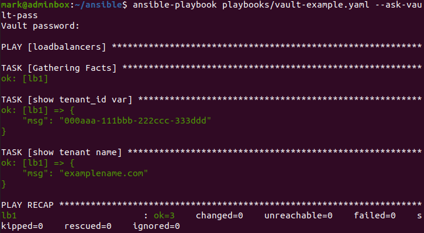

In this post I'll demonstrate using variables in your Ansible Playbooks, then go on to secret management using Ansible Vault, before finally completing the post covering Ansible Roles. The complete list of posts in this series are:

1. [Ansible Part 1: Setup and Configure on Ubuntu and VirtualBox](https://markkerry.github.io/posts/2022/04/ansible-part-1/)
2. [Ansible Part 2: Playbooks](https://markkerry.github.io/posts/2022/04/ansible-part-2/)
3. Ansible Part 3: Variables, Vault and Roles (This post)

All code in these posts can be found on [GitHub - ubuntu-config/ansible](https://github.com/markkerry/ubuntu-config/tree/main/ansible) and [GitHub - ubuntu-config/ansible-roles](https://github.com/markkerry/ubuntu-config/tree/main/ansible-roles)

## Variables and Debug

Ansible allows you to create local variables in your playbooks. We can use **vars** to create key/value pairs or you can use variable files and import them into the playbook. Variables use the same Jinger2 syntax I used to configure the load balancer in the previous post.

In the example below, I have defined a local variable called `app_path` with a value of `/var/www/html`. Then, anywhere there was "/var/www/html" hard-coded was replaced with `"{{ app_path }}"`.

```yaml
---
  - hosts: webservers
    become: true  
    
    vars:
      app_path: "/var/www/html"
      
    tasks:
      - name: Copy app files
        copy:
          src: ../index.php
          dest: "{{ app_path }}"
          mode: 0755
        notify: restart apache
          
      - name: Delete index.html
        ansible.builtin.file:
          path: "{{ app_path }}/index.html"
          state: absent
        notify: restart apache
```

During the **TASK [Gathering Facts]** step, Ansible will create a variable for us called **ansible_facts**, which holds metadata about the host we are interacting with. This information, such as the hosts IP address, from the **ansible_facts** variable can be injected into future tasks.

Using the **setup** module, we can see the information gathered in the **TASK [Gathering Facts]** step.

```terminal
ansible -m setup web1
```

Ansible allows you to use the **debug** module to see STDOUT information from the playbook, such as variables set and tasks that are ran. The example below shows a playbook which runs a `command` to list the contents of a directory and uses `register` to a **dir_contents** variable. The debug module then returns the captured information in the variable to STDOUT.

```yaml
---
  vars:
    path_to_app: "/var/www/html"
    
  tasks:
    - name: see directory contents
      command: ls -al {{ path_to_app }}
      register: dir_contents
      
    - name: debug directory contents
      debug:
        msg: "{{ dir_contents }}"
```

I have updated the `app-setup.yaml` file to include the variables and debug module, which now looks as follows:

```yaml
# app-setup.yaml
---
  - hosts: webservers
    become: true

    vars:
      app_path: "/var/www/html"

    tasks:
      - name: Copy app files
        copy:
          src: ../index.php
          dest: "{{ app_path }}"
          mode: 0755
        notify: restart apache

      - name: Delete index.html
        ansible.builtin.file:
          path: "{{ app_path }}/index.html"
          state: absent
        notify: restart apache

      - name: gather directory contents
        command: ls -al {{ app_path }}
        register: dir_content

      - name: show directory contents
        debug:
          msg: "{{ dir_content }}"

    handlers:
      - name: restart apache
        service: name=apache2 state=restarted
```

Below you will see the command `ls -al /var/www/html` returning the index.php file on both web1 and web2.



## Ansible Vault

Ansible Vault allows us to keep sensitive information - such as passwords or variables - in encrypted files rather than in plan text in a playbook.

The vault is password protected with the default cipher of AES256. I created one as follows

```teminal
ansible-vault create vault/secret-vars.yaml
```

Enter the password twice.



Next you will be able to fill add variables in your vault. Here as an example I added:

```yaml
tenant_id: "000aaa-111bbb-222ccc-333ddd"
tenant_name: "examplename.com"
```

It is essentially VIM so exit by pressing Esc then:

```terminal
:wq
```

To edit the vault again use

```yaml
ansible-vault edit vault/secret-vars.yaml
```

Then you can reference this vault in a playbook by specifying `vars_files` and referencing it in a `task` as follows:

```terminal
vim playbooks/vault-example.yaml
```

The debug module will allow you to return them as you would any other variable, as long as you enter the vault password when running the playbook.

```yaml
# vault-example.yaml
---
  - hosts: loadbalancers
      
    vars_files:
      - ../vault/secret-vars.yaml
      
    tasks:
      - name: show tenant_id var
        debug:
          msg: "{{ tenant_id }}"
      - name: show tenant var
        debug:
          msg: "{{ tenant_name }}"
```

Run the playbook and specify `--ask-vault-pass`

```terminal
ansible-playbook playbooks/vault-example.yaml --ask-vault-pass
```



## Ansible Roles

Ansible Roles allow you to create a framework to separate out (make more modular) each part of the configuration. E.g. variables, tasks, and templates in their self contained directory. It will break-up the configuration into files which can be re-used and are easier to modify.

I created a new directory to host the roles.

```terminal
mkdir ~/ansible-roles
```

### Create the Role

We can create a role for the two web servers with the following command:

```terminal
ansible-galaxy role init ansible-roles/webservers
```

I then copied the following three files I've been using to configure the webservers to the following directories:

* `ansible-roles/webservers/app-setup.yaml`
* `ansible-roles/webservers/hosts-dev`
* `ansible-roles/webservers/files/index.php`

The directory structure looks as follows:

```terminal
~/ansible-roles/webservers
    ├── app-setup.yaml
    ├── hosts-dev
    └── webservers
        ├── defaults
        │   └── main.yml
        ├── files
        │   └── index.php
        ├── handlers
        │   └── main.yml
        ├── meta
        │   └── main.yml
        ├── README.md
        ├── tasks
        │   └── main.yml
        ├── templates
        ├── tests
        │   ├── inventory
        │   └── test.yml
        └── vars
            └── main.yml

9 directories, 12 files
```

### Configure the Role

With the app-setup.yaml, hosts-dev and index.php in the correct place I can now configure the rest of the files in the webservers role.

Copy the `vars` content from `app-setup.yaml` into `ansible-roles/webservers/vars/main.yaml`

The `vars/main.yaml` file will look as follows:

```yaml
---
# vars file for ansible-roles/webservers
app_path: "/var/www/html"
```

Then, copy the `handlers` section from `app-setup.yaml` into `ansible-roles/webservers/handlers/main.yaml`

The `handlers/main.yaml` file will look as follows:

```yaml
---
# handlers file for ansible-roles/webservers
- name: restart apache
  service: name=apache2 state=restarted
```

Then, copy the `tasks` section from `app-setup.yaml` into `ansible-roles/webservers/tasks/main.yaml`

The `tasks/main.yaml` file will look as follows:

```yaml
---
# tasks file for ansible-roles/webservers
- name: Copy app files
  copy:
    src: ../files/index.php
    dest: "{{ app_path }}"
    mode: 0755
  notify: restart apache
    
- name: Delete index.html
  ansible.builtin.file:
    path: "{{ app_path }}/index.html"
    state: absent
  notify: restart apache
  
- name: gather directory contents
  command: ls -al {{ app_path }}
  register: dir_content
  
- name: show directory contents
  debug:
    msg: "{{ dir_content }}"
```

And finally, replace the content of the `ansible-roles/webservers/app-setup.yaml` with the following:

```yaml
# app-setup.yaml
---
  - hosts: webservers
    become: true
    roles:
      - webservers
```

### Run the Role Playbook

Now it's time to run the new playbook from the `~/ansible-roles` directory

```terminal
ansible-playbook ansible-roles/app-setup.yaml -K
```

I haven't captured the output as it is exactly the same as previous runs of `app-setup.yaml`

That concludes this series of posts on Ansible.
