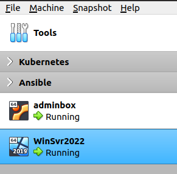
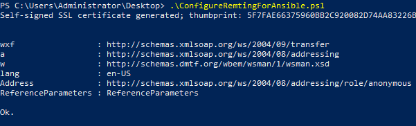
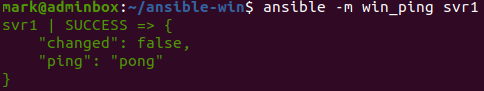
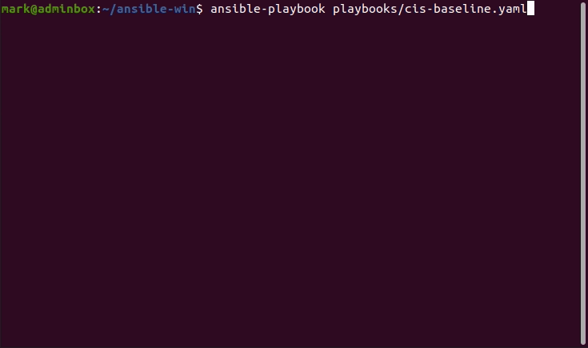
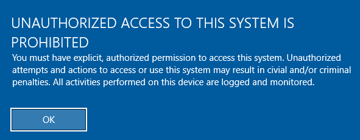

In a Windows Server environment which is not domain joined and where group policies are available to configure hosts, it is important to harden the server infrastructure against security vulnerabilities via other methods. In this post I will demonstrate applying the CIS security policies for Windows Server with Ansible. You can find all the configurations for this post on [GitHub - ubuntu-config/ansible-win](https://github.com/markkerry/ubuntu-config/tree/main/ansible-win).

Since Ansible cannot be installed on Windows, I am using the same adminbox Ubuntu host which has Ansible installed already from the following posts:

* [markkerry.github.io - Ubuntu Server Lab](https://markkerry.github.io/posts/2022/02/ubuntu-server-lab/)
* [markkerry.github.io - Ansible Part 1: Setup and Configure on Ubuntu and VirtualBox](https://markkerry.github.io/posts/2022/04/ansible-part-1/)

I have built another server which has Windows Server 2022 installed which I will configure with Ansible.

| name     | OS                  | Memory | Disk  | vCpu |
| -------- | ------------------- | ------ | ----- | ---- |
| adminbox | Ubuntu LTS 20-04    | 4 GB   | 20 GB | 2    |
| svr1     | Windows Server 2022 | 8 GB   | 50 GB | 2    |



## Setup the Windows Host

After the Windows Server OS is installed, we can start by ensuring it is ready to be configured by Ansible. Ansible will interact with the Windows host using WinRM rather than SSH. Ansible provides a script to easily configure WinRM on the host using a Self-Signed SSL certificate.

Download and run the script:

```powershell
$file = ConfigureRemotingForAnsible.ps1
$uri = "https://raw.githubusercontent.com/ansible/ansible/devel/examples/scripts/$file"
Invoke-WebRequest -UserBasicParsing -Uri $uri -OutFile ~\Desktop\$file
cd ~\Desktop
.\ConfigureRemotingForAnsible.ps1
```



I would recommend here setting a static IP on the Windows host so you do not have to update the ip in the Ansible configuration file.

That's all to configure the Windows host. Let's move on to the adminbox with Ansible installed.

## Setup the Ansible Host

In order for Ansible to communicate with the Windows host using WinRM, I need to install the `pywinrm` Python module. But `testresources` is a requirement for `pywinrm`, so I will install both.

```terminal
python3 -m pip install --user --ignore-installed tetsresources --no-warn-script-location
python3 -m pip install --user --ignore-installed pywinrm --no-warn-script-location
```

Next, I created a new directory to host the Windows Ansible files.

```terminal
mkdir ~/ansible-wind && cd ~/ansible-win
mkdir playbooks
```

Create a new `~/ansible-win/ansible.cfg` file which looks as follows:

```terminal
# ansible.cfg

[defaults]
inventory = ./hosts-win
host_key_checking = False
retry_files_enabled = False
```

Create a new `~/ansible-win/hosts-win` file which looks as follows:

```terminal
# hosts-win

[win]
svr1 ansible_host=10.0.2.30

[win:vars]
ansible_user=administrator
ansible_password=password
ansible_port=5986
ansible_connection=winrm
ansible_winrm_server_cert_validation=ignore
```

> Note: I would only include a password in this file for testing purposes in a lab environment.

With the Ansible configuration in place I can now test connectivity to the Windows host.

```terminal
ansible -m win_ping svr1
```

As you can see the `ping` was met with `pong`. Success.



## Run the CIS-Windows Playbook

Using the Ansible Galaxy [win_cis collection](https://galaxy.ansible.com/jayroad/win_cis) by [jayroad](https://galaxy.ansible.com/jayroad). I have copied them into a playbook.

The playbook does require the `community.windows` collection installed which can be done as follows:

```terminal
ansible-galaxy collection install community.windows
```

You can find the playbook at [GitHub - ubuntu-config/ansible-win](https://github.com/markkerry/ubuntu-config/blob/main/ansible-win/playbooks/cis-baseline.yaml)

Run the playbook:

```terminal
ansible-playbook playbooks/cis-windows.yaml
```



We can now see the logon message has changed and the policies have been applied.



This may not be the full CIS baseline but it certainly is a good start and can be expanded upon from here.
