In the following post I will demonstrate getting started with the Terraform Azure Provider. I'll build the configuration for:

* Resource Group
* Virtual Network
* Subnet
* Network Security Group (Allow SSH)
* NSG Association
* 2 x Linux Virtual Machines
* 2 x Network Interface Cards
* 2 x Public IPs

These will all be deployed them from Azure Cloud Shell.

## Remote vs Local State

A quick note on the Terraform state file... I have decided to create a remote state file, stored in an Azure Storage Account in order to demonstrate the "backend" configuration.

## Prerequisites

You would usually have to install VSCode, Terraform, Azure CLI and some VSCode extensions in order to build and deploy your terraform configurations, but for simplicity of this post I have decided to demonstrate the process using Azure Cloud Shell, as all of the prerequisites are installed. That being said, the only requirements to follow along are an Azure Storage Account to host both the state file and Azure Cloud Shell.

So to get started I created the following:

* Resource Group
* Storage Account
* Container in the Storage Account called __tf-state__

Log into the Azure Cloud Shell (Bash) and get going. Create a new terraform-demo directory as follows:

```terminal
mkdir terraform-demo && cd terraform-demo
```

## Providers

You can include the "providers" configuration in the __main.tf__ along with the configuration of resources, or you can put it in a separate file. I started by creating a __providers.tf__ file.

```termial
code providers.tf
```

Here I included the name and container of the storage account to hold the Terraform state file. The rest of the __providers.tf__ file looks as follows:

```terraform
terraform {
    required_providers {
        azurerm = {
            source  = "hashicorp/azurerm"
            version = "=3.0.0"
        }
    }
    backend "azurerm" {
        resource_group_name = "rg-eu-stg"
        storage_account_name = "mkstgcqgtckq5sjjds"
        container_name = "tf-state"
        key = "terraform.tfstate"
    }
}

provider "azurerm" {
    subscription_id = "xxxxxxxx-xxxx-xxxx-xxxx-xxxxxxxxxxxx"
    features {}
}
```

This is how it will look from the Cloud Shell. Make sure you change the subscription ID, or leave it out. Features has to be in the provider "block", even if no features are specified.

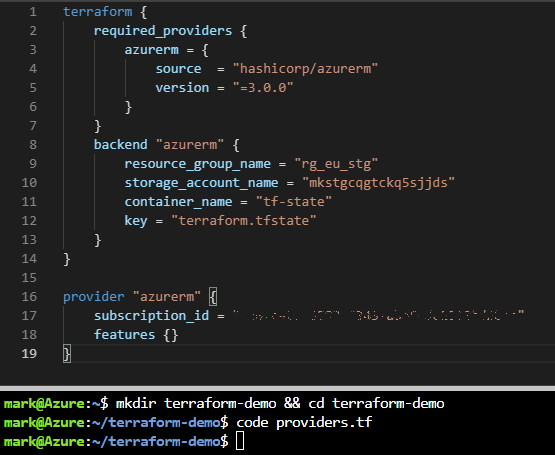

Save and close the editor when complete.

## Variables

Next I created a `variables.tf` file to hold and prompt for values during deployment. Simply the "prefix" I want to give to name each resource, the location to deploy to (Default UK South), and the instance count (Number of VMs).

```terminal
code variables.tf
```

Which looks as follows:

```terraform
variable "prefix" {
  description = "Prefix for the resource names"
}

variable "location" {
  default     = "UK South"
  description = "Region location for the resources"
}

variable "instance_count" {
  description = "Number of VMs to deploy"
}
```

Save and close the editor when complete

## Main

The `main.tf` file includes all the resources and the resource group. Notice `${var.prefix}` being used for each resource name, and `var.instance_count` for the count.

```terminal
code main.tf
```

Which looks as follows:

```terraform
# create the resource group
resource "azurerm_resource_group" "rg" {
  name     = "${var.prefix}-rg"
  location = var.location
}

# create vNet
resource "azurerm_virtual_network" "vnet" {
  name                = "${var.prefix}-vnet"
  resource_group_name = azurerm_resource_group.rg.name
  location            = azurerm_resource_group.rg.location
  address_space       = ["10.0.0.0/16"]
}

# create Subnet
resource "azurerm_subnet" "internal" {
  name                 = "internal-subnet"
  virtual_network_name = azurerm_virtual_network.vnet.name
  resource_group_name  = azurerm_resource_group.rg.name
  address_prefixes     = ["10.0.1.0/24"]
}

# create the nics
resource "azurerm_network_interface" "nics" {
  count               = var.instance_count
  name                = "${var.prefix}-vm${count.index}-nic"
  location            = azurerm_resource_group.rg.location
  resource_group_name = azurerm_resource_group.rg.name

  ip_configuration {
    name                          = "internal"
    subnet_id                     = azurerm_subnet.internal.id
    private_ip_address_allocation = "Dynamic"
    public_ip_address_id          = element(azurerm_public_ip.pip.*.id, count.index)
  }
}

# create the pips
resource "azurerm_public_ip" "pip" {
  count               = var.instance_count
  name                = "${var.prefix}-vm${count.index}-pip"
  resource_group_name = azurerm_resource_group.rg.name
  location            = azurerm_resource_group.rg.location
  allocation_method   = "Dynamic"
}

# create the nsg
resource "azurerm_network_security_group" "nsg" {
  name                = "${var.prefix}-nsg"
  location            = azurerm_resource_group.rg.location
  resource_group_name = azurerm_resource_group.rg.name

  security_rule {
    name                       = "ssh"
    priority                   = 100
    direction                  = "Inbound"
    access                     = "Allow"
    protocol                   = "Tcp"
    source_port_range          = "*"
    destination_port_range     = "22"
    source_address_prefix      = "*"
    destination_address_prefix = "*"
  }
}

# associate the ngg with the nics
resource "azurerm_network_interface_security_group_association" "nsgassoc" {
    count = var.instance_count
    network_interface_id      = element(azurerm_network_interface.nics.*.id, count.index)
    network_security_group_id = azurerm_network_security_group.nsg.id
}

# create the vms
resource "azurerm_linux_virtual_machine" "vms" {
  name                  = "${var.prefix}-vm${count.index}"
  count                 = var.instance_count
  resource_group_name   = azurerm_resource_group.rg.name
  location              = azurerm_resource_group.rg.location
  size                  = "Standard_ds1_v2"
  admin_username        = "admin-user"
  network_interface_ids = [
    element(azurerm_network_interface.nics.*.id, count.index)
,
  ]
  
  admin_ssh_key {
    username   = "admin-user"
    public_key = file("~/.ssh/id_rsa.pub")
  }

  os_disk {
    caching              = "ReadWrite"
    storage_account_type = "Standard_LRS"
  }

  source_image_reference {
    publisher = "Canonical"
    offer     = "UbuntuServer"
    sku       = "19.04"
    version   = "latest"
  }
}
```

Save and close the editor when complete

## Create SSH public-private key pair

Notice in `resource "azurerm_linux_virtual_machine"` of __main.tf__ there is `admin_ssh_key` which specifies `file("~/.ssh/id_rsa.pub")`. I need to create this ssh key pair before deploying the VMs. To do this run the following:

```terminal
ssh-keygen -m PEM -t rsa -b 4096
```

Accept the default path `/home/user/.ssh/id_rsa` which should match what's in the __main.tf__ file. Enter a passphrase which you will using when you ssh onto the VM once deployed

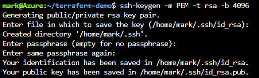

## Deploy

Now it is time to deploy resources using Terraform. Start by initialising the local directory and remote backend. This will download the Azure provider and create a `.terraform.lock.hcl` file in the local directory. Then validate the configuration to check for any misconfigurations in the code.

```terminal
terraform init
terraform validate
```

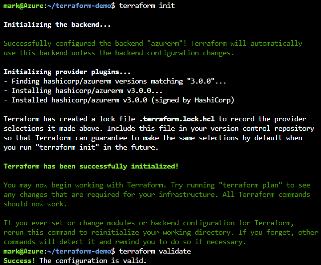

Next you can create a plan. This will output what resources are to be added, changed, or destroyed. If you configure an "out" file, you can reference this file when you apply the terraform configuration, assuming the plan passes. This means it won't need to run through another plan.

```terminal
terraform plan -out main.deploy.tfplan
```

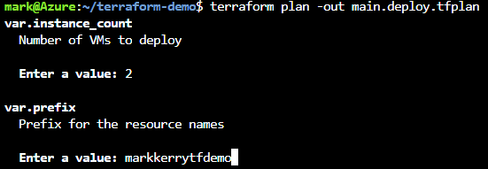

I entered a value of `2` and a prefix of `markkerrytfdemo`. It then stated the plan had detected 12 resources are to be added, 0 to change and 0 to destroy. The command to apply is also shown.

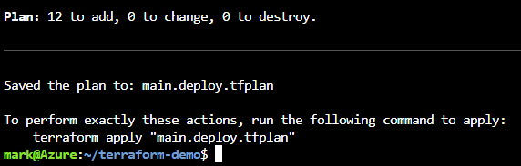

So, to apply the plan

```terminal
terraform apply "main.deploy.tfplan"
```

> NOTE: I had errors in my first deploy as I set the Ubuntu sku to 20.04. All resources except the VMs were created. This is invalid so I changed it to 19.04 and deployed it again. After I applied the plan again the final two resources were created

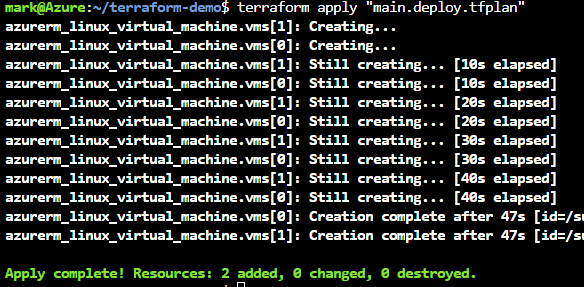

The resources looks as follows in Azure

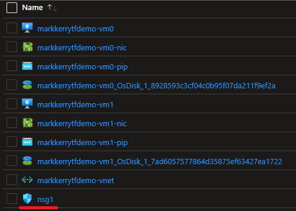

> NOTE: I don't like the look of the Network Security Group being named __nsg1__, so I will change the main.tf file to match the other resources

In the `main.tf` I changed `name = "nsg1"` to `name = "${var.prefix}-nsg"`

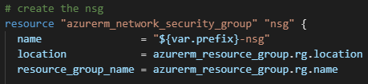

If I run `terraform plan -out main.deploy.tfplan` again I can see that the NSG, NSG Association, and NSG rule will be both destroyed and created again. And the Nics attached will have their NSG changed.

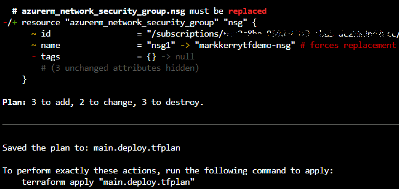

Then finally, `terraform apply main.deploy.tfplan` again to change the NSG.

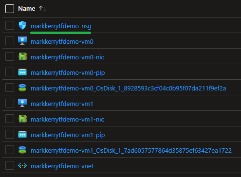

I can test connectivity to one of the VMs using the SSH key. First gather the machine's public IP and connect as follows:

```terminal
ssh admin-user@public-ip
```

Enter the passphrase you specified when generating the SSH Key Pair.

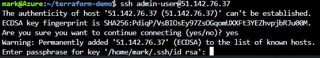

And can see I am connected

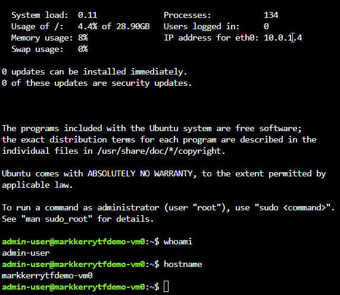

## Destroy

Once you have finished with the resources they can be "destroyed" by Terraform using the `terraform plan -destroy` command and then by applying the destroy plan.

```terminal
terraform plan -destroy -out=main.destroy.tfplan
```

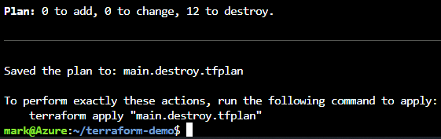

```terminal
terraform apply main.destroy.tfplan
```

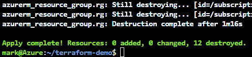

## Source Code

All of the configuration files for this post can be found on [GitHub](https://github.com/markkerry/terraform-azure-provider).
