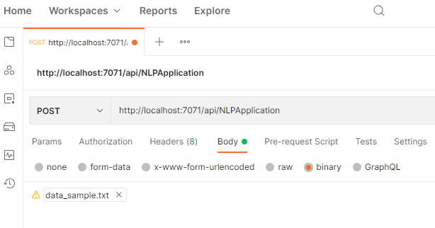
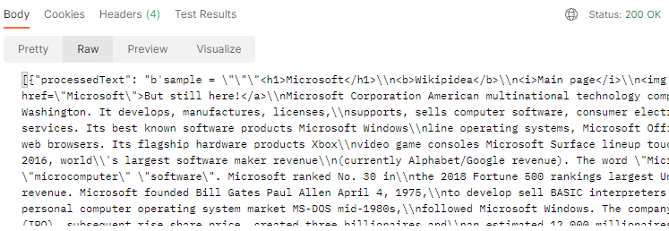
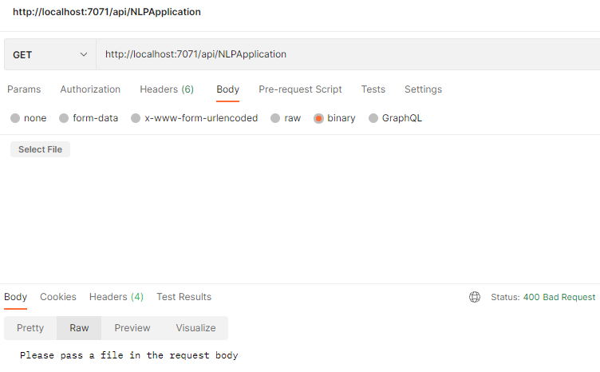
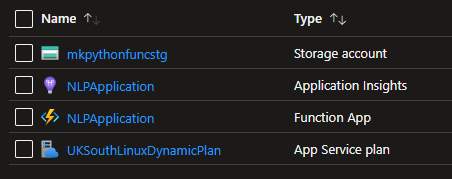
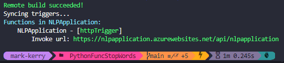
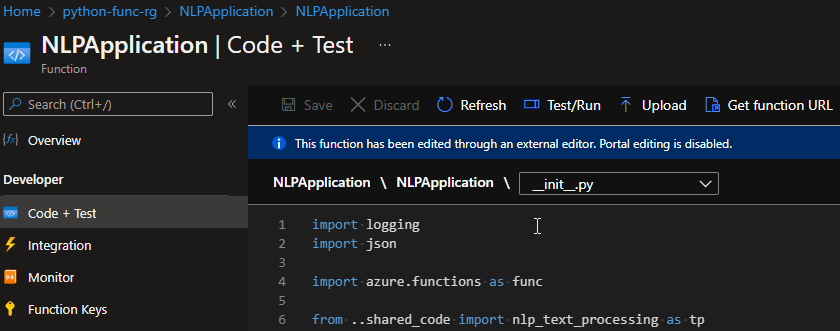
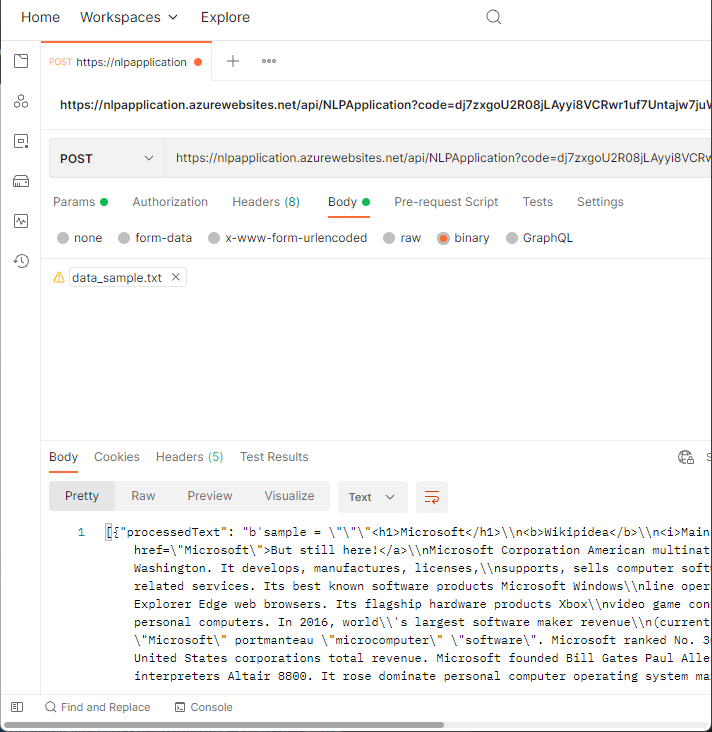

The following will run through the Python exercise from the Azure Functions University [repo](https://github.com/marcduiker/azure-functions-university/tree/main/src/python/AzureFunctions.Http) and [YouTube channel](https://youtu.be/fDnPGeRTwHc). Azure Functions University is a great resource for learning all about Azure Functions, including all the various triggers, languages, deployment, and Durable Functions.

Also it's worth reviewing the [Azure Functions Python developer guide](https://docs.microsoft.com/en-us/azure/azure-functions/functions-reference-python) on Microsoft Docs.

## Create the Azure Function

The following applications are a prerequisite to get started:

* [Azure Functions Core Tools](https://docs.microsoft.com/en-us/azure/azure-functions/functions-run-local?tabs=v4%2Cwindows%2Ccsharp%2Cportal%2Cbash#install-the-azure-functions-core-tools) - To build, test and deploy the Azure Function
* [Azure CLI](https://docs.microsoft.com/en-us/cli/azure/install-azure-cli) - To create the Azure resources
* [Python 3.9](https://www.python.org/downloads/release/python-390/) - Recommended at time of writing as the latest version supported by Azure Functions.
* [Postman](https://www.postman.com/downloads/) - For interacting with the API

Once you have installed Python, install the following packages with `pip`.

```bash
pip install azure-functions
pip install nltk
pip install numpy
```

Create a new directory and `cd` into it. Then create a new `tst` directory.

```bash
mkdir azure-functions-university-python && cd azure-functions-university-python
mkdir tst
```

Create a new Python virtual environment used for local development. If you are using bash use the following:

```baah
sudo apt-get install python3-venv
python -m venv .venv
source .venv/bin/activate
```

Or PowerShell as follows:

```powershell
py -m venv .venv
.venv\scripts\activate
```

> __Note:__ _if you using git you should add `/.venv` to the `.gitignore` file_

Now download the `data_sample.txt` which will be used to POST an HTTP request to the API.

```bash
# Change to the tst directory
cd tst

# Download the data_sample.txt file
curl https://raw.githubusercontent.com/marcduiker/azure-functions-university/main/src/python/AzureFunctions.Http/homework/homework_resources/data/data_sample.txt -o data_sample.txt

# Change back to the previous directory
cd ..
```

Create the `src` directory where the Azure Function project will be created, and `cd` into it.

```bash
mkdir src && cd src
```

Now, using the Azure Functions Core Tools CLI, create a new project as follows: 

```bash
func init PythonFuncStopWords --python
```

Change directory into the new directory.

```bash
cd PythonFuncStopWords
```

And now create a new function app and name it whatever you want. I named mine __NLPApplication__. Name your something unique.

```bash
func new --name NLPApplication --template "HTTP trigger" --authlevel "function"
```

Within the PythonFuncStopWords directory I created a new folder called __shared_code__. This will be used to host a couple of other Python functions which will be imported into the _main_ function.

```bash
mkdir shared_code && cd shared_code
```

Create a new file called `nlp_text_processing.py` and copy the code from [here](https://github.com/marcduiker/azure-functions-university/blob/main/src/python/AzureFunctions.Http/homework/homework_resources/shared_code/nlp_text_processing.py). Or you can download it using the following command:

```bash
curl https://raw.githubusercontent.com/marcduiker/azure-functions-university/main/src/python/AzureFunctions.Http/homework/homework_resources/shared_code/nlp_text_processing.py -o nlp_text_processing.py

# Change back
cd ..
```

The PythonFuncStopWords project folder should look like this:

```terminal
PythonFuncStopWords
│   .funcignore
│   .gitignore
│   getting_started.md
│   host.json
│   local.settings.json
│   requirements.txt
│
├───.vscode
│       extensions.json
│
├───NLPApplication
│       function.json
│       __init__.py
│
└───shared_code
        nlp_text_processing.py
```

Populate the `requirements.txt` with the following:

```terminal
# Do not include azure-functions-worker as it may conflict with the Azure Functions platform
azure-functions
nltk
numpy
```

Change directory into the function:

```terminal
cd NLPApplication
```

The "entry point" to the application is the `__init__.py` [file on GitHub](https://raw.githubusercontent.com/marcduiker/azure-functions-university/main/src/python/AzureFunctions.Http/homework/homework_solution/response_text_processing/__init__.py), which should look as follows:

```python
import logging
import json

import azure.functions as func

from ..shared_code import nlp_text_processing as tp

def main(req: func.HttpRequest) -> func.HttpResponse:
    logging.info("Python HTTP trigger function processed a request.")

    file_sent = None
    text = ""

    try:
        file_sent = req.get_body()
    except ValueError as e:
        logging.error("Value Error: ", e)
        raise ValueError
    else:
        text = str(file_sent)

    processed_text = tp.remove_stop_words(text)
    tokens = tp.tokenize_text(processed_text)
    entities = tp.get_entities(tokens)

    if file_sent:
        return func.HttpResponse(
            json.dumps(
                [
                    {
                        "processedText": processed_text,
                        "tokens": tokens,
                        "entities": entities,
                    }
                ]
            ),
            status_code=200,
        )
    else:
        return func.HttpResponse(
            "Please pass a file in the request body", status_code=400
        )
```

Now it is time to test the function. Ensure you are in the `PythonFuncStopWords` directory and then type:

```bash
func start
```

You should receive the following which states the functions URL (http://localhost:7071/api/NLPApplication)

```terminal
Azure Functions Core Tools
Core Tools Version:       4.0.4590 Commit hash: N/A  (64-bit)
Function Runtime Version: 4.5.2.18383


Functions:

        NLPApplication: [GET,POST] http://localhost:7071/api/NLPApplication
```

We can test it using Postman. Enter the functions URL (above), set the method the __POST__, select __BODY__ as __binary__ and then attach the `data_sample.txt` file from the `tst` directory. Then click __Send__



The following JSON will be returned as the response and a __Status: 200 OK__ will be received.



This time if you change the method to __GET__ and remove the `data_sample.txt`, clicking __Send__ will return a __Status: 400 Bad Request__ and the response as "Please pass a file in the request body". This is all specified in the function's code.



## Deploy to Azure

Start by creating the resources. Sign into Azure using the CLI

```bash
az login
```

Create a resource group for the resources

```bash
az group create --name python-func-rg --location uksouth
```

Create a Storage Account

```bash
az storage account create --name "mkpythonfuncstg" --location uksouth --resource-group python-func-rg --sku Standard_LRS
```

AZ CLI should return similar to this:

```terminal
{
  "id": "/subscriptions/xxxxxxxx-xxxx-xxxx-xxxx-xxxxxxxxxxxx/resourceGroups/python-func-rg",
  "location": "uksouth",
  "managedBy": null,
  "name": "python-func-rg",
  "properties": {
    "provisioningState": "Succeeded"
  },
  "tags": null,
  "type": "Microsoft.Resources/resourceGroups"
}
```

Create the function app in Azure. NLPApplication name was available so ensure yours is unique.

```bash
az functionapp create --resource-group python-func-rg --os-type Linux --consumption-plan-location uksouth --runtime python --name "NLPApplication" --storage-account "mkpythonfuncstg" --functions-version 3
```

Here's how the resource group looks in Azure.



And now deploy the local app to the new Function in Azure.

```bash
func azure functionapp publish "NLPApplication" --build remote
```



And we can see the app and code now in Azure.



Click __Get function URL__ which will include the function key. You can test a GET request with `curl`

```terminal
curl https://nlpapplication.azurewebsites.net/api/NLPApplication?code=<FUNCTION-KEY>
```

Which if successful will return

```terminal
Please pass a file in the request body
```

And one more time performing a POST from Postman using the function URL and Key.



## Delete Resources

And finally to delete all of the resources when you are finished.

```bash
az group delete --name python-func-rg
```
