The following will walkthrough deploying Azure resources using Terraform in Azure DevOps Pipelines. Although its a detailed guide, there is an expectation that the person following already has a good understanding of Git, Azure and Terraform.

It's setup with the `master` or `main` branch created in DevOps and then cloned locally. A new branch is created and then committed to DevOps (Branch policies will restrict committing directly into master/main). A Pull Request is then created and the first pipeline is run which initialites a `terraform plan` and `terraform validate`. After the pull request is approved a build pipeline will run which initiates a `terraform plan` to a plan file, which is then archived as an artifact. If all checks are passed the release will need to be approved, which then starts a release pipeline. This performs a `terraform apply` using the plan file artifact, to deploy the resources into Azure. Once all is deployed the final step is to switch back to the master/main branch in VS code, pull the merged code and delete the old branch.

For a detailed video walkthrough, follow [Terraform And Azure DevOps - How To Configure](https://www.youtube.com/watch?v=AWXOYS-SBfY) by Jack Tracey. I found this really helpful when setting up for myself.

## Requirements

* Visual Studio Code
* Git
* Azure Subscription - Sign up for free credits
* Azure DevOps Organisation - Get one for free
  * [Request free parallelism](https://aka.ms/azpipelines-parallelism-request) - If using the free plan

You now have to make a request for free parallelism if using private repos on the free plan as stated on Microsoft Docs:

> __Note__ _We have temporarily disabled the free grant of parallel jobs for public projects and for certain private projects in new organizations. However, you can request this grant by submitting [a request](https://aka.ms/azpipelines-parallelism-request). Existing organizations and projects are not affected. Please note that it takes us 2-3 business days to respond to your free tier requests._

All code from the this post can be found on [GitHub](https://github.com/markkerry/terraform-in-azure-devops-pipelines)

## Setup DevOps Project

I started by creating a free DevOps organisation and then creating a new private project called __devops-terraform-build__. Create a `.gitignore` file using the Terraform template which will basically tell it to not upload state and tfvars files. This created a repo under __Repos__ which I cloned into VS Code.

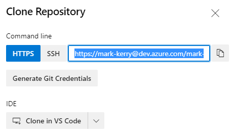

Ensure you select a local directory and that you `cd` into the directory using your terminal, which has Git installed.

## Azure Resources

A few things need to be in place in Azure in order for Azure DevOps and Terraform to be able to interact with it. Manually create the following in Azure to host your Terraform backend, SPN and secrets:

* A Resource group for the following resources:
  * Storage account and container for remote state
  * Key Vault
* An App registration, copying the relevant secret, application id, tenant id.
  * Assign the app registration __Owner__ permissions on the subscription
  * Assign an access policy for the app registration of __list__ and __get__, Secret Permissions in Key Vault

Open Key Vault and create the following new secrets:

| Name                      | Value                                |
| ------------------------- | ------------------------------------ |
| stgAccountName-key-1      | The Storage Account's Access Key1    |
| stgAccountName-key-2      | The Storage Account's Access Key2    |
| SPN-Application-client-ID | The App Registration's Client ID     |
| SPN-Object-ID             | The App Registration's Object ID     |
| SPN-Secret                | The App Registrations's Secret value |
| SPN-Tenant-ID             | The tenant ID of the SPN             |

## Configure Project

Create a Service Connection in DevOps project to allow access to the Azure Subscription.

Select __Project Settings__ > __Pipelines__ / __Service Connections__ > __New Service Connection__

Select __Azure Resource Manager__ > __Next__ > __Service principal (manual)__ > __Next__

Configure it with the following:

| Name                    | Value                                          |
| ----------------------- | ---------------------------------------------- |
| Environment             | Azure Cloud                                    |
| Scope Level             | Subscription                                   |
| Subscription Id         | The Azure Subscription ID                      |
| Subscription Name       | The Azure Subsciption Name                     |
| Service Principle Id    | The app registration's Application (client) ID |
| Credential              | Service principal key                          |
| Service principal key   | The app registration's Secret value            |
| Tenant ID               | The Azure Tenant ID                            |
| Service Connection name | I named mine the same as the app registration  |

Click __Verify__

Next, to create an Azure DevOps Variable Group, select __Pipelines__ > __Library__ > __+ Variable group__

Name it the same as the Azure Key Vault which has been created. Select __Link secrets from an Azure key vault as variables__. Then select the Azure Subscription spn and the Key vault it has access to. Then finally add all of the secrets in the key vault.

## Create the Plan CI Pipline

We'll start by creating the CI/Build pipeline, but this isn't the first pipeline to be initiated in the process. It's easier to create this one first and then clone it later.

Click __Pipelines__ > __Create Pipeline__ > __Use the classic editor__. Name it __terraform-plan__

Select __Azure Repos Git__ as the source and then ensure it has selected the project, Repo and branch. Click __Continue__

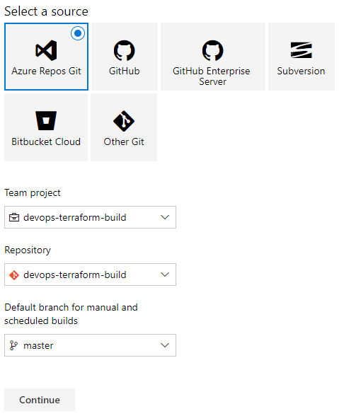

Click __Start with an Empty Job__. Rename the pipeline and select the "Agent Specification" as __Ubuntu 18.04__

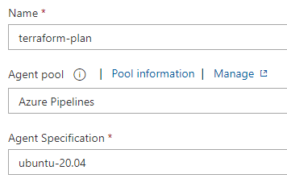

Select __Agent job 1__ and rename it to the same name as the Pipeline. Then click the __+__ to add a task. Search __Terraform tool installer__, and click Get it free. Install it, and select your organisation when prompted. Once installed enter the __Version__ on the task as __1.2.6__ (This was the latest version for linux at the time of writing).

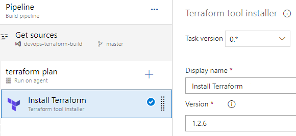

Add a new __Command Line__ task and name it __terraform init__. Set the script as:

```terminal
terraform init -backend-config="access_key=$(Name of access key variable)"
```

This will tell it to check the variable group to match the `stgAccountName-key-1` variable, which is a Storage Account's access key.

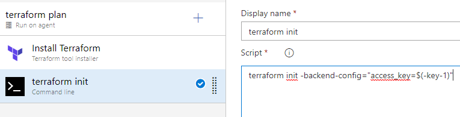

Clone the task and this time rename to __terraform validate__. Set the script the same:

```terminal
terraform validate
```

Clone it again and this time rename it to __terraform plan__ and set the script as:

```terminal
terraform plan -input=false -out=tfplan -var="spn-client-id=$(CHANGEME-spn-client-id)" -var="spn-client-secret=$(CHANGEME-spn-secret)" -var="spn-tenant-id=$(CHANGEME-spn-tenant-id)"
```

This will tell it not to prompt for any input variables at runtime and out to a tfplan file. Ensure the variables are updated with the name of your variables.

Now create a new task to create an archive of the plan file. The task to add is called __Archive Files__ and configure as follows:

| Name                           | Value                                                           |
| ------------------------------ | --------------------------------------------------------------- |
| Disaplay name                  | archive terraform plan files                                    |
| Root folder or file to archive | terraform                                                       |
| Archive type                   | tar                                                             |
| Tar compression                | gz                                                              |
| Archive file to create         | `$(Build.ArtifactStagingDirectory)/$(Build.BuildId)-tfplan.tgz` |

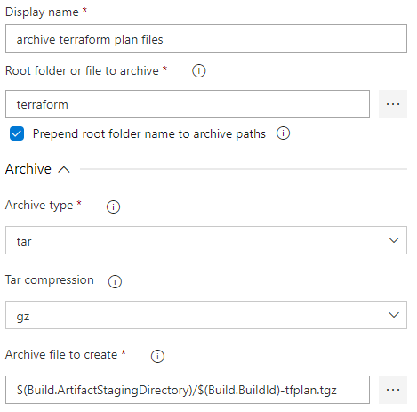

And finally it is time to publish the pipeline artifacts. Add a task called __Publish Pipline Artifacts__ and configure as follows:

| Name                      | Value                                                           |
| ------------------------- | --------------------------------------------------------------- |
| Display name              | publish terraform plan artifact                                 |
| File or directory path    | `$(Build.ArtifactStagingDirectory)/$(Build.BuildId)-tfplan.tgz` |
| Artifact name             | `$(Build.BuildId)-tfplan`                                       |
| Artifact publish location | Azure pipeline                                                  |

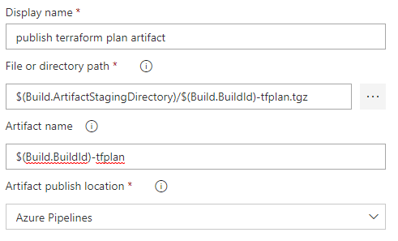

The pipeline tasks should look as follows:

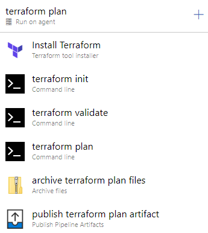

That's the last "task" to add for this pipeline. Now at the top of the pipeline, click __Variables__ > __Variable groups__ > __Link variable group__. Then select the variable groups which was created earlier.

Finally, click __Triggers__ > tick __enable continuous integration__ > Add the path `terraform/` so that it only takes affect on git changes within the terraform directory (yet to create locally).

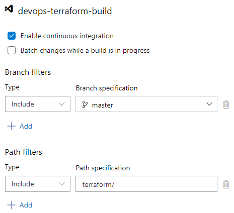

Click __save__ when complete to save the pipeline.

## Create the Status Check & Plan, Pull Request Pipline

We now need to create a new piplline, not for CI but for to validate the code after Pull Requests are created. Start by cloning the __terraform-plan__ pipeline and make the following changes:

* Rename it to __terraform-status-check-plan-and-validate__
* Delete the last two tasks __archive terraform plan files__ and __publish terraform plan artifact__
* Click the __terraform plan__ task and delete the `-out=tfplan` from the Script.
* Click __Triggers__ and un-tick (disable) __Enable continuous integration__
* Save the pipeline

## Release Pipeline

The CD/release pipeline is the final one to configure to deploy the resources in Azure using Terraform.

Go to __Pipelines__ > __Releases__ > __New pipeline__ > name it __terraform apply__ > select __Empty job__.

Name Stage 1 as __terraform apply__. Then click __Add artifact__ and select from the __terraform-build__ pipeline which was created earlier.

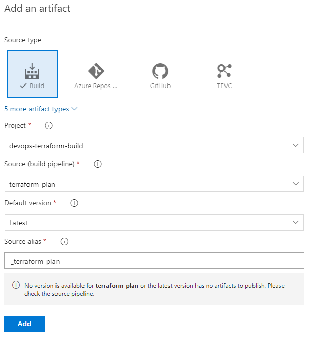

Then enable CD by clicking the lightening icon, then __Enabled__ under __Continuous deployment trigger__.

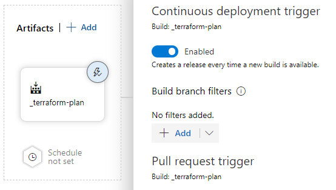

Configure the job, under __Stages__, click __1 job, 0 task__. Enter the following:

| Name                | Value           |
| ------------------- | --------------- |
| Display name        | terraform apply |
| Agent pool          | Azure Pipelines |
| Agent Specification | ubuntu-18.04    |

Click the __+__ to add a task. Search for and select __Extract files__. Change __Archive file patterns__ to:

```terminal
$(System.ArtifactsDirectory)/_terraform-plan/$(Build.BuildId)-tfplan/$(Build.BuildId)-tfplan.tgz
```

Set the __Destination folder__ to:

```terminal
$(System.DefaultWorkingDirectory)/
```

Add a new task called __Terraform tool installer__, set __1.2.6__ as the version.

Add a new task called __Command line__, name it __terraform init__ and use the same command line as in the build task.

```terminal
terraform init -backend-config="access_key=$(Name of access key variable)"
```

Then __Advanced__ > __Working directory__ set it to:

```terminal
$(System.DefaultWorkingDirectory)/terraform
```

Clone the Command line task and create a new one called __terraform apply__. Script is:

```terminal
terraform apply -auto-approve -input=false tfplan 
```

All tasks will then looks as follows:

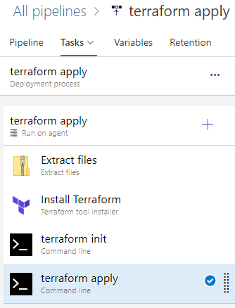

Now link our variable groups. Click __Variables__ > __Variable groups__ > __Link varibale group__ > Select the variable group created earlier.

That's all that is required to configure the pipeline tasks, but we need to add a __Pre-deployment condition__, go back to Pipeline and click the following:

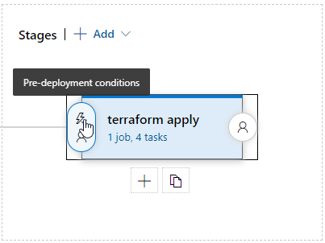

Enable __Pre-deployment approvals__, I set myself as the approver as I am the only person in my DevOps organisation. I also changed the timeout to __7 Days__.

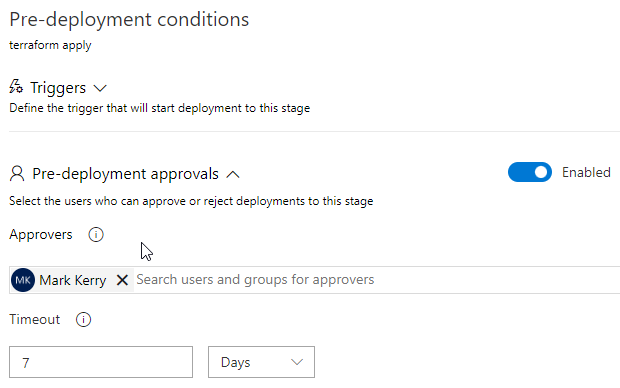

The release pipeline should now look as follows:

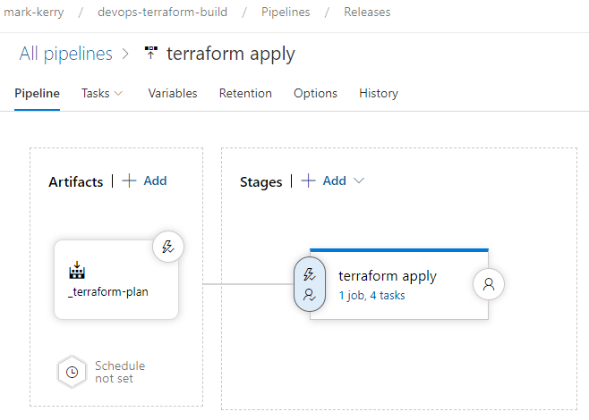

Click __Save__

## Branch Policies

The Branch policy will ensure that code is only being commited via a pull request and not directly in the main/master branch.

Click __Repos__ > __Branches__ > under your default branch, hover over it with mouse and in the far right, click the three dots > __More options__ > __Branch Policies__. Set as follows:

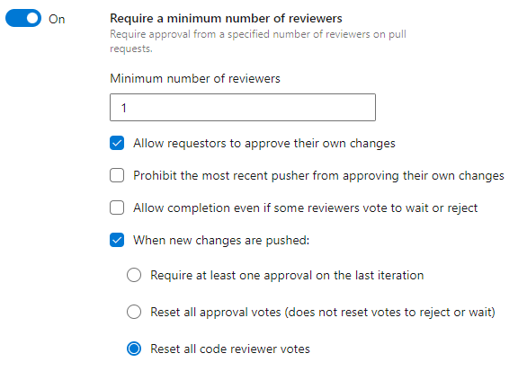

Scroll down and enable __Squash merge__

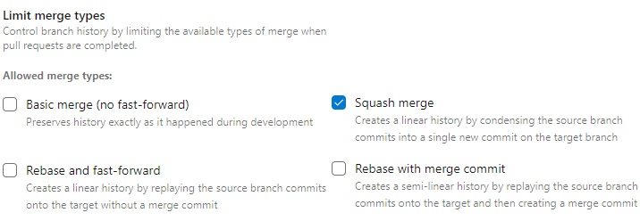

Build validation > __+__ (add). We only want the __terraform-status-check-plan-and-validate__ pipeline to run if there have been any commits on `*.tf` files. Set as follows:

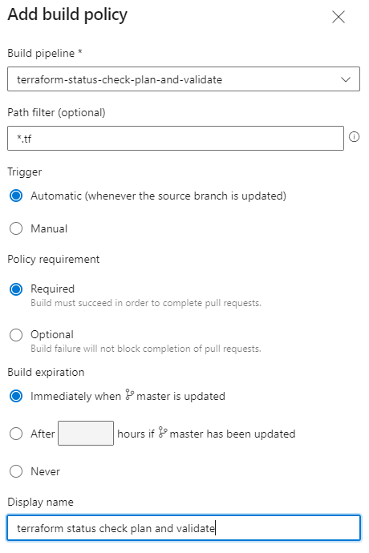

And finally add myself under __Automatically included reviewers__

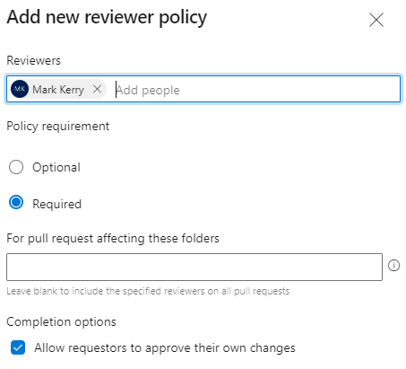

And that's it for the DevOps configuration. Now it is time to write some Terraform configurations and commit the code to test the pipelines.

## Testing the Build and Release Pipelines

To create a new branch in VS Code, click __Source Control__ > three dots > __Branch__ > __Create Branch__ > name it __test__

I should not be allowed to commit code changes directly to the `master` branch now there is a "branch policy" in place. Start by creating a folder called `terraform` and add the following `.tf.` files.

```terminal
devops-terraform-build
│
│   .gitignore
│   README.md
│
└───terraform
        backend.tf
        providers.tf
        resource_group.tf
        variables.tf
```

The `.gitignore` will look something like this:

```terminal
#  Local .terraform directories
**/.terraform/*

# .tfstate files
*.tfstate
*.tfstate.*

# .tfvars files
*.tfvars
```

The `backend.tf` file. Ensure you set the correct name for the resource group and storage account which will host the state file.

```terraform
terraform {
  backend "azurerm" {
    resource_group_name  = "NAME OF RG"
    storage_account_name = "NAME OF STG"
    container_name       = "devops-tf-state"
    key                  = "terraform.tfstate"
  }
}
```

The `providers.tf` file. Ensure you set your unique subscription id.

```terraform
terraform {
  required_providers {
    azurerm = {
      source  = "hashicorp/azurerm"
      version = "=3.0.0"
    }
  }
}

provider "azurerm" {
  subscription_id = "SUBSCRIPTION ID"
  client_id       = var.spn-client-id
  client_secret   = var.spn-client-secret
  tenant_id       = var.spn-tenant-id
  features {}
}
```

The `resource_group.tf` file. Set the name of the resource group you want to create. This is all that will be created for now.

```terraform
resource "azurerm_resource_group" "rg1" {
  name     = "devops-terraform-rg1"
  location = "UK South"
}
```

The `variables.tf` file.

```terraform
variable "spn-client-id" {}
variable "spn-client-secret" {}
variable "spn-tenant-id" {}
```

## Deploy Resources

Now we can deploy the resource group. In VS Code, click Source Control > then the __+__ (stage) > Tick to commit > Name the commit > and then __Push__

Back in Azure DevOps, in __Repos__ you'll see the `test` branch has been commited and that you have an option to __Create a pull request__. Click it.

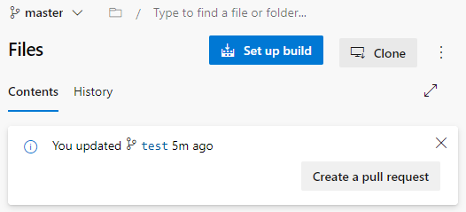

Fill in name and description and click __Create__

Notice the pipeline which performs a terraform plan and validate has passed

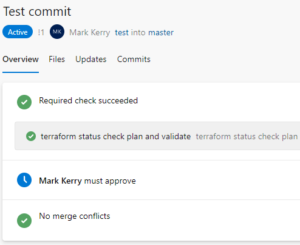

Click it to see the jobs.

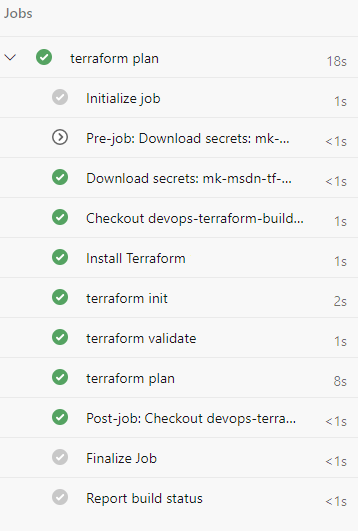

Select the __terraform plan__ job to see detailed output. Notice one resource will be created; the resource group.

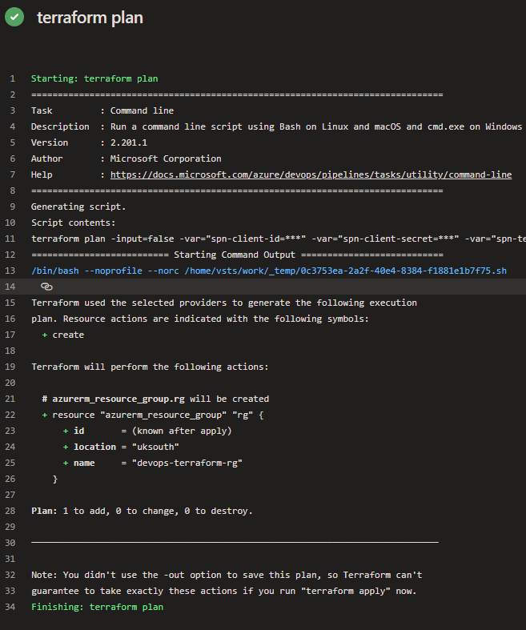

If I open Azure and browse to the Storage Account and Container, I can see the state file created by the `terraform init` command.

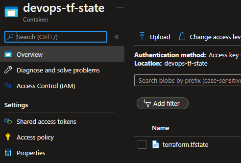

Now approve the Pull request to merge the test branch into Master

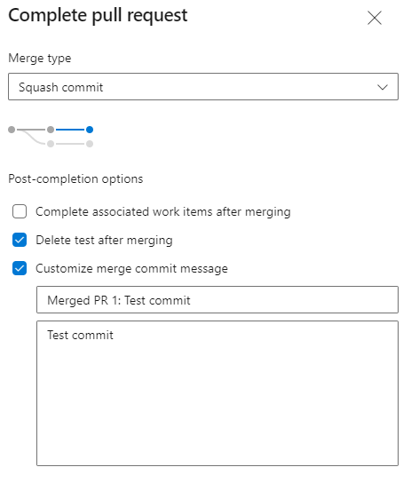

This will initiate the build pipeline to create a plan file as an artifact.

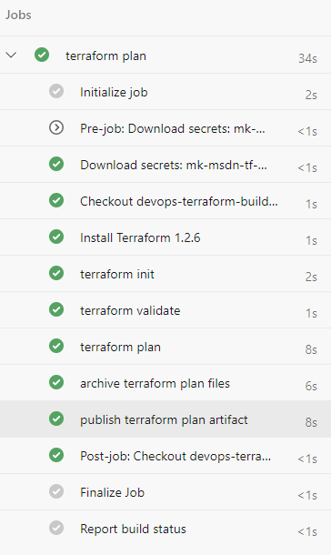

Select __archive terraform plan files__ for detailed output of the command.

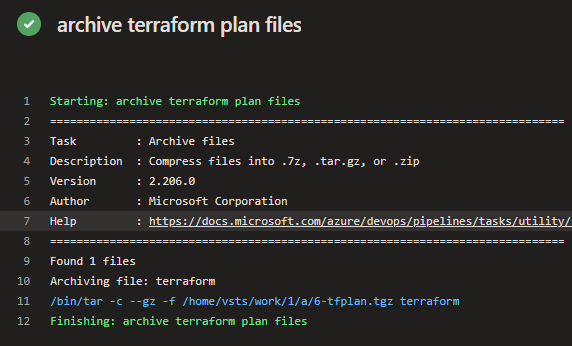

Now approve the release by going to __Pipelines__ > __Releases__

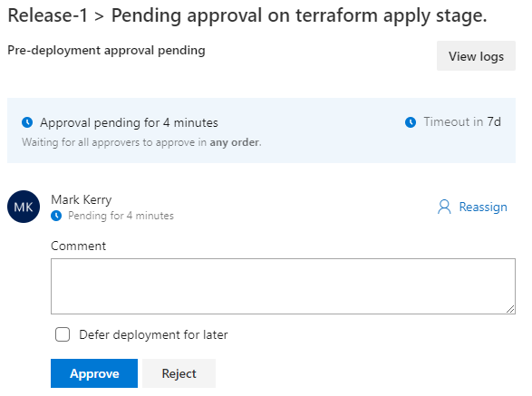

Then watch the release pipepline progress and deploy the Resource Group to Azure.

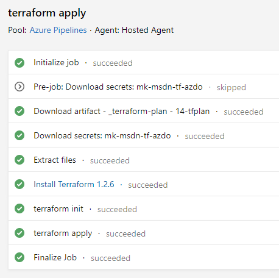

Once complete you can see the new Resource Group "devops-terraform-rg1" was created.

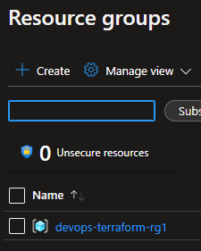

That's a lot of work to deploy a resource group. But now I can create new branches with more resources and have Azure DevOps deploy then when the branch is merged. But first I will show you how to cleanup up the old branch in VS Code.

## Clean up local repo

Now the "test" branch has been merged into main/master (in my example; master), we can cleanup the local test branch and swtich back to master.

```terminal
git checkout master
```

You'll notice in VS Code in the bottom left that the branch has changed.

Fetch and prune. The -p option tells fetch to delete any references that no longer exist on the remote origin. Git remote prune will also remove deleted branches.

```terminal
git fetch -p
```

Then "pull" the updates on the origin repo to your local repo.

```terminal
git pull
```

Delete the old, local "test" branch

```terminal
git branch -D test
```

Verify your local branches

```terminal
git branch -a
```

That's it. Create a new branch if you want to commit new code as a pull request.