In this post I will demonstrate containerising a simple ASP.NET Core web app, pushing it to an Azure Container Registry (ACR), and then running it in a two-node Azure Kubernetes Service (AKS) cluster. It's not too CLI heavy, and has a lot of manual steps. But it's a good insight into the end-to-end process of how you can develop and test an app in AKS.

The prerequisites you will need installed on your machine:

* Visual Studio 2022 Community or Professional
* Or Visual Studio Code with .Net 6.0 SDK
* AZ CLI or just use the Cloud Shell
* Docker Desktop if debugging the container locally in Visual Studio
* WSL 2 and Ubuntu if running on Windows

This guide does assume you have a basic understanding of creating Azure resources in the portal, such as resource groups, AKS, and ACRs.

## Create Azure Container Registry

Start by creating a resource group and an ACR. I created a resource group named __rg-uk-aks-demo__ and named the container registry __acrmkmsdn__. I chose UK South as it's closest to me.

## Create AKS Cluster

Now create an AKS cluster in the Azure portal. A few things to note which you will need to select: On the Basics tab, choose the cluster pre-set configuration, availability zones, and the API availability which works for your budget. Also change the Node size and scale method if you want to reduce costs. I chose Standard_B2s as the node size. On the Integrations tab, select the ACR you created earlier. And I think the rest of the configuration you can leave as the default.

## Create ASP.NET Core App with Docker Support

Now the infrastructure has been created, we can create the ASP.NET Core web app. I simply opened Visual Studio Community 2022 and selected __Create a new project__ > __ASP.NET Core Web App__. I named it as follows:

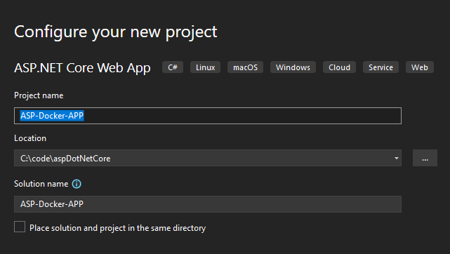

Then ensure you select the following:

* Framework: __.NET 6.0 (Long Term Support)__
* Tick __Enable Docker__
* Docker OS: __Linux__

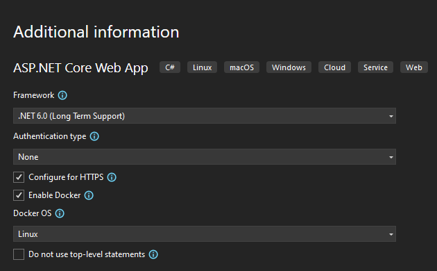

Once the new project has been created you should notice a `Dockerfile` in the root of the solution, which will look as follows:

```dockerfile
FROM mcr.microsoft.com/dotnet/aspnet:6.0 AS base
WORKDIR /app
EXPOSE 80
EXPOSE 443

FROM mcr.microsoft.com/dotnet/sdk:6.0 AS build
WORKDIR /src
COPY ["ASP-Docker-App/ASP-Docker-App.csproj", "ASP-Docker-App/"]
RUN dotnet restore "ASP-Docker-App/ASP-Docker-App.csproj"
COPY . .
WORKDIR "/src/ASP-Docker-App"
RUN dotnet build "ASP-Docker-App.csproj" -c Release -o /app/build

FROM build AS publish
RUN dotnet publish "ASP-Docker-App.csproj" -c Release -o /app/publish /p:UseAppHost=false

FROM base AS final
WORKDIR /app
COPY --from=publish /app/publish .
ENTRYPOINT ["dotnet", "ASP-Docker-App.dll"]
```

There is nothing to change here. This will be used to build the container image before it is pushed to the container registry. Now browse to Pages > Index.cshtml.

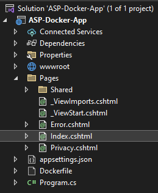

This is optional but I changed the text displayed as follows:

```html
@page
@model IndexModel
@{
    ViewData["Title"] = "Home page";
}

<div class="text-center">
    <h1 class="display-4">ASP.NET Core App running on AKS</h1>
    <p>This containerised ASP.NET Core app is running on an AKS Cluster</p>
</div>
```

Save and close Index.cshtml if applicable.

## Publish Container to ACR

Once you are happy with your APS.NET Core Web App you can publish it to the ACR. You will need to ensure you are signed into Visual Studio with the Account which has access to the Azure Subscriptions you are wanting to deploy to. Once you have signed in, select __Build__ > __Publish__. Select __Docker Container Registry__ and click __Next__.

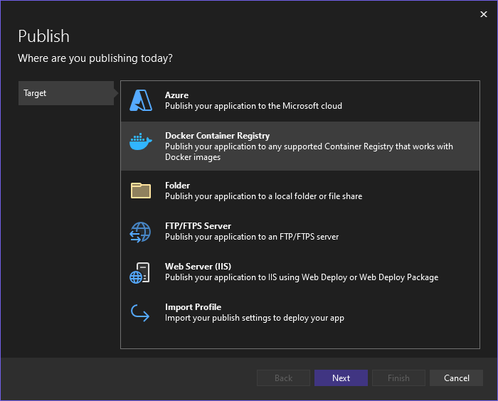

Select __Azure Container Registry__ and click __Next__.

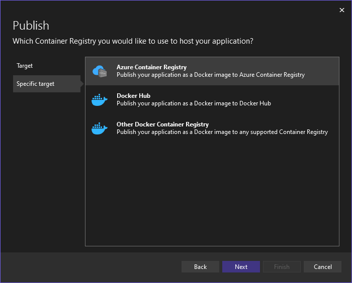

Once you select your Subscription, The registry we created earlier and the resource group it is in should be detected. Select it and click __Finish__.

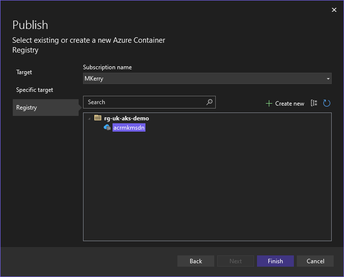

Click __Close__ when prompted.

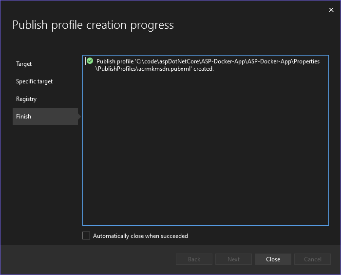

And when you are ready click __Publish__.

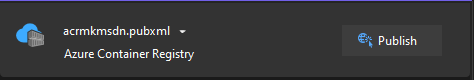

You will see in the Output window the container being built and pushed to the ACR.

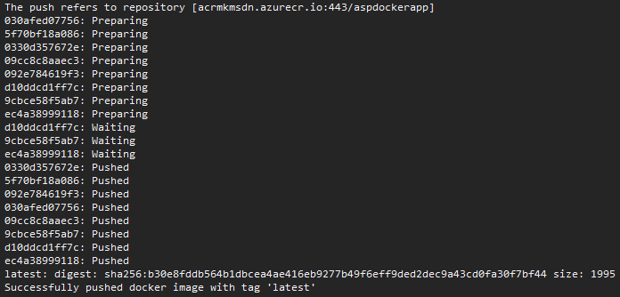

## Deploy Container Image to AKS

Now we can deploy container to the AKS cluster. Start by opening the Azure portal, browsing to the Subscription and opening the Cloud Shell (BASH). We will use the `kubectl` tool to manage the cluster.

You need to gather the credentials in order to interact with the cluster using `kubectl` in Azure Cloud Shell. I used the following command:

```bash
az aks get-credentials --resource-group rg-uk-aks-demo --name aks-uk-demo-msdn
```

You can review the credentials with the following command:

```bash
cat .kube/config
```

> __Note:__ If you forgot to attach the ACR when creating the AKS resource (Like I did the first time), you can attach it after. I had to use the following command: `az aks update -n aks-uk-demo-msdn -g rg-uk-aks-demo --attach-acr acrmkmsdn`

Now in the Cloud Shell, create a new file called deploy.yaml as follows:

```bash
code deploy.yaml
```

Then I pasted in the following Kubernetes Deployment and Service configurations. Note, change yours to match your app name, container name, registry, etc.

```yaml
apiVersion: apps/v1
kind: Deployment
metadata:
  name: asp-docker-app
spec:
  replicas: 2
  selector:
    matchLabels:
      app: asp-docker-app
  template:
    metadata:
      labels:
        app: asp-docker-app
    spec:
      containers:
      - name: asp-docker-app
        image: acrmkmsdn.azurecr.io/aspdockerapp:latest
---
apiVersion: v1
kind: Service
metadata:
  name: asp-docker-app
spec:
  type: LoadBalancer
  ports:
    - port: 80
      targetPort: 80
      protocol: TCP
  selector:
    app: asp-docker-app
```

Once you save and close the code editor, it's finally time to apply the configuration:

```terminal
kubectl apply -f deploy.yaml
```

Notice the deployment and service shows as __created__.

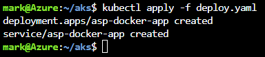

You can run the following commands:

```terminal
kubectl get pods
kubectl get nodes
kubectl get service
kubectl describe deployment
```

Or just run:

```terminal
kubectl get all
```

This will show the pods, services, apps and replica sets.

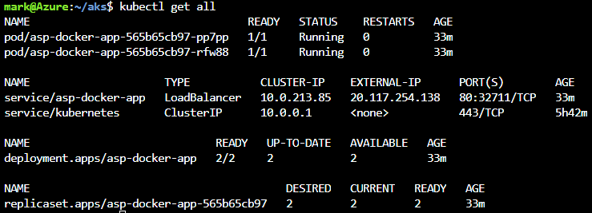

We can see the __EXTERNAL-IP__ of the LoadBalancer above as being 20.117.254.138 and the port as 80. I should now be able to use this to browse the the web app running on AKS.

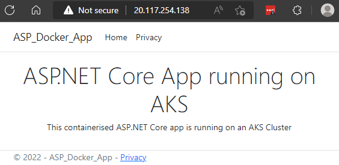

If we head over to the Azure portal, select the AKS resource > Workloads > asp-docker-app, we can see the pods.

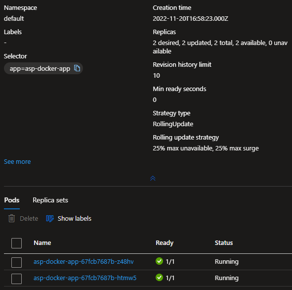

And that's it, the containerised ASP.NET Core Web App is running on the AKS cluster.

## Delete deployment

If you want to clean up the cluster, you can run the following commands:

```terminal
kubectl delete -f deploy.yaml
kubectl delete svc asp-docker-app --namespace=default
```

## Delete the Resources

Don't forget to delete the resources you created if you are not longer using them.
