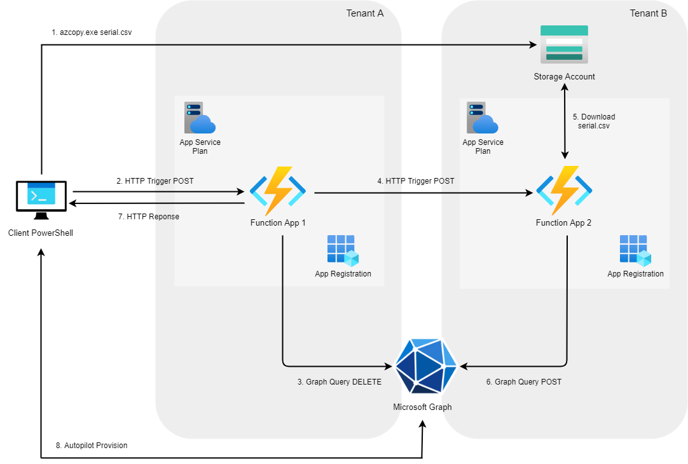

Thanks to [Powers-Hell (Ben)](https://powers-hell.com/2021/06/16/create-advanced-dynamic-groups-with-powershell-azure-functions/) for the handy `Get-AuthHeader` and `Invoke-GraphCall` PowerShell functions.

## Introduction

There may be a scenario where you need all of your Intune managed, Autopilot registered devices setup on a new tenant. But there are a few challenges you will face:

* An OEM may have uploaded every device's hardware hash to Autopilot, so you do not have them to upload to the new tenant.
* An Autopilot device cannot be deleted from the registration service while it's a "managed device" (enrolled in Intune).
* The device will need to be reset and Autopilot provisioned in the new tenant, so setting a machine to wipe, then deleting from one tenant and registering with another, is a manual task which you may fail to complete during the device reset.

This post will provide a high-level overview of the automated process to go from one tenant to another. This can be achieved by sending the hardware hash csv file to an Azure Storage Account, using an Azure Function to de-register from one tenant, another Function to register with another tenant, all while the device is resetting. It assumes you have a good fundamental understanding of Azure Storage, Azure Functions and performing MS Graph queries.

Admittedly, this is a slightly over engineered solution, which quite honestly I don't expect anybody to follow. But it does work and it's fun to see what we can achieve using the Azure cloud and MS Graph. All of the code from this post can be found [here on GitHub](https://github.com/markkerry/automated-autopilot-tenant-move).

A future post will walk through a lower-level, single script method.

## Design Overview

See the drawing below for a full overview of the end-to-end process. In the example below, "Tenant A" is the old, source tenant and "Tenant B" is the new, destination tenant.

1. The end user starts an app from the Company Portal which is a PowerShell script. It exports the hardware hash as it's "serialnumber".csv and posts it to an Azure Storage Account using `azcopy.exe` and a shared access signature (SAS).
2. Then the script posts the device's hostname to Azure Function 1.
3. Azure Function 1 authenticates to graph using an App Registration in Tenant A, deletes the Intune managed device, Autopilot registration, and syncs the Autopilot registration service.
4. Once complete, Function 1 posts the device's serial number in the body of "serialnumber.csv" to Azure Function 2.
5. Azure Function 2 then downloads the "serialnumber.csv" from the Storage Account using a different SAS.
6. Azure Function 2 imports the csv information, authenticates to graph using an App Registration in Tenant B and performs graph queries to register the device and sync the Autopilot registration service.
7. Function 1 sends back the HTTP response to the client.
8. The client completes the script by resetting the device and Autopilot provisioning in Tenant B.

## Resource Requirements

In this section I will go over the requirements of the individual requirements and recommend they get provisioned in this order.

### Tenant B - Storage Account

The Storage Account can sit in either tenant, but as the devices and their hash will belong to Tenant B going forward, makes sense to provision it there. Create as follows:

* __Performance/Access tier__ : Standard/Hot
* __Replication__ : Locally-redundant storage (LRS)
* __Account Kind__ : StorageV2 (general purpose v2)

### Tenant A - SAS Key for Function 2

Function 2, which will be created last requires a SAS to be able to download the csv file from the Storage Account. Create one by browsing to the Azure Portal:

* Select the storage account
* Shared access signature
* __Allowed services__ : Blob
* __Allowed resource types__ : Object
* __Allowed permissions__ : Read
* Set an expiry which works for you
* Click __Generate SAS and connection string__
* Copy the __Blob service SAS URL__ for the function's `$blobUri` variable

### Tenant A - SAS Key for Client Script

The client script will need to include as SAS key to upload the csv to the Storage Account. Create one by browsing to the Azure Portal:

* Select the storage account
* Shared access signature
* __Allowed services__ : Blob
* __Allowed resource types__ : Object
* __Allowed permissions__ : Write
* Set an expiry which works for you
* Click __Generate SAS and connection string__
* Copy the __Blob service SAS URL__ for the client script's `$blobUri` variable (Next step)

### Tenant A - Client Script

> __WARNING - The client script includes code which will wipe the end user device__

You can find the client script on [GitHub](https://github.com/markkerry/automated-autopilot-tenant-move/tree/main/client-script). This will need to wrapped as a win32 app and made available for the end user. After the script is invoked, posted it's hardware hash to the storage account, and triggered the Azure Function, it will reset it's OS.

After creating the Storage Account, the variable `$blobUri` will have to be updated with the __Blob service SAS URL__. And after creating Azure Function 1, the `$uri` variable will need to be updated with the function URL.

### Tenant A - App Registration for Function 1

An Azure AD App Registration is required in order to authenticate and perform Graph queries against Tenant A. In the Azure Portal select __Azure Active Directory / App registrations / New registration__. Then set the following:

* __Name__ : Name the app registration
* __Supported account types__ : Accounts in this organizational directory only
* Click register

To configure the permissions of the app registration, select __API Permissions__:

* Add permission
* Microsoft Graph
* Application permissions
* Select __DeviceManagementManagedDevices.ReadWrite.All__
* Select __DeviceManagementServiceConfig.ReadWrite.All__
* Then __Grant admin consent for "tenant name"__

Now create a client secret for the app registration. Select __Certificates and secrets__:

* New client secret
* __Description__ : Name it yourself
* __Expires__ : Set a time which works for you
* Click __Add__
* Copy the __Value__ somewhere safe to be used for Azure Function 1 (next step)
* Copy the __Application (client) ID__ to be used for Azure Function 1 (next step)

### Tenant A - Azure Function 1

The code for function 1 and can be found here on [GitHub](https://github.com/markkerry/automated-autopilot-tenant-move/tree/main/func1-delete-from-tenant/src). Create the Azure Function in tenant A with the following:

* __Name__ : Name the function
* __Publish__ : Code
* __Runtime stack__ : PowerShell Core
* __Version__ : 7.0
* __Storage account__ : Create new
* __Operating System__ : Windows
* __Plan type__ : Consumption (Serverless)
* __Application Insights__ : Up to you

Then create new function app with the code from [GitHub](https://github.com/markkerry/automated-autopilot-tenant-move/tree/main/func1-delete-from-tenant/src). Once the function has been created, open it and select __Configuration__. Under __Application settings__ create three new application settings as follows:

| Name          | Value                                                  |
| ------------- | ------------------------------------------------------ |
| CLIENT_ID     | The client ID of the app registration you just created |
| CLIENT_SECRET | The secret of the app registration you just created    |
| TENANT_ID     | The name of Tenant A. E.g. contosoa.com                |

### Tenant B - App Registration for Function 2

An Azure AD App Registration is required in order to authenticate and perform Graph queries against Tenant B. In the Azure Portal select __Azure Active Directory / App registrations / New registration__. Then set the following:

* __Name__ : Name the app registration
* __Supported account types__ : Accounts in this organizational directory only
* Click register

To configure the permissions of the app registration, select __API Permissions__:

* Add permission
* Microsoft Graph
* Application permissions
* Select __DeviceManagementServiceConfig.ReadWrite.All__
* Then __Grant admin consent for "tenant name"__

Now create a client secret for the app registration. Select __Certificates and secrets__:

* New client secret
* __Description__ : Name it yourself
* __Expires__ : Set a time which works for you
* Click __Add__
* Copy the __Value__ somewhere safe to be used for Azure Function 2 (next step)
* Copy the __Application (client) ID__ to be used for Azure Function 2 (next step)

### Tenant B - Azure Function 2

The code for function 2 and can be found here on [GitHub](https://github.com/markkerry/automated-autopilot-tenant-move/tree/main/func2-register-to-tenant/src). Create the Azure Function in tenant B with the following:

* __Name__ : Name the function
* __Publish__ : Code
* __Runtime stack__ : PowerShell Core
* __Version__ : 7.0
* __Storage account__ : Create new
* __Operating System__ : Windows
* __Plan type__ : Consumption (Serverless)
* __Application Insights__ : Up to you

Then create new function app with the code from [GitHub](https://github.com/markkerry/automated-autopilot-tenant-move/tree/main/func2-register-to-tenant/src). Once the function has been created, open it and select __Configuration__. Under __Application settings__ create three new application settings as follows:

| Name          | Value                                                  |
| ------------- | ------------------------------------------------------ |
| CLIENT_ID     | The client ID of the app registration you just created |
| CLIENT_SECRET | The secret of the app registration you just created    |
| TENANT_ID     | The name of Tenant B. E.g. contosob.com                |

## Conclusion

Hopefully this gives you a rough idea of what can be achieved using Azure Functions and Microsoft Graph. The functions do not have to be http triggered. They could both be triggered from the csv storage blob. I plan to create a more in-depth post of the same goal but a far simpler process.
