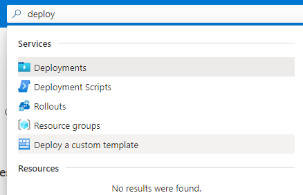
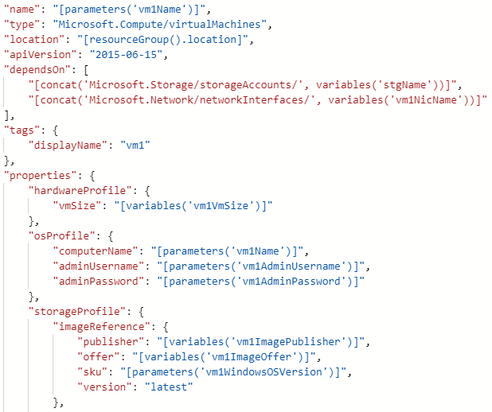
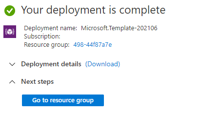

Azure Edit template feature in the portal



then


then


then


then


then


then


then


then


then


then


then


then


then


then



then


then


then


then


then



then


```json
{
    "$schema": "https://schema.management.azure.com/schemas/2019-04-01/deploymentTemplate.json#",
    "contentVersion": "1.0.0.0",
    "parameters": {
        "stgType": {
            "type": "string",
            "defaultValue": "Standard_LRS",
            "allowedValues": [
                "Standard_LRS",
                "Standard_ZRS",
                "Standard_GRS",
                "Standard_RAGRS",
                "Premium_LRS"
            ]
        },
        "vm1Name": {
            "type": "string",
            "minLength": 1
        },
        "vm1AdminUserName": {
            "type": "string",
            "minLength": 1
        },
        "vm1AdminPassword": {
            "type": "securestring"
        },
        "vm1WindowsOSVersion": {
            "type": "string",
            "defaultValue": "2019-Datacenter",
            "allowedValues": [
                "2016-Datacenter",
                "2019-Datacenter",
                "Windows-Server-Technical-Preview"
            ]
        }
    },
    "resources": [
        {
            "name": "vnet1",
            "type": "Microsoft.Network/virtualNetworks",
            "location": "[resourceGroup().location]",
            "apiVersion": "2015-06-15",
            "dependsOn": [],
            "tags": {
                "displayName": "vnet1"
            },
            "properties": {
                "addressSpace": {
                    "addressPrefixes": [
                        "[variables('vnet1Prefix')]"
                    ]
                },
                "subnets": [
                    {
                        "name": "[variables('vnet1Subnet1Name')]",
                        "properties": {
                            "addressPrefix": "[variables('vnet1Subnet1Prefix')]"
                        }
                    },
                    {
                        "name": "[variables('vnet1Subnet2Name')]",
                        "properties": {
                            "addressPrefix": "[variables('vnet1Subnet2Prefix')]"
                        }
                    }
                ]
            }
        },
        {
            "name": "[variables('stgName')]",
            "type": "Microsoft.Storage/storageAccounts",
            "location": "[resourceGroup().location]",
            "apiVersion": "2015-06-15",
            "dependsOn": [],
            "tags": {
                "displayName": "stg"
            },
            "properties": {
                "accountType": "[parameters('stgType')]"
            }
        },
        {
            "name": "[variables('vm1NicName')]",
            "type": "Microsoft.Network/networkInterfaces",
            "location": "[resourceGroup().location]",
            "apiVersion": "2015-06-15",
            "dependsOn": [
                "[concat('Microsoft.Network/virtualNetworks/', 'vnet1')]"
            ],
            "tags": {
                "displayName": "vm1Nic"
            },
            "properties": {
                "ipConfigurations": [
                    {
                        "name": "ipconfig1",
                        "properties": {
                            "privateIPAllocationMethod": "Dynamic",
                            "subnet": {
                                "id": "[variables('vm1SubnetRef')]"
                            }
                        }
                    }
                ]
            }
        },
        {
            "name": "[parameters('vm1Name')]",
            "type": "Microsoft.Compute/virtualMachines",
            "location": "[resourceGroup().location]",
            "apiVersion": "2015-06-15",
            "dependsOn": [
                "[concat('Microsoft.Storage/storageAccounts/', variables('stgName'))]",
                "[concat('Microsoft.Network/networkInterfaces/', variables('vm1NicName'))]"
            ],
            "tags": {
                "displayName": "vm1"
            },
            "properties": {
                "hardwareProfile": {
                    "vmSize": "[variables('vm1VmSize')]"
                },
                "osProfile": {
                    "computerName": "[parameters('vm1Name')]",
                    "adminUsername": "[parameters('vm1AdminUsername')]",
                    "adminPassword": "[parameters('vm1AdminPassword')]"
                },
                "storageProfile": {
                    "imageReference": {
                        "publisher": "[variables('vm1ImagePublisher')]",
                        "offer": "[variables('vm1ImageOffer')]",
                        "sku": "[parameters('vm1WindowsOSVersion')]",
                        "version": "latest"
                    },
                    "osDisk": {
                        "name": "vm1OSDisk",
                        "vhd": {
                            "uri": "[concat('http://', variables('stgName'), '.blob.core.windows.net/', variables('vm1StorageAccountContainerName'), '/', variables('vm1OSDiskName'), '.vhd')]"
                        },
                        "caching": "ReadWrite",
                        "createOption": "FromImage"
                    }
                },
                "networkProfile": {
                    "networkInterfaces": [
                        {
                            "id": "[resourceId('Microsoft.Network/networkInterfaces', variables('vm1NicName'))]"
                        }
                    ]
                }
            }
        }
    ],
    "variables": {
        "vnet1Prefix": "10.0.0.0/16",
        "vnet1Subnet1Name": "Subnet-1",
        "vnet1Subnet1Prefix": "10.0.0.0/24",
        "vnet1Subnet2Name": "Subnet-2",
        "vnet1Subnet2Prefix": "10.0.1.0/24",
        "stgName": "[concat('stg', uniqueString(resourceGroup().id))]",
        "vm1ImagePublisher": "MicrosoftWindowsServer",
        "vm1ImageOffer": "WindowsServer",
        "vm1OSDiskName": "vm1OSDisk",
        "vm1VmSize": "Standard_D1",
        "vm1VnetID": "[resourceId('Microsoft.Network/virtualNetworks', 'vnet1')]",
        "vm1SubnetRef": "[concat(variables('vm1VnetID'), '/subnets/', variables('vnet1Subnet1Name'))]",
        "vm1StorageAccountContainerName": "vhds",
        "vm1NicName": "[concat(parameters('vm1Name'), 'NetworkInterface')]"
    }
}
```