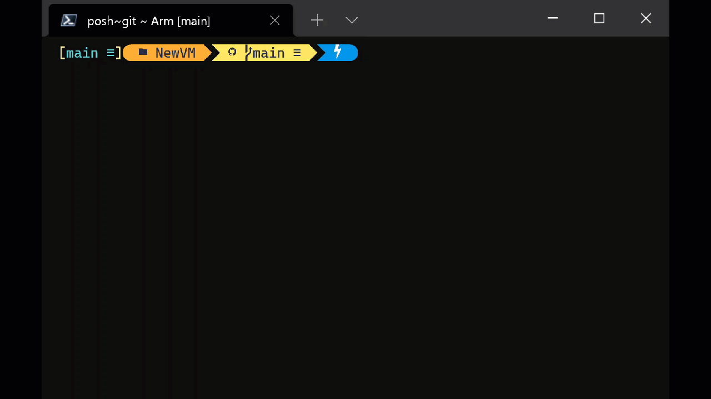

Following on from authoring the ARM template and parameters file in the last post, in this one I will cover testing the ARM template.

Two potential ways to test the ARM templates is by manually building a [Pester](https://pester.dev/docs/quick-start) test. And the other is using Microsoft's [Azure Resource Manager Template Toolkit](https://github.com/Azure/arm-ttk) (arm-ttk) module.

You can run local tests against ARM templates using PowerShell - which I will demonstrate in the post - but most commonly template testing and validating is used during a CI pipeline.

## Pester

Pester is designed for testing and mocking PowerShell code, and is really commonly used in CI pipelines. But that's not what we are using it for here. If something can be achieved in PowerShell, then you can use Pester to evaluate the results to see if they match what you are expecting. So essentially we are asking Pester to get the content of the json file, using PowerShell, and then validate the elements, resources, file format etc, are all what we are expecting.

In the same directory as your ARM template and parameters file, create a new file called `NewVM.test.ps1`. Then paste the contents of the code below into the NewVM.test.ps1 file.

```powershell
Describe 'ARM Template Validation' {

    BeforeAll {
        $TemplatePath = "C:\git\repos\arm-templates\NewVM\NewVM.json"
        $templateRaw = Get-Content -Path $TemplatePath -Raw -ErrorAction SilentlyContinue
        $template = ConvertFrom-Json -InputObject $templateRaw -ErrorAction SilentlyContinue
    }

    Context 'File Validation' {
        It 'Template ARM file exists' {
            Test-Path $TemplatePath -Include "*.json" | Should -Be $true
        }
        It 'Is a valid JSON file' {
            $templateRaw | ConvertFrom-Json -ErrorAction SilentlyContinue | Should -Not -Be $null
        }
    }

    Context 'Template Content Validation' {
        It 'Contains all required elements' {
            $elements = '$schema',
                        'contentVersion',
                        'functions',
                        'outputs',
                        'parameters',
                        'resources',
                        'variables'
            $templateElements = $template | Get-Member -MemberType NoteProperty | ForEach-Object Name
            $templateElements | Should -Be $elements
        }
        It 'Creates the expected resources' {
            $resources = 'Microsoft.Storage/storageAccounts',
                        'Microsoft.Network/publicIPAddresses',
                        'Microsoft.Network/networkSecurityGroups',
                        'Microsoft.Network/virtualNetworks',
                        'Microsoft.Network/networkInterfaces',
                        'Microsoft.Compute/virtualMachines'
            $templateResources = $template.resources.type
            $templateResources | Should -Be $resources
        }
    }
}
```

Run the test

```powershell
# Change directory to the location of the pester file and ARM template
cd "c:\git\repos\Arm\NewVM"

# Import the Pester module
Import-Module -Name Pester

# Run invoke-pester to run every *.test.ps1 file in the current directory
Invoke-Pester -Output Detailed
```



## Azure Resource Manager Template Toolkit

The arm-ttk

From the Azure Resource Manager Template Toolkit (arm-ttk) GitHub repo.

_A little bit about the tests... These are the tests that are used to validate templates for the Azure QuickStart Repo and the Azure Marketplace. The purpose is to ensure a standard or consistent set of coding practices to make it easier to develop expertise using the template language (easy to read, write, debug)._

```powershell
# download the module from github and extract to directory of choice
cd "c:\git\src\arm-ttk"

# Import the arm-ttk module
Import-Module .\arm-ttk.psd1 -Force

# Change directory to the location of the ARM template
cd "c:\git\repos\Arm\NewVM"

# Run the arm-ttk 
Test-AzTemplate -TemplatePath .\NewVM.json
```

