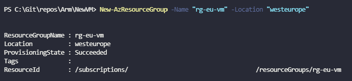
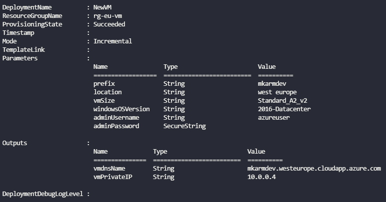

Test

## Deploy

Deploy

```powershell
# Connect to Azure
Connect-AzAccount

# Create the Resource Group
New-AzResourceGroup -Name "rg-eu-vm" -Location "westeurope"
```



``` powershell
# Deploy the resources using the template and parameters file
New-AzResourceGroupDeployment -Name "NewVM" -ResourceGroupName "rg-mk-bicep" -TemplateParameterFile .\NewVM.parameters.json -TemplateFile .\NewVM.json
```



You can list the resource using the command

```powershell
Get-AzResource -ResourceGroupName "rg-eu-vm" | ft
```

## Clean-up Resources

```powershell
Remove-AzResourceGroup -Name "rg-eu-vm"
```
