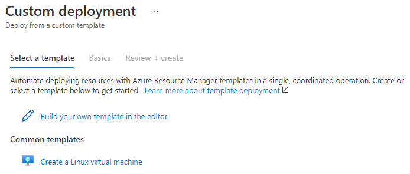
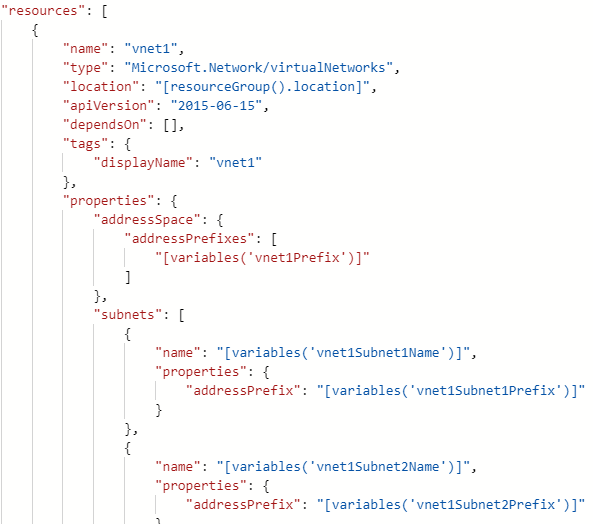
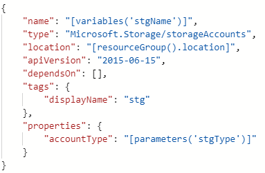
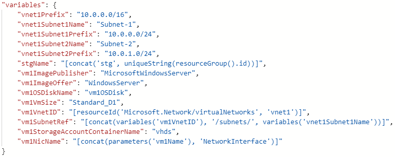
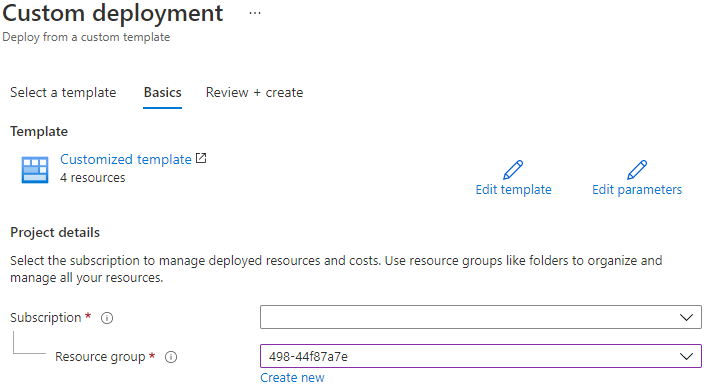
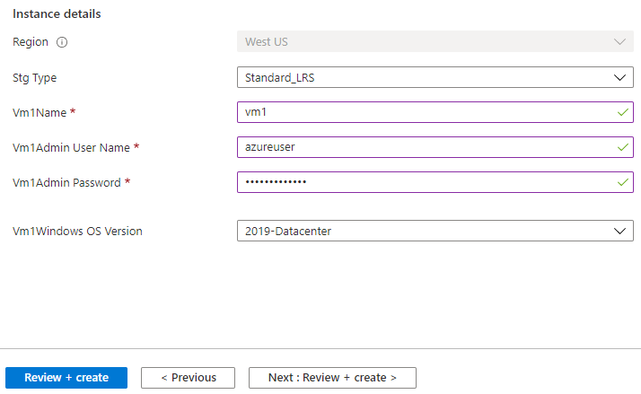

In my [previous posts](https://markkerry.github.io/posts/azure-arm-templates-part-1-development/) I walked through the process to author ARM templates using VS Code and the [Azure Resource Manager (ARM) Tools](https://marketplace.visualstudio.com/items?itemName=msazurermtools.azurerm-vscode-tools) extension. In this post I will walk through the process to author ARM templates from scratch using the Azure portal's Custom Deployment feature. It's handy for getting started with ARM template authoring, but as you will see below, creates resources with old API versions, bloats the variables element, and creates the variables element at the bottom of the template. This isn't exactly a problem, but my preference is to have them towards top of the JSON file above the resources element.

In this ARM template I am are simply going to deploy:

* 1 x Windows Server 2019 Datacenter Virtual Machine
* 1 x Network Interface
* 1 x Virtual Network
* 2 x Subnets
* 1 x Storage Account

## Create the Template

Start by logging into the Azure portal and typing "deploy" into the search bar. Select __Deploy a custom template__.

Click __Build your own template in the editor__.

Once you are in the editor, click __Add resource__.

In the _Select a resource_ drop-down list, select __Virtual network__.

Give it a name. In the example below I simply named it __vnet1__. Click __OK__.

Below you will see the json configuration for the VNet configured for you. Notice the apiVersion of 2015-06-15. I'm unsure why Azure uses this old version.

And scrolling down to the variables part of the template, you can see the values Azure has created by default for the VNet address space and two subnets.

Next, scroll back up to the top of the template and click __Add resource__. In the _Select a resource_ drop-down list, select __Storage Account__ and give it a name. I named mine __stg__. Click __OK__.

Now we have a parameters element containing the storage account type.

Further down you can see the Storage Account resource.

And another variable has been added for the Storage Account name. Notice the name I gave of __stg__ has been concatinated (joined) with a unique string.

Scroll back up to the top of the template and click __Add resource__. In the _Select a resource_ drop-down list, select __Windows Virtual Machine__. I named it __vm1__ and selected and existing Storage Account (stg) and Virtual network (vnet1). Click __OK__.

More parameters have been created for the VM Name, the admin username, admin password, and the OS version. The OS version has a _defaultValue_ of 2019-Datacenter. This is in case the _vm1WindowsOSVersion_ parameter is not specified at time of deployment.

Now looking at the resources section we can see a Network Interface (NIC) has been defined to be added with a subnet specified. The NIC has a dependency on __vnet1__ being created first.

The next resource is the Virtual Machine. This also has two dependencies. The Storage account and the NIC.

So looking at the resource's dependencies, the Storage Account and VNet will probably be created first in parallel, then the NIC will be created once the VNet completes, and finally the VM will be after the Storage Account and NIC are fully provisioned.

And now the variables section contains a load more for the VM. 

Now that the final resource has been created, you can scroll to the top and select __Download__ to save a copy and inspect the JSON file.

## Deploy the Resources

And once you are ready to deploy, at the bottom of the custom template, click __Save__. From the drop-down menus, select the __Subscription__ and __Resource group__ to deploy these resources.

The region will be the location of the resource group you just selected, as specified in the template. The Storage Account is Standard_LRS as specified as the default in the parameters element. And the rest of the VM parameters are populated. Click __Review + create__.

Once the resources have finished deploying click __Go to resource group__.

Then you will be presented with the four resources

## Clean-up the Resources

To clean-up the resources after you are done with them and to avoid any unnecessary spend, delete the Resource Group.

## Summary

As I mentioned at the beginning of the post, authoring ARM templates using the Azure portal's Custom deployment feature is handy for getting started with ARM template authoring, but I don't think provides the best practices for development. This would surely fail any [arm-ttk](https://markkerry.github.io/posts/azure-arm-templates-part-2-testing/#azure-resource-manager-template-toolkit) tests and also lacks the ability to automatically create any advanced features such as functions and loops etc.

The full JSON file for the resources created above can be found [on GitHub](https://github.com/markkerry/arm-templates/blob/main/AzureTemplateEditor.json)
