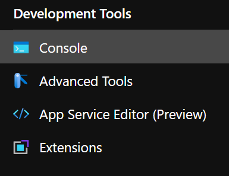
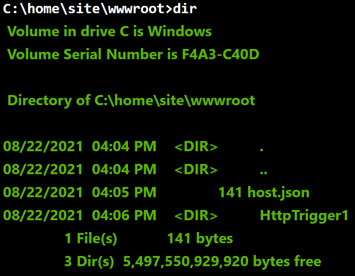
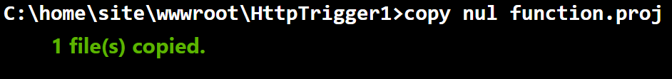
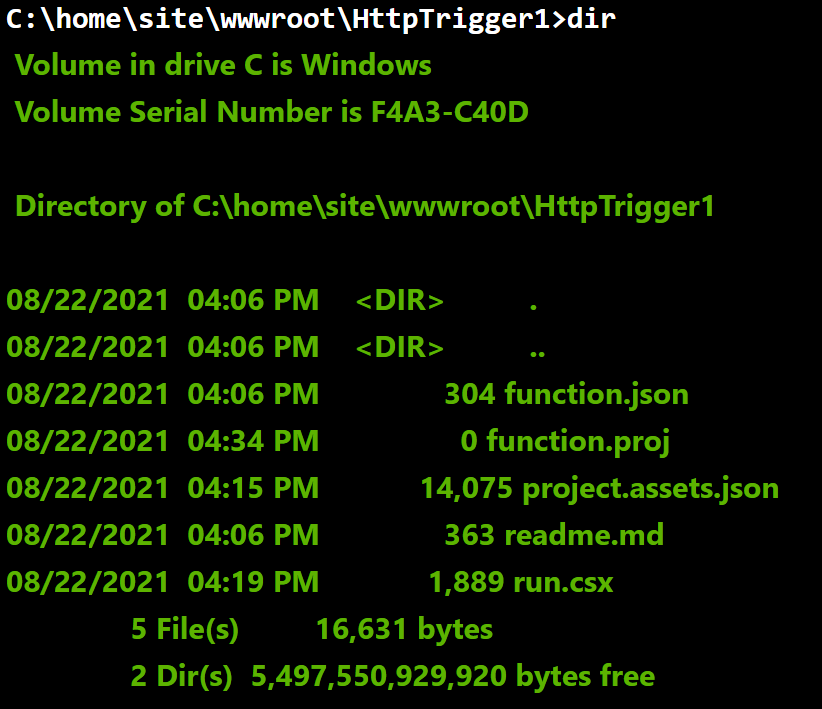
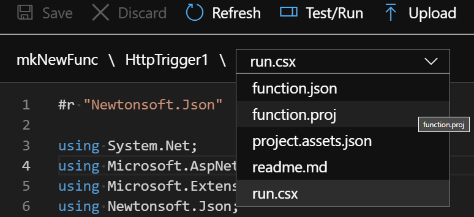
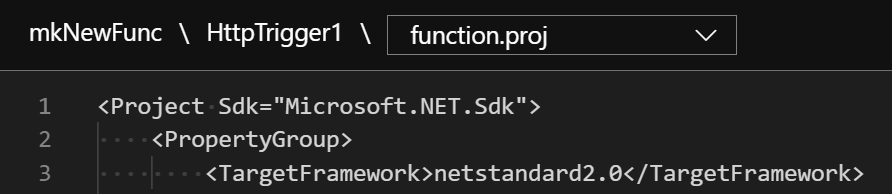
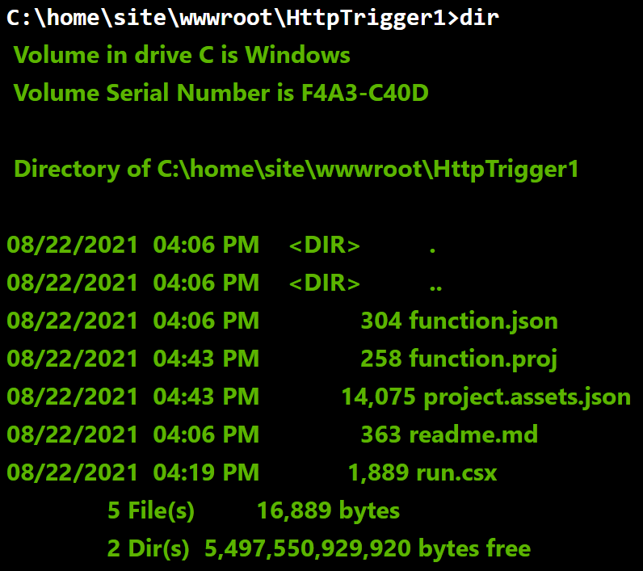

## Introduction

In this short post I will walk through the process to create new files for your Azure Function project, using the __Console__ tool. This may come in handy for people who develop their Azure functions from the Azure portal.

As stated when opening the Console development tool:

_"Manage your web app environment by running common commands ('mkdir', 'cd' to change directories, etc.) This is a sandbox environment, so any commands that require elevated privileges will not work."_

## Getting Started

From the Azure portal, open your function app and under __Development Tools__, select __Console__.



Once you are in the console, type `dir` to display the contents of __wwwroot__



Change directory into the function. My function in the example below was called __HttpTrigger1__ so I typed 

```cmd
cd HttpTrigger1
```

From here I can create a new file called __function.proj__ by typing the following:

```cmd
copy nul function.proj
```



Typing `dir` again I can now see the __function.proj__ file which is zero bytes in size.



Moving back to the function in the portal and selecting __Code + Test__, the new __function.proj__ file is available in the drop-down list of files.



After selecting the file I am able to enter data/code in to the new file and select __Save__ once complete.



And back in the __Console__ again and after navigating to the function root, typing `dir` again will show the __function.proj__ file is now 258 bytes in size.



And files can also be deleted from here using the del command as follows:

```cmd
del function.proj
```

Hopefully this may be of use for people who develop their Azure functions from the Azure portal, or may simply need to test new functionality.