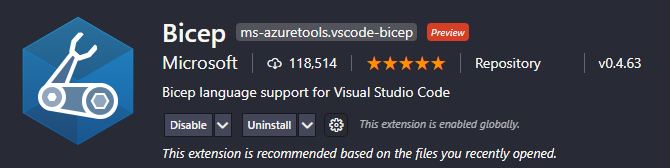

Using the Go container created in a [previous post](https://markkerry.github.io/posts/docker-go-web-app/)

## What are Azure Container Instances

## What is Azure Bicep

## Install Bicep

```bash
# Check your version of Azure CLI
az version

# If it is out of date, upgrade it with
az upgrade  

# Install bicep as follows
az bicep install

# If Bicep is already installed you can ensure it is on the latest version with
az bicep upgrade
az bicep vesion
```

Now install the Bicep Visual Studio Code extension



## Create the Bicep File

```bash
param containerName string = 'go-app'
param location string = 'westeurope'
param imageName string = 'markkerry/go-app:v1'
param cpuCores int = 1
param memoryInGb int = 1

resource containerGroup 'Microsoft.ContainerInstance/containerGroups@2019-12-01' = {
  name: containerName
  location: location
  properties: {
    containers: [
      {
        name: containerName
        properties: {
          image: imageName
          resources: {
            requests: {
              cpu: cpuCores
              memoryInGB: memoryInGb
            }
          }
          ports: [
            {
              protocol: 'TCP'
              port: 3000
            }
          ]
        }
      }
    ]
    restartPolicy: 'OnFailure'
    osType: 'Linux'
    ipAddress: {
      type: 'Public'
      ports: [
        {
          protocol: 'TCP'
          port: 3000
        }
      ]
    }
  }
}

output containerIpv4Address string = containerGroup.properties.ipAddress.ip

```

## Compile the Bicep File

```terminal
az bicep build --file .\containerInstance.bicep  
```

45 line bicep file into an 85 line json. You can find the compiled json file here

## Deploy the ARM Template

```powershell
# Connect to Azure
Connect-AzAccount

# Create the Resource Group
New-AzResourceGroup -Name "rg-eu-ci" -Location "westeurope"
```

```powershell
# Deploy the resources using the template file
New-AzResourceGroupDeployment -Name "go-app" -ResourceGroupName "rg-eu-ci"  -TemplateFile .\containerInstance.json
```

# Test the Container Instance

