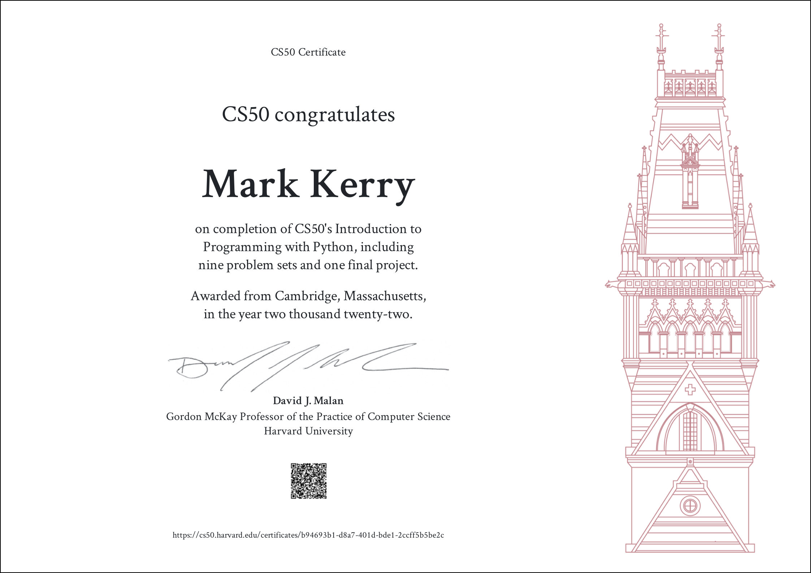

I recently completed [__CS50’s Introduction to Programming with Python__](https://www.edx.org/course/cs50s-introduction-to-programming-with-python) course. It's a really enjoyable, challenging course filled with online lectures and hands-on problem sets to solve. I learned a lot from this course and would highly recommend it to anybody wanting to learn Python. If you are fairly new to Python you will complete the course with a great foundation to further your learning of coding with Python.

## Certificate



## Course Overview

It's a ten part online course covering the following:

* Functions, Variables
* Conditionals
* Loops
* Exceptions
* Libraries
* Unit Tests
* File I/O
* Regular Expressions
* Object-Oriented Programming
* Final Project

After each lecture you are given a "problem set", with a couple of coding challenges to solve based on what you have learned during the lecture.

Find out more [here (edx)](https://www.edx.org/course/cs50s-introduction-to-programming-with-python) and [here (cs50)](https://cs50.harvard.edu/python/2022/).

## Final Project

For my final project I wanted to create a program which will perform a task I am likely use in my role as an infrastructure engineer. So I decided to create a program which queries an API, parses the data and outputs it with the desired fields. This program performs an HTTP GET request against the StackExchange API for the latest questions on StackOverflow, specified by tag, and returns them in appending order of latest activity. The person running the program can specify the tag, count of questions to gather, and whether to output the results as text or a table.

There are two modules/libraries required to install, which are specified in the requirements.txt file.

* pyshorteners
* tabulate

Pyshorteners will take the URL of the post and shorten it to a "tinyurl". Tabulate will output the results to a table if specified.

These can be installed using:

```terminal
pip install -r requirements.txt
```

### Help

Get the programs built-in help as follows:

```terminal
python project.py -h
python project.py --help
```

Will return:

```terminal
usage: project.py [-h] [-t TAG] [-c COUNT] [-o {text,table}]

Get the latest Stack Overflow questions from desired 'tag'

optional arguments:
  -h, --help            show this help message and exit
  -t TAG, --tag TAG     Subject tag to search for E.g. 'python', 'c' or 'cs50'
  -c COUNT, --count COUNT
                        Number of items to show
  -o {text,table}, --output {text,table}
                        Output as text or table
```

Argparse does have some defaults if the user does not specify any arguments, for example `python project.py`. The tag is set to `CS50`, the count is set to `10`, and the output is set to `text`

### Example 1

In the following example I will specify the tag as `CS50`, the count to return as `3` and to output as a `table`

```terminal
 python project.py -t CS50 -c 3 -o table
```

Will return a table similar to as follows:

```terminal
Gathering information... Tag CS50, count 3, output table

╒══════════════════════════════════════════════════════════════════════╤══════════════════════════════╤═════════════════════╤══════════════════════╕
│ Title                                                                │ URL                          │ Creation Date       │ Last Activity Date   │
╞══════════════════════════════════════════════════════════════════════╪══════════════════════════════╪═════════════════════╪══════════════════════╡
│ Why can an array used in fread/fwrite in a position of a buffer b... │ https://tinyurl.com/2aw4wtpq │ 2022-06-13 19:29:28 │ 2022-06-16 13:28:07  │
├──────────────────────────────────────────────────────────────────────┼──────────────────────────────┼─────────────────────┼──────────────────────┤
│ cs50 Pset5 Speller segmentation fault and memory leaks               │ https://tinyurl.com/26jf8v4b │ 2022-06-15 16:43:06 │ 2022-06-16 06:37:10  │
├──────────────────────────────────────────────────────────────────────┼──────────────────────────────┼─────────────────────┼──────────────────────┤
│ CS50 Speller - Check function stops working after finding first 4... │ https://tinyurl.com/262acu3v │ 2022-06-15 19:41:01 │ 2022-06-15 22:52:00  │
╘══════════════════════════════════════════════════════════════════════╧══════════════════════════════╧═════════════════════╧══════════════════════╛
```

### Example 2

The same command but this time to return the output as `text`

```terminal
 python project.py -t CS50 -c 3 -o text
```

Will return text similar to as follows:

```terminal
Gathering information... Tag CS50, count 3, output text

Title: Why can an array used in fread/fwrite in a position of a buffer b...
URL: https://tinyurl.com/2aw4wtpq
Creation date: 2022-06-13 19:29:28
Last activity date 2022-06-16 13:28:07

Title: cs50 Pset5 Speller segmentation fault and memory leaks
URL: https://tinyurl.com/26jf8v4b
Creation date: 2022-06-15 16:43:06
Last activity date 2022-06-16 06:37:10

Title: CS50 Speller - Check function stops working after finding first 4...
URL: https://tinyurl.com/262acu3v
Creation date: 2022-06-15 19:41:01
Last activity date 2022-06-15 22:52:00
```

### Example 3

If you enter a `tag` which does not exist:

```terminal
 python project.py -t footag -c 3 -o text
```

The program will return the following:

```terminal
No posts for tag footag found. Try another
```

> __NOTE__: _It can take some time to convert the URL to a tinyurl. So the higher the count, the longer it takes for the program to run. If you specify a count of greater than 25 your will receive the following_
>>  

```terminal
python project.py -t java -c 50 -o text

A count of 50 is too many and will take some time. Try 25 or less.
```

## Video Demonstration

To submit the final project, you must provide a link to a video demonstration. Mine can be found below.



## Source Code

https://github.com/markkerry/CS50P-Final-Project/tree/main/project
