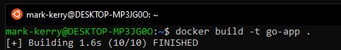
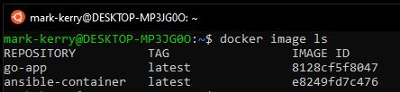
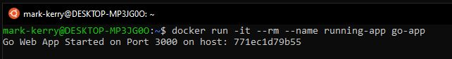

In this post, I walk through creating a simple Go web app that runs in a Docker container, and lists the hostname of the container it's running in. I chose Go as I've recently gotten started writing code in Go and it's a lot of fun to work with.

The container will install Go, so there is no need to install it locally on your machine. Docker is a prerequisite, however.

First, lets take a look at the folder structure of where to keep your `dockerfile` and `main.go` code.

## Folder Structure

```terminal
~/dockerfile
~/go/src/app/main.go
```

## dockerfile

The dockerfile contains the instruction of how to build our docker image and the app to run when the container is created from the image. Let's start by creating the dockerfile:

```teminal
cd ~
touch dockerfile
```

Here I referenced the following [Docker/Golang](https://hub.docker.com/_/golang) official image documentation. Using your favourite code editor, modify the contents of the dockerfile to look as follows:

```docker
FROM golang:1.14

WORKDIR /go/src/app
COPY . .

RUN go get -d -v ./...
RUN go install -v ./...

CMD ["app"]
```

## main.go

Now let's create the main.go file and the folder structure to store it.

```termial
mkdir ~/go
mkdir ~/go/src
mkdir ~/go/src/app
touch ~/go/src/app/main.go
```

Here is the contents of the main.go file:

```go
package main

import (
  "fmt"
  "net/http"
  "os"
)

func homePage(w http.ResponseWriter, r *http.Request) {
    hostname, err := os.Hostname()
	if err != nil {
		fmt.Println(err)
		os.Exit(1)
	}
    fmt.Fprintf(w, "Go App running on host: %s\n", hostname)
}

func setupRoutes() {
    http.HandleFunc("/", homePage)
}

func main() {
    hostname, err := os.Hostname()
	if err != nil {
		fmt.Println(err)
		os.Exit(1)
	}
    fmt.Printf("Go Web App Started on Port 3000 on host: %s\n", hostname)
    setupRoutes()
    http.ListenAndServe(":3000", nil)
}
```

## Build the Container

To build the container, ensure you are in the `~/` directory which hosts your dockerfile, then type the following.

```bash
docker build -t go-app .
```



Let's take a look at the container image by running:

```terminal
docker image ls
```

I have two docker containers in my example. The one we just created is called __go-app__ with an _IMAGE ID_ of __8128cf5f8047__.



## Run the Container

Finally, let's run the container from the image, but ensure we automatically delete the container after it is stopped.

```bash
docker run -it --rm --name running-app go-app
```



Now browse to http://localhost:3000 to see the running container in your browser

## Wrapping Up

Click `ctrl + c` to cancel out of the interactive container session.

Running `docker container ls` will show the container not only is no longer running, but was also deleted after it was stopped.

If you want to delete the image, get the IMAGE ID by running `docker image ls`, then running the following (8128cf5f8047 in my example is the IMAGE ID):

```terminal
docker image rm 8128cf5f8047
```

Next I plan the create a container which does something else than simply run a web page stating the host of the container it is running in. But this does feel like a nice first step when progressing towards Docker Swarm or Kubernetes, where I will hopefully look to deploy to an Azure Container Instance or Azure Kubernetes Service.
