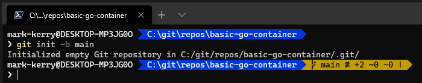
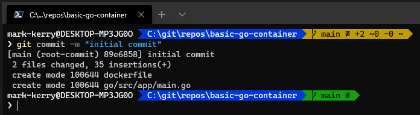
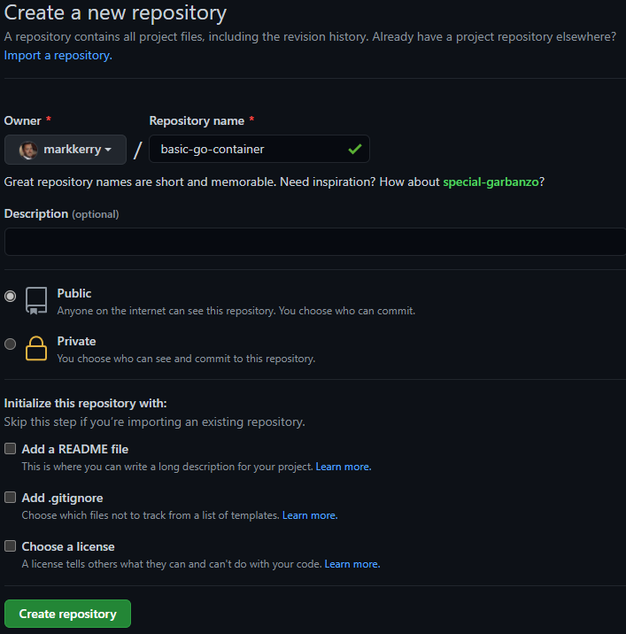
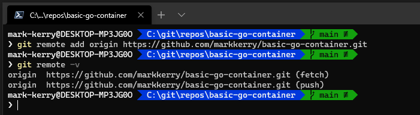
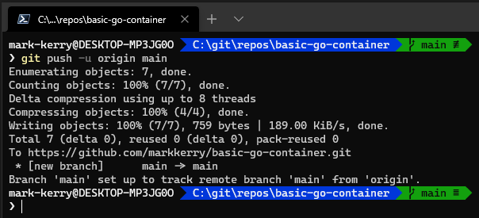
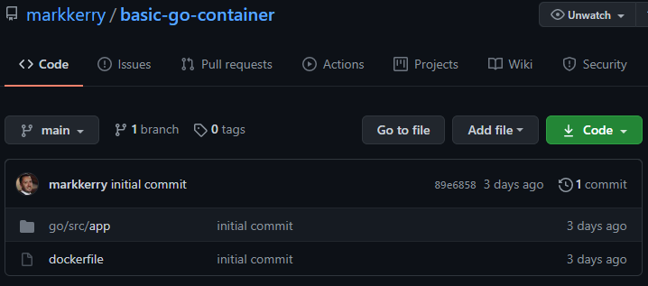
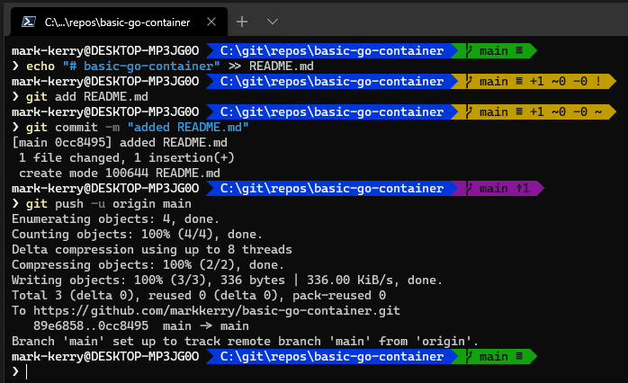
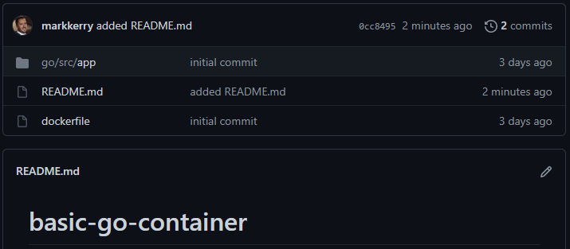

Here are some basics. I'm going to push the code from my [last post](https://markkerry.github.io/posts/docker-go-web-app/) to GitHub. In this example I am using PowerShell with Git and GitHub Desktop already installed. You will have to ensure you sign into GitHub Desktop with your GitHub account.

Tip: You can install and import the PowerShell module [posh-git](https://www.powershellgallery.com/packages/posh-git/1.0.0) for the Git summary status info to display in your terminal.

<br>

## Directory Structure

In the following example, I created my new repository I want to push to GutHub in `C:\git\repos\` and created a new folder called `basic-go-container`.

```terminal
cd C:\git\repos\
mkdir basic-go-container
```

The contents of the folder is as follows

```terminal
dockerfile
└─go
  └─src
     └─app
       main.go
```

Change directory into the newly created directory

```terminal
cd C:\git\repos\basic-go-container
```

<br>

## Initialise the Branch

You can initialise a new Git repository and call the initial branch __main__ as follows:

```git
git init -b main
```

Notice the Git summary status in the terminal changes as the locally installed Git application and posh-git module recognises the current directory is a Git repository.



The +2 shows that there are two new added files (dockerfile and main.go), but the "!" means they are un-tracked. Now we can change that.

## First Commit

Track all the files within the repo and make the initial commit.

```git
git add *
git commit -m "initial commit"
```

After `git add *` the "!" in the prompt changes to "~", which means there are uncommitted changes. After `git commit` the status turns green as there are currently no un-tracked or uncommitted changes pending.



<br>

## Create the GitHub Repository

Here, I logged into my GitHub account and created a new, public repository called __basic-go-container__. I can add a README file here but will do that later.



## Define the Remote Repository

Next, I have to define the remote repository where I want to push the local repo to. I'm using my markkerry GitHub account and the new repo I just created.

```git
git remote add origin https://github.com/markkerry/basic-go-container.git

# Now let's verify it
git remote -v
```



<br>

## Push to GitHub

It's time to push the locally committed changes to the remote GitHub repo. The -u option automatically sets that upstream for you, linking your repo to a central one

```git
git push -u origin main
```



You can see the newly create repo in GitHub.



<br>

## Additional Commits

Now let's create a `README.md` file with a bold H1 header of __basic-go-container__. Then we'll add the file, commit the change, and push to GitHub.

```terminal
echo "# basic-go-container" >> README.md
git add README.md
git commit -m "added README.md"
git push -u origin main
```



If you refresh GitHub you can see the README.md file in the repo.



Finally, I'll add simple instructions within README.md of what to do with the dockerfile and main.go files.
