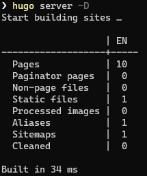
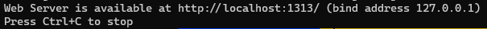
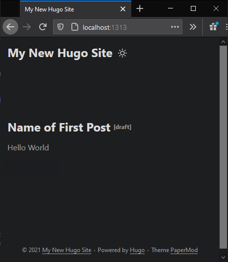

Assuming at this stage you have installed all the prerequisite apps required in Part 1 to get started with HUGO: Git, GitHub Desktop, and HUGO.

The Official [HUGO getting started](https://gohugo.io/getting-started/quick-start/) docs are a great resource to read through and recommend you get started there if you are having any trouble following the below.

<br>

### Create the Site

Browse to your local directory where you want to keep the site's source files, and enter the following commands to create the site (change markkerry to your GitHub username).

```terminal
# Browse to the directory
cd c:\git\repos

# Use the hugo command to create a new site
hugo new site markkerry-hugo

# Create the repo
cd markkerry-hugo

# initialise the repo
git init -b main
```

I used PaperMod as my theme so let's install it now.

```terminal
git clone https://github.com/adityatelange/hugo-PaperMod themes/PaperMod --depth=1

# Browse to themes\PaperMod and delete the .git directory
```

Now open the `config.toml` file, set the theme as PaperMod and save the file. Note, here you can change the title of the site to something that is appropriate to you. See below:

```terminal
baseURL = "http://example.org/"
languageCode = "en-us"
title = "My New Hugo Site"
theme = "PaperMod"
```

<br>

### Create Your First Post

Now it's time to create our first post by running the following `hugo` command:

```
hugo new posts/name-of-first-post.md
```

This will be created in the content/posts directory. Edit the name-of-first-post.md and add some text. I added Hello World. Notice that the "draft" is set to true. This means that the page will not display in GitHub Pages as HUGO does not deploy drafts. Once you are happy with the post change "draft" to false.

```terminal
---
title: "Name of First Post"
date: 2021-03-28T16:23:28Z
draft: true
---

Hello World
```

<br>

### Running the Site Locally

Let's test the site by running it locally to see how it looks. `-D` means with drafts enabled.

```terminal
hugo server -D
```



Notice at the bottom it states the Web Server is running on localhost port 1313. 



Browse to http://localhost:1313 to see how the site looks when it is built. Press Ctrl+C to stop the site running when you are done.



And there it is displaying the first post and the Hello World content. Next steps will be to build the site and then upload the output to a hosting service. But I'm next going to cover pushing this un-built content to GitHub and having a GitHub action run the `hugo` commands which build the site. And finally have the GitHub action push the built output directory to the _username_.github.io repo.

<br>

### Next Parts

* [Part 3: Build and Deploy](https://markkerry.github.io/posts/hugo-and-github-pages-part3/)