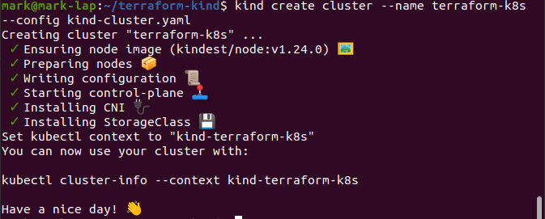
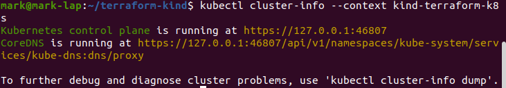
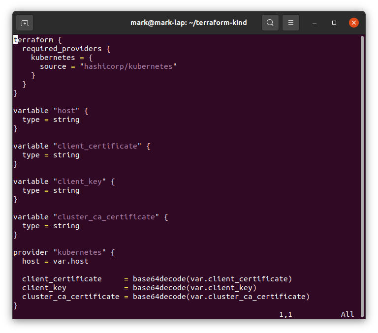
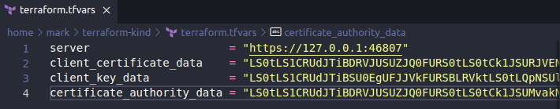
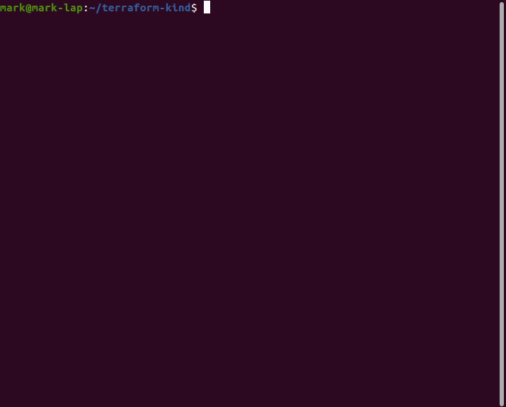
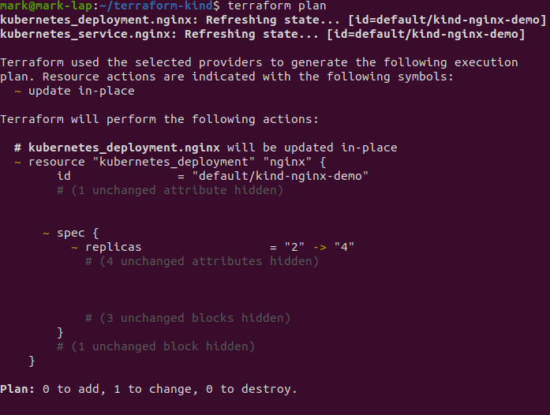

## Install Terraform

```terminal
curl -fsSL https://apt.releases.hashicorp.com/gpg | sudo apt-key add -

sudo apt-add-repository "deb [arch=amd64] https://apt.releases.hashicorp.com $(lsb_release -cs) main"

sudo apt-get update && sudo apt-get install terraform

terraform version
```

## Install Go

```terminal
cd ~/Downloads

curl https://go.dev/dl/go1.18.3.linux-amd64.tar.gz -o go1.18.3.linux-amd64.tar.gz

sudo rm -rf /usr/local/go && sudo tar -C /usr/local -xzf go1.18.3.linux-amd64.tar.gz

export PATH=$PATH:/usr/local/go/bin

go version
```

## Install Docker

[See post](https://markkerry.github.io/posts/2022/03/ubuntu-kubernetes-virtualbox/#install-docker)

## Install Kind

```terminal
sudo mkdir /usr/local/kind
curl -Lo /usr/local/kind//kind https://kind.sigs.k8s.io/dl/v0.14.0/kind-linux-amd64
sudo chmod +x /usr/local/kind/kind
export PATH=$PATH:/usr/local/kind
```

## Install Kubectl

```terminal
sudo curl -fsSLo /usr/share/keyrings/kubernetes-archive-keyring.gpg https://packages.cloud.google.com/apt/doc/apt-key.gpg

echo "deb [signed-by=/usr/share/keyrings/kubernetes-archive-keyring.gpg] https://apt.kubernetes.io/ kubernetes-xenial main" | sudo tee /etc/apt/sources.list.d/kubernetes.list

sudo apt update
sudo apt install -y kubectl
```

## Download config

```terminal
mkdir ~/terraform-kind && cd ~/terraform-kind

curl https://raw.githubusercontent.com/markkerry/ubuntu-config/main/kind/main.tf -o main.tf

curl https://raw.githubusercontent.com/markkerry/ubuntu-config/main/kind/kind-cluster.yaml -o kind-cluster.yaml
```

## Provision Kind Cluster

```terminal
kind create cluster --name kind-terraform-k8s --config kind-cluster.yaml
```



```terminal
kubectl cluster-info --context kind-terraform-k8s
```



## Manage Cluster with Terraform

Next need to create a `terraform.tfvars` file to populate the variables in the main.tf file below



to do this we can gather the information

```terminal
touch terraform.tfvars
```

```terraform
host = ""
client_certificate = ""
client_key = ""
cluster_ca_certificate = ""
```

Run the following command:

```terminal
kubectl config view --minify --flatten --context=kind-terraform-k8s
```

Copy the output into the following of the terraform.tfvars file

* Copy the `server:` URL in to the `server` variable
* Copy the `client-certificate-data:` data into the `client_certificate_data` variable
* Copy the `client-key-data:` data into the `client_key_data` variable
* copy the `certificate-authority-data:` data into the `certificate_authority_data` variable

Perform a `terraform fmt` and then your `terraform.tfvars` file should look something like the following



Initialise the terraform working directory

```terminal
terraform init
```

```terminal
terraform apply
```



```terminal
$ kubectl get pods
NAME                               READY   STATUS    RESTARTS   AGE
kind-nginx-demo-77697f8f5b-478nt   1/1     Running   0          2m37s
kind-nginx-demo-77697f8f5b-pzzl9   1/1     Running   0          2m37s
```

change main.tf from 2 to 4 pods

```terminal
terraform plan
```



```terminal
terraform apply
```

```terminal
$ kubectl get pods
NAME                               READY   STATUS    RESTARTS   AGE
kind-nginx-demo-77697f8f5b-478nt   1/1     Running   0          3m32s
kind-nginx-demo-77697f8f5b-6r2xk   1/1     Running   0          13s
kind-nginx-demo-77697f8f5b-cwfz6   1/1     Running   0          13s
kind-nginx-demo-77697f8f5b-pzzl9   1/1     Running   0          3m32s
```


```terminal
$ kubectl get services
NAME              TYPE        CLUSTER-IP      EXTERNAL-IP   PORT(S)        AGE
kind-nginx-demo   NodePort    10.96.149.238   <none>        80:30001/TCP   5m46s
kubernetes        ClusterIP   10.96.0.1       <none>        443/TCP        10m
```

```terminal
terraform destroy
```

```terminal
kind delete cluster --name kind-terraform-k8s
```