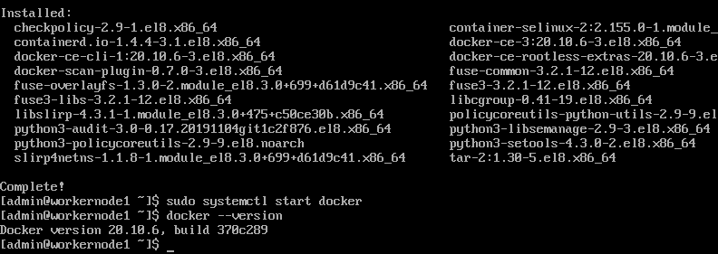
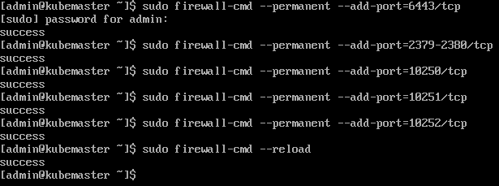
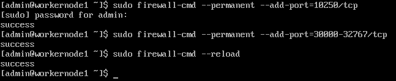

Going to be using Docker as the container runtime

https://kubernetes.io/docs/setup/production-environment/container-runtimes/#docker

https://docs.docker.com/engine/install/centos/

## Install Docker - DONE

Let's get started by installing Docker on the workernodes

```bash
# Set up the repository
sudo yum install -y yum-utils

sudo yum-config-manager \
    --add-repo \
    https://download.docker.com/linux/centos/docker-ce.repo

# Install Docker Engine
sudo yum install docker-ce docker-ce-cli containerd.io

# Start Docker
sudo systemctl start docker
```



<br>

## From kubemaster - DONE

https://kubernetes.io/docs/setup/production-environment/tools/kubeadm/install-kubeadm/

## Ensure iptables can see bridges traffic - DONE

```bash
cat <<EOF | sudo tee /etc/modules-load.d/k8s.conf
br_netfilter
EOF

cat <<EOF | sudo tee /etc/sysctl.d/k8s.conf
net.bridge.bridge-nf-call-ip6tables = 1
net.bridge.bridge-nf-call-iptables = 1
EOF

sudo sysctl --system
```


## Firewall ports - DONE 

https://kubernetes.io/docs/setup/production-environment/tools/kubeadm/install-kubeadm/#control-plane-node-s

### Kubemaster

| Protocol | Direction | Port Range | Purpose                 | Used By              |
| -------- | --------- | ---------- | ----------------------- | -------------------- |
| TCP      | Inbound   | 6443*      | Kubernetes API server   | All                  |
| TCP      | Inbound   | 2379-2380  | etcd server client API  | kube-apiserver, etcd |
| TCP      | Inbound   | 10250      | kubelet API             | Self, Control plane  |
| TCP      | Inbound   | 10251      | kube-scheduler          | Self                 |
| TCP      | Inbound   | 10252      | kube-controller-manager | Self                 |

This can be achieved in CentOS with the following commands:

```bash
sudo firewall-cmd --permanent --add-port=6443/tcp
sudo firewall-cmd --permanent --add-port=2379-2380/tcp
sudo firewall-cmd --permanent --add-port=10250/tcp
sudo firewall-cmd --permanent --add-port=10251/tcp
sudo firewall-cmd --permanent --add-port=10252/tcp
sudo firewall-cmd --reload
```



### Workernodes

| Protocol | Direction | Port Range  | Purpose           | Used By             |
| -------- | --------- | ----------- | ----------------- | ------------------- |
| TCP      | Inbound   | 10250       | kubelet API       | Self, Control plane |
| TCP      | Inbound   | 30000-32767 | NodePort Services | All                 |

```bash
sudo firewall-cmd --permanent --add-port=10250/tcp
sudo firewall-cmd --permanent --add-port=30000-32767/tcp
sudo firewall-cmd --reload
```



## Installing kubeadm - TO DO

Disable swap

```bash
# Disable swap
swapoff -a

# Update repo info
cat <<EOF | sudo tee /etc/yum.repos.d/kubernetes.repo
[kubernetes]
name=Kubernetes
baseurl=https://packages.cloud.google.com/yum/repos/kubernetes-el7-\$basearch
enabled=1
gpgcheck=1
repo_gpgcheck=1
gpgkey=https://packages.cloud.google.com/yum/doc/yum-key.gpg https://packages.cloud.google.com/yum/doc/rpm-package-key.gpg
exclude=kubelet kubeadm kubectl
EOF

# Set SELinux in permissive mode to disable it
sudo setenforce 0
sudo sed -i 's/^SELINUX=enforcing$/SELINUX=permissive/' /etc/selinux/config

# Install kubelet, kubeadm, and kubectl
sudo yum install -y kubelet kubeadm kubectl --disableexcludes=kubernetes

# Enable kubelet
sudo systemctl enable --now kubelet
```

## Create the Cluster
