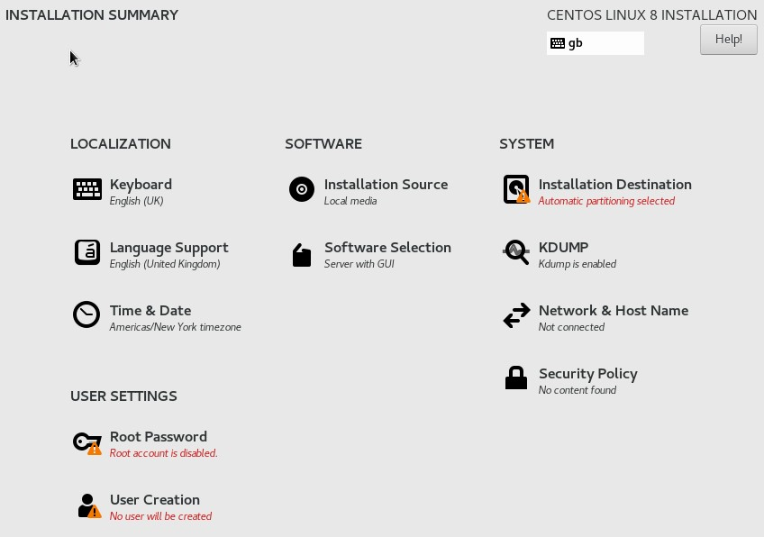

I wanted to start learning the basics of Kubernetes. In this first post I will detail the initial setup of the Virtual Machines in a lab environment. I used Hyper-V on Windows 10, connected to a "Default switch" (internal), and running 3x CentOS 8 as the Kubemaster and worker nodes.

This guide assumes you at least have a _basic_ knowledge of configuring virtual machines and the Linux command line.

[Centos 8 can be downloaded from here](https://www.centos.org/download/)

Network configuration

| Server      | IP Address      | Gateway     |
| ----------- | --------------- | ----------- |
| kubemaster  | 172.26.32.19/16 | 172.26.32.1 |
| workernode1 | 172.26.32.20/16 | 172.26.32.1 |
| workernode2 | 172.26.32.21/16 | 172.26.32.1 |

Hyper-V setup. 3 x Virtual Machines as follows

| Hyper-V Configuration | Value    |
| --------------------- | -------- |
| VM OS                 | CentOS 8 |
| vCPU                  | 2        |
| Ram                   | 2048 MB  |
| Disk size             | 20 GB    |
| Generation            | 2        |
| Secure Boot           | Disabled |
| Automatic Checkpoints | Disabled |

---

## 1. Installing CentOS 8

Power on the first Virtual machine and boot from the CentOS ISO. Start by selecting the language and keyboard layout you want to install

Next you will be taken to the __INSTALLATION SUMMARY__ page



Select __Installation Destination__, ensure the local disk is selected then click done.


Now select __Software Selection_. We want the Base Environment to be __Minimal Install_, select it then click done.


Back on the INSTALLATION SUMMARY page, select __Network & Host Name__. First switch __Ethernet (eth0)__ to __ON__, then enter the Host Name as Kubemaster and click done. NOTE: the image below was taken when creating workernode1.


Select __Root Password__ and create a root password. Click done when complete.

Lastly, select __User Creation__. Enter the __Full name__ and __User name__ as admin, tick "Make this user administrator", and enter a password for it. I set mine the same as the root password as it's only a lab environment. Click done when ready.


Now click _Begin Installation" if the INSTALLATION SUMMARY page should look as follows:


Once the installation is complete you can log into the VM with admin username and password. First job will be to update the OS which can be achieved with the following command

```terminal
sudo yum update
```

After the updates are all installed you can either move onto the next part for the kubemaster VM, or complete part 1 again for workernode1 and workernode2.

---

## 2. Setting a Static IP

The next important steps will be to configure static IPs and in part 3, configure the hosts file. The following will instruct you how to do this with the kubemaster VM's IP address. To follow this again for the workernodes, change the IP accordingly.

First backup the resolve.conf file

```terminal
sudo cp /etc/resolv.conf /etc/resolv.conf.backup
```

Next we need to set the static IP in the ifcfg-eth0 file

```terminal
cd /etc/sysconfig/network-scripts/
sudo vi ifcfg-eth0
```

Press the insert key to modify the file, change BOOTPROTO from dhcp to static and add the IPADDR.

```terminal
BOOTPROTO=static
IPADDR=172.26.32.19
```

Once complete, you can save you changes by pressing the Esc key then

```terminal
:wq!
```

Next, modify the network file as follows

```terminal
sudo vi /etc/sysconfig/network
```

Add the following to the file

```terminal
NETWORKING=yes
GATEWAY=172.26.32.1
```

Once complete, you can save you changes by pressing the Esc key then

```terminal
:wq!
```

Now reboot the machine. I recommend from here you complete configuring all three VMs before moving onto the next part.

---

## 3. Update the hosts File

Updating the hosts files allows for communication over hostname rather than IP address. Change the hosts file on each machine as follows:

```terminal
sudo vi /etc/hosts
```

Add the following:

```terminal
172.26.32.19 kubemaster
172.26.32.20 workernode1
172.26.32.21 workernode2
```

Once complete, you can save you changes by pressing the Esc key then

```terminal
:wq!
```

---

## 4. CentOS Firewall

---

## 5. Generate a SSH Key Pair

To enable us to easily access the worker nodes from the kubemaster for system administration, and possibly configuration management with Ansible it a later date, we can easily setup an SSH key-pair as follows:

From the Kubemaster, create the ssh key-pair as follows

```terminal
ssh-keygen -t rsa -b 4096
```

Press Enter to accept the key to be saved in '/home/admin/.ssh' and do not specify a passphrase. Then use the following command to copy to workernode1 and workernode2:

```termial
ssh-copy-id admin@workernode1
ssh-copy-id admin@workernode2
```

Test by connecting to the machine via SSH

```terminal
ssh admin@workernode2
```
