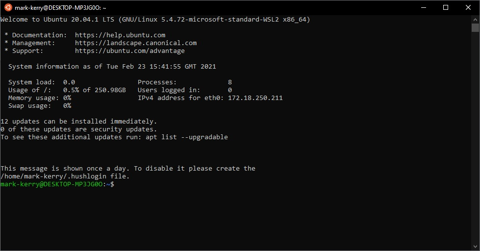

If you scroll to the bottom of any page of this site, you will notice the words "Powered by [Hugo](https://gohugo.io)", and all posts generated in a Hugo static web app are written in markdown. Having owned a [Github](https://github.com/markkerry) account for a few years now, I have some experience writing readme files in markdown. 

Here is my quick reference for writing in Markdown.

<br>

## Headers

```markdown
# Header 1
## Header 2
### Header 3
```

Display as follows:

# Header 1

## Header 2

### Header 3

---

<br>

## Code Snips

Add a code snippets by wrapping it in three backticks (```) above and below the code.

And the following will display:

```PowerShell
$uptime = Get-ComputerInfo | Select-Object OSUptime
if ($Uptime.OsUptime.Days -ge 7) {
    Write-Output "Device has not rebooted in $($Uptime.OsUptime.Days) days"
    Write-Output "Non-Compliant"
    exit 1
}
else {
    Write-Output "Device has rebooted $($Uptime.OsUptime) days ago"
    Write-Output "Compliant"
    exit 0
}
```

---

<br>

## Bold and Italics

Bold __text__ can be defined in **two** different ways. Using double underscores `'__'` or double asterisk `'**'`

```
Bold __text__ can be defined in **two** different ways
```

Italic _text_ can be defined in *two* different ways. Using single underscores `'_'` or single asterisk `'*'`

```
Italic _text_ can be defined in *two* different ways
```

---

<br>

## Lists

Ordered lists as follows

```
1. Item 1
1. Item 2
1. Item 3
```

1. Item 1
1. Item 2
1. Item 3


Unordered lists

```
* Item 1
* Item 2
  * Item 2a
  * Item 2b
```

* Item 1
* Item 2
  * Item 2a
  * Item 2b

  ---

<br>

## Images

```

```


<br>

## Links

Links can be written as follows:

```
link to [Github](https://github.com/markkerry)
```

Which will display as follows:

link to [Github](https://github.com/markkerry)

---

<br>

## Tables

And finally tables. Structure them as follows

```
| Name | Age |
| ---- | --- |
| Mark | Old |
```

To display the following:

| Name | Age |
| ---- | --- |
| Mark | Old |

That should be enough to get me writting in markdown for now
