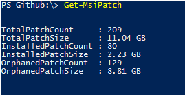
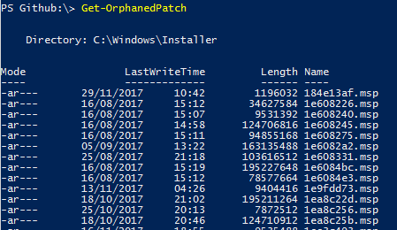
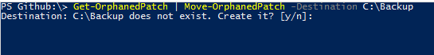
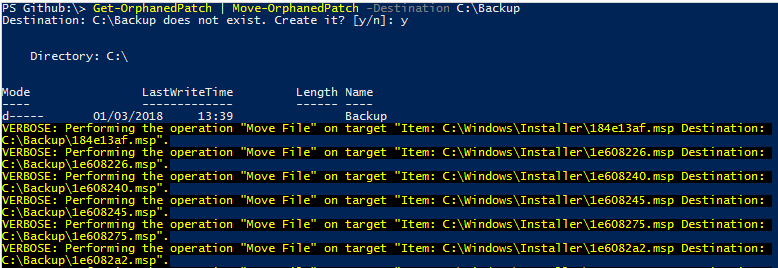
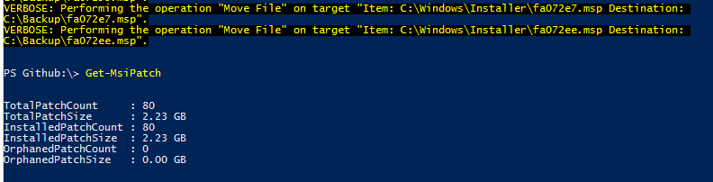
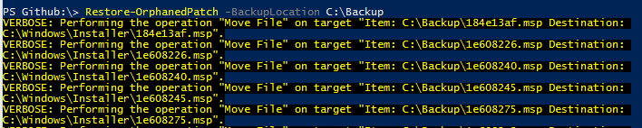
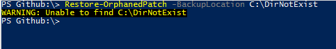

I created a PowerShell module a few years back to safely purge the `C:\Windows\Installer` directory of any orphaned MSI patches. This directory can often grow very large in size due to applications such as Microsoft Office (MSI not Click-to-Run) being regularly patched. Superseded patches get left behind leaving them in an orphaned state. The MSIPatches module can detect and move the orphaned patches freeing up valuable disk space.

This module requires the [MSI](https://github.com/heaths/psmsi) module by [Heath Stewart](https://github.com/heaths), which will be automatically installed when MSIPatches module is installed.

I'm please to see the module has been downloaded over 6,000 times from the PowerShell Gallery. You can find the module at the project site [GitHub](https://github.com/markkerry/MSIPatches) repo and in the [PowerShell Gallery](https://www.powershellgallery.com/packages/MSIPatches/1.0.20).

## MSIPatches Functions

The following cmdlets/advanced functions are available in the MSIPatches module.

### Get-MsiPatch.ps1

* Lists all msp files in `$env:SystemRoot\Installer\`
* Calculates their total size
* Gets installed patches and size
* Gets orphaned patches and size

### Get-OrphanedPatch.ps1

* Lists all orphaned patches in `$env:SystemRoot\Installer\`
* Outputs the objects as `[System.IO.FileInfo]` which can be piped to the next functions.

### Move-OrphanedPatch.ps1

* Moves all orphaned patches in `$env:SystemRoot\Installer\` to a specified location.

### Restore-OrphanedPatch.ps1

* Restores all previously backed up orphaned patches to `$env:SystemRoot\Installer\`

## Installation

You can install the module from the PowerShell gallery

``` powershell
Install-Module MSIPatches

# List the commands in the MSIPatches module
Get-Command -Module MSIPatches

CommandType     Name                        Version    Source
-----------     ----                        -------    ------
Function        Get-MsiPatch                1.0.21     MSIPatches
Function        Get-OrphanedPatch           1.0.21     MSIPatches
Function        Move-OrphanedPatch          1.0.21     MSIPatches
Function        Restore-OrphanedPatch       1.0.21     MSIPatches

# Get-Help
Get-Help about_MSIPatches
Get-Help Get-MsiPatches
```

## How to Use MSIPatches

Since we are modifying the contents of the `$env:SystemRoot\Installer\` directory, we will have to run an elevated PowerShell session.

Get a count of all MSI patches with `Get-MsiPatch`. Notice in the example below, there 129 orphaned patches discovered, totalling 8.81 GB in size.



The `Get-OrphanedPatch` command returns `[System.IO.FileInfo]` objects, listing every orphaned patch discovered.



Pass the `[System.IO.FileInfo]` objects through the pipeline to `Move-OrphanedPatch`. The following examples shows `C:\Backup` as the location. This obviously isn't a good idea since we are trying to free up space on the C:\ drive.

``` powershell
Get-OrphanedPatch | Move-OrphanedPatch -Destination C:\Backup
```



Press `y` to create the directory if it doesn't exist.



After you move the orphaned patches, you can run the `Get-MsiPatch` command again to see the results. There are now zero orphaned patches and the installed ones are still intact.



You can restore previously backed up msp files using the `Restore-OrphanedPatch` command.

``` powershell
Restore-OrphanedPatch -BackupLocation <String>
```



If the directory doesn't exist/inaccessible or doesn't contain any msp files, the following will display

  


> Note: you can pass the [System.IO.FileInfo] objects through the pipeline to `Remove-Item` to permanently delete the msp files. Recommend you pipe to `Move-OrphanedPatch` instead.

``` powershell
Get-OrphanedPatch | Remove-Item -Force
```
