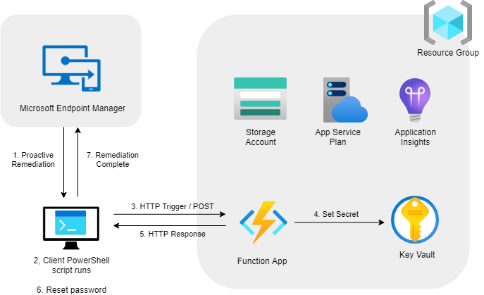
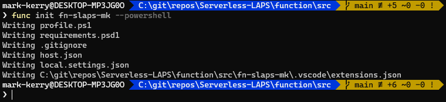
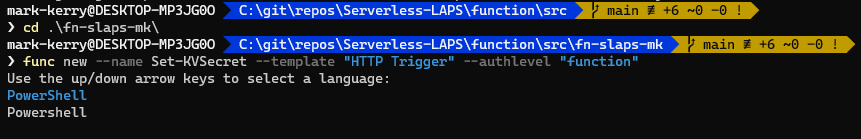

Based on the great solution created by [John Seerden](https://www.srdn.io/2018/09/serverless-laps-powered-by-microsoft-intune-azure-functions-and-azure-key-vault/) with a little help creating and deploying Azure Functions by the [Serverless on Azure](https://www.youtube.com/channel/UCmoWqg6T-c8zEGm4sZdnwbA) YouTube channel.

All of the code in this post can be found in my [GitHub repo](https://github.com/markkerry/Serverless-LAPS)

I am only posting a few differences here, such as creating the Azure resources using AZ CLI and creating/testing/deploying the function using the Azure Functions Core Tools CLI.

<br>

## What is Serverless LAPS

Local Admin Password Solution (LAPS) is a great solution from Microsoft to allow IT admins to automatically recycle local admin accounts on domain joined Windows machines. But it requires an agent, GPO and a connection to AD either on-premises or via a VPN. This doesn't cover remote, AAD joined devices managed by Intune.

Serverless LAPS is an Azure Function (PowerShell) which will generate a unique password, add it to Azure Key Vault, and then set the password on the local machine.

For more info, check out [John Seerden's blog post.](https://www.srdn.io/2018/09/serverless-laps-powered-by-microsoft-intune-azure-functions-and-azure-key-vault/) 

<br>

## What are Proactive Remediations

Proactive Remediations is a part of Endpoint Analytics, which is a part of Microsoft Productivity Score. Accessible via the MEM portal, Proactive Remediations can be seen as a similar solution to ConfigMgr's Configuration Items/Baselines. They are a set of custom PowerShell scripts to detect if the machine meets the desired state and if non-compliant, run the remediation script. Once the remediation script completes, the detection script runs again to confirm if the machine is now compliant with the desired state.

This feels like the perfect solution to automatically run Serverless LAPS on internet managed devices. The detection will check the age of the password of the specified local admin account and run the remediation if the account doesn't exist or if the password age is greater than 180 days.

<br>

## Solution Overview

The following diagram illustrates the high-level overview of the Azure resources and the process flow.



1. The machine will start by running the MEM Proactive Remediation. If the Detection script determines the local admin password on the device is older than 180 days, it will return non-compliant and the Remediation script will run.
2. The remediation script is invoked on the client.
3. The machine will send an HTTP POST method containing it's hostname to the Azure Function (all over HTTPS)
4. The Azure Function generates a unique, secure password and sends it along with the hostname to an Azure Key Vault, which it has access to via it's Managed Identity. The Access Policy for the Key Vault has the Managed Identity defined with __Set__ permission for __Secrets__.
5. The function sends an HTTP Response (over HTTPS) back to the device containing the new password.
6. The password is then reset and the Intune Management Extension log is overwritten to hide the Function URI.
7. The Proactive Remediation is then marked as compliant after the Detection script is run again and determined that the password has been reset 0 days ago.

<br>

## Prerequisites

To complete the steps in this post you will need the following:

* [Azure Functions Core Tools](https://github.com/Azure/azure-functions-core-tools)
* [Azure CLI](https://docs.microsoft.com/en-gb/cli/azure/install-azure-cli)
* [.Net Core SDK](https://docs.microsoft.com/en-us/dotnet/core/install/)
* An Azure subscription

### Windows Installation - Chocolatey

```terminal
choco install azure-functions-core-tools-3 -y
choco install azure-cli -y
choco install dotnetcore-sdk -y
```

### macOS Installation - Homebrew

```terminal
brew update
brew tap azure/functions
brew install azure-functions-core-tools@3
brew install azure-cli
brew install --cask dotnet-sdk
```

<br>

## Create the SLAPS Azure Function Locally Using Azure Function Core Tools

Start by creating the folder structure on your machine

```terminal
cd C:\git\repos
mkdir Serverless-LAPS
cd Serverless-LAPS
mkdir function
cd function
mkdir src
mkdir tst
cd src
```

Next we can create (initialise) a new project. Ensure the function name is unique (do not use "mk").

```terminal
func init fn-slaps-mk --powershell
```



Now change directory into the new project.
> __NOTE__: Ensure you change "mk" to your initials or whatever you want. The function name should be unique as will be included in the URI to trigger it.

```terminal
cd fn-slaps-mk
```

And create a new function called __Set-KVSecret__ with an HTTP Trigger and authorisation level of "function".

```terminal
func new --name Set-KVSecret --template "HTTP Trigger" --authlevel "function"
```

Then select PowerShell as the language. This appears twice, just highlight the first one and hit return.



The `src` directory will then look as follows

```terminal
├───src
│   └───fn-slaps-mk
│       ├───.vscode
│       └───Set-KVSecret
└───tst
```

## Test the Local Function

Now, I want to test the local function. Using modified code of what the final function will look like, open `src\fn-slaps-mk\Set-KVSecret\run.ps1` file, delete the existing code and paste the code found below.
> __Note:__ Here we are just generating a random password and returning the password in the response. There is no Key Vault interaction here.

```powershell
using namespace System.Net

param(
    [Parameter(Mandatory = $true)]
    $Request
)

# Write to the Azure Functions log stream.
Write-Host "PowerShell HTTP trigger function processed a request."

# Function to generate a random password
function New-Password {
    $alphabets = 'a,b,c,d,e,f,g,h,i,j,k,m,n,p,q,r,t,u,v,w,x,y,z'
    $numbers = 2..9
    $specialCharacters = '@,#,$,%,&,*,?,+'
    $array = @()
    $array += $alphabets.Split(',') | Get-Random -Count 8
    $array[0] = $array[0].ToUpper()
    $array[-1] = $array[-1].ToUpper()
    $array += $numbers | Get-Random -Count 5
    $array += $specialCharacters.Split(',') | Get-Random -Count 2
    ($array | Get-Random -Count $array.Count) -join ""
}

# Generate a random password
$password = New-Password

# Return the password in the response
Push-OutputBinding -Name Response -Value ([HttpResponseContext]@{
    Body = $password
})
```

Save and close `run.ps1` then in your terminal start the function

```terminal
func start
```

Notice the function is available via `http://localhost:7071/api/Set-KVSecret`

Then invoke the function with the following code

```powershell
$userName = "Administrator"

# Azure Function Request Body
$body = @"
{
    "keyName": "$env:COMPUTERNAME",
    "contentType": "Local Administrator Credentials",
    "tags": {
        "Username": "$userName"
    }
}
"@

# URI of the local function
$uri = "http://localhost:7071/api/Set-KVSecret"

# Trigger Azure Function.
try {
    Invoke-RestMethod -Uri $uri -Method POST -Body $body -ContentType 'application/json' -ErrorAction Stop
}
catch {
    Write-Host "$(Get-Date -format g): Failed to submit Local Administrator configuration. StatusCode: $($_.Exception.Response.StatusCode.value__). StatusDescription: $($_.Exception.Response.StatusDescription)"
}
```

Every time you run the code above the local function will return a different, unique password. For example:

```terminal
q6dMc&g2j4kX?39
h9w3JC*k4pi76u@
58&6tn74uYeaJ$p
2mdx#fN63t4a@H7
```

### Update the Function Code

OK now that that works, let's update the `src\fn-slaps-mk\Set-KVSecret\run.ps1` code with the code which will run in the Azure Function once it is deployed.
> __Note:__ Later you will have to enter the Key Vault name in `$keyVaultName` variable

```powershell
using namespace System.Net

param(
    [Parameter(Mandatory = $true)]
    $Request
)

# Write to the Azure Functions log stream.
Write-Host "PowerShell HTTP trigger function processed a request."

# Function to generate a random password
function New-Password {
    $alphabets = 'a,b,c,d,e,f,g,h,i,j,k,m,n,p,q,r,t,u,v,w,x,y,z'
    $numbers = 2..9
    $specialCharacters = '@,#,$,%,&,*,?,+'
    $array = @()
    $array += $alphabets.Split(',') | Get-Random -Count 8
    $array[0] = $array[0].ToUpper()
    $array[-1] = $array[-1].ToUpper()
    $array += $numbers | Get-Random -Count 5
    $array += $specialCharacters.Split(',') | Get-Random -Count 2
    ($array | Get-Random -Count $array.Count) -join ""
}

# Enter the name of your Key Vault below
$keyVaultName = ""

# Azure Key Vault resource to obtain access token
$vaultTokenUri = 'https://vault.azure.net'
$apiVersion = '2017-09-01'

# Get Azure Key Vault Access Token using the Function's Managed Service Identity
try {
    $authToken = Invoke-RestMethod -Method Get -Headers @{ 'Secret' = $env:MSI_SECRET } -Uri "$($env:MSI_ENDPOINT)?resource=$vaultTokenUri&api-version=$apiVersion"
}
catch {
    Write-Host "ERROR, could not HTTP GET Azure Key Vault Access Token using the Function's Managed Service Identity $_"
}
# Use Azure Key Vault Access Token to create Authentication Header
$authHeader = @{ Authorization = "Bearer $($authToken.access_token)" }

# Generate a random password
$password = New-Password

# Generate a new body to set a secret in the Azure Key Vault
$body = $request.body | Select-Object -Property * -ExcludeProperty keyName

# Append the random password to the new body
$body | Add-Member -NotePropertyName value -NotePropertyValue "$password"

# Convert the body to JSON
$body = $body | ConvertTo-Json

# Azure Key Vault Uri to set a secret
$vaultSecretUri = "https://$keyVaultName.vault.azure.net/secrets/$($request.Body.keyName)/?api-version=2016-10-01"

# Set the secret in Azure Key Vault
try {
    $null = Invoke-RestMethod -Method PUT -Body $body -Uri $vaultSecretUri -ContentType 'application/json' -Headers $authHeader -ErrorAction Stop
    $pwdValue = $password 
}
catch {
    Write-Host "ERROR, could not HTTP PUT to the Azure KeyVault $_"
    $pwdValue = $null
}

# Return the password in the response
Push-OutputBinding -Name Response -Value ([HttpResponseContext]@{
    Body = $pwdValue
})
```

<br>

## Create the Azure Resources Using Azure CLI

The following can be completed using AZ CLI installed locally on your machine or Azure Cloud Shell. If using your local install of AZ CLI, first log into your Azure account

```bash
az login
```

Change the variables below to suit your resource group name, location, storage account name, function name and Key Vault name.

```bash
rgName="rg-serverless-laps"
location="westeurope"
saName="saslaps4857392"
funcName="fn-slaps-mk"
kvName="kv-slaps-mk"

# create the resource group
az group create --name $rgName --location $location

# check storage account name is available first
az storage account check-name --name $saName

# create the storage account
az storage account create --name $saName \
    --resource-group $rgName \
    --location $location \
    --sku Standard_LRS \
    --kind Storagev2 \
    --access-tier Hot

# create the function app
az functionapp create --name $funcName \
    --resource-group $rgName \
    --consumption-plan-location $location \
    --storage-account $saName \
    --assign-identity [system] \
    --runtime powershell \
    --os-type Windows \
    --functions-version 3

# list the function app
az functionapp list --out table

# create Key Vault
az keyvault create --name $kvName \
    --resource-group $rgName \
    --location $location

# get the function app managed identity
spID=$(az resource list -n $funcName --query [*].identity.principalId --out tsv)

# assign managed identity to the key vault access policy
az keyvault set-policy --name $kvName \
    --secret-permissions create \
    --spn $spID
```

<br>

## Update and Deploy the Local Function to Azure

Hopefully you have already updated the code in `run.ps1` with the code that will run within the Azure Function once it is deployed? If not see [above.](https://markkerry.github.io/posts/serverless-laps-azure-function/#update-the-function-code)

Now it's time to deploy the local function the Azure Function resource we have just created. From the `src\fn-slaps-mk` directory:

```bash
$funcName="fn-slaps-mk"

func azure functionapp publish $funcName
```

<br>

## Test the Azure Function

And that's it, the function should now be deployed and running in Azure. To test the function, use the `Reset-LocalAdminPasswordRemediate.ps1` file in my [GitHub Repo](https://github.com/markkerry/Serverless-LAPS/blob/main/proactive-remediation/Reset-LocalAdminPasswordRemediate.ps1).

Just ensure you change the `$userName`and `$uri` variables to the local admin account and function URI, respectively.

<br>

## MEM Proactive Remediation

Getting started with Proactive Remediations can be found in the following [Microsoft documentation](https://docs.microsoft.com/en-us/mem/analytics/proactive-remediations).

The detection and remediation scripts can be found in my GitHub repo. But let's start by breaking down the two scripts.

<br>

### Detection

The detection script quite simply checks the following:

* Does the specified local admin exist? If not return non-compliant so the remediation script creates it and sets the password.
* If the local admin does exist, check when the password was last set. If less than 180 days, return compliant and exit. If greater than 180 days return non-compliant and run remediation to reset the password.

```powershell
# Enter the name of the local admin account below
$userName = ""
$user = Get-LocalUser -Name $userName -ErrorAction SilentlyContinue
$date = (Get-Date).AddDays(-180)

# Validate compliance
if ($null -ne $user) {
    # account was found
    if ($user.PasswordLastSet -gt $date) {
        # Password was set less than 180 days ago
        Write-Output "Compliant. Password last set $($user.PasswordLastSet)"
        exit 0
    }
    else {
        # Password was set more than 180 days ago
        Write-Output "Non-compliant. Password last set $($user.PasswordLastSet)"
        exit 1
    }
}
else {
    # account was not found
    Write-Output "Non-compliant. Account not found"
    exit 1
}
```

<br>

### Remediation

The Remediation script is around 150 lines which is a little too much to add to the this post, which I am already aware has too much code in it already. As stated above you can find the the Remediation code in the `Reset-LocalAdminPasswordRemediate.ps1` file in my [GitHub Repo](https://github.com/markkerry/Serverless-LAPS/blob/main/proactive-remediation/Reset-LocalAdminPasswordRemediate.ps1). Just ensure you change the `$userName`and `$uri` variables to the local admin account and function URI, respectively.
