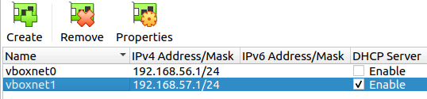
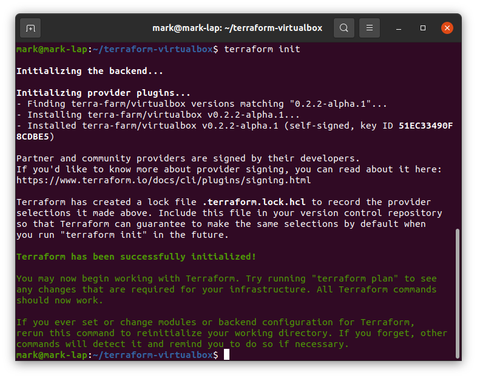
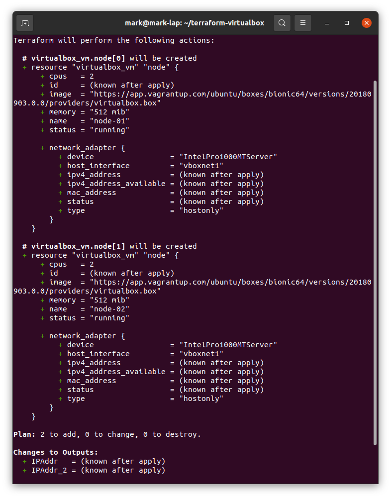
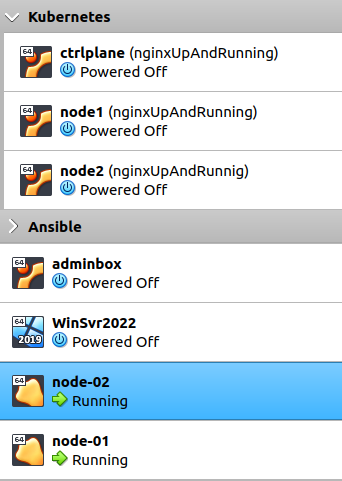
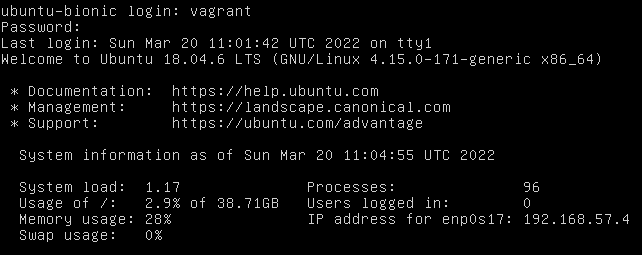
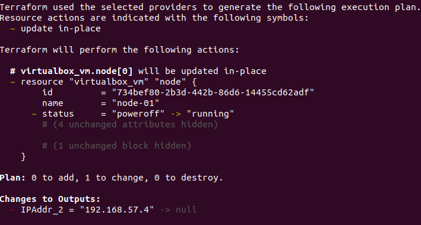
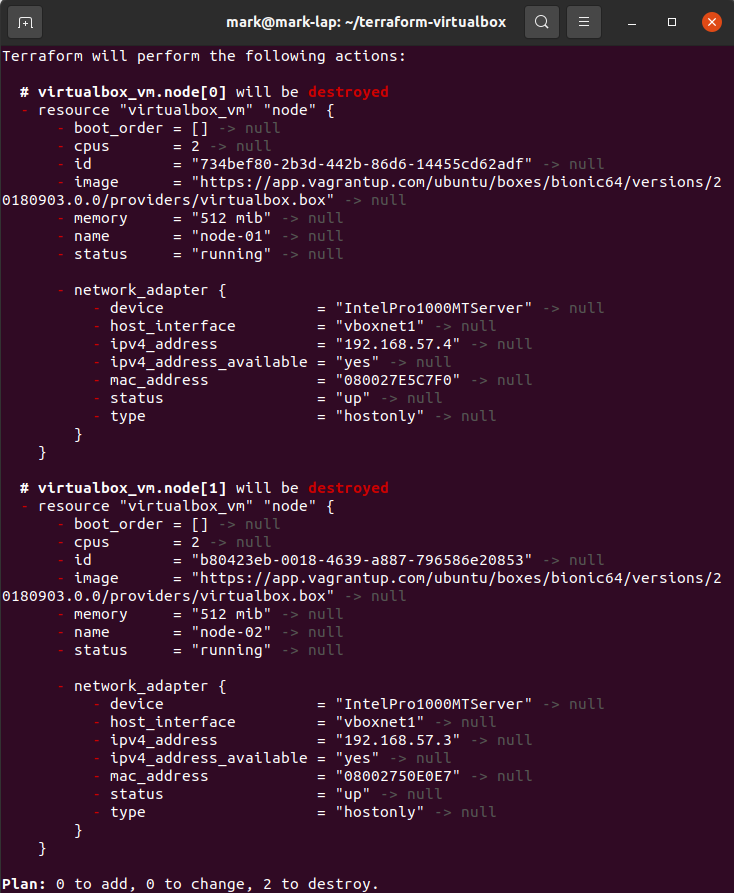
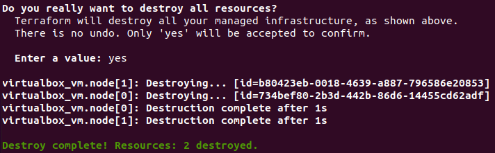

In this post I will demonstrate how to deploy 2x Ubuntu Virtual Machines using the Terraform VirtualBox provider, [terra-farm](https://registry.terraform.io/providers/terra-farm/virtualbox/latest/docs)

You can install VirtualBox on Ubuntu using [this guide](https://markkerry.github.io/posts/2022/02/ubuntu-server-lab/#install-virtualbox-61). The `main.tf` file is configured to use a network adapter called **vnetbox1**, so you need to ensure it is created and set **DHCP Server** to **Enable**.



## Install Terraform

Let's start by installing Terraform. The following is from the official Terraform documentation:

Add the Terraform gpg key.

```terminal
curl -fsSL https://apt.releases.hashicorp.com/gpg | sudo apt-key add -
```

Add the Terraform apt repo

```terminal
sudo apt-add-repository "deb [arch=$(dpkg --print-architecture)] https://apt.releases.hashicorp.com $(lsb_release -cs) main"
```

Update the apt package index

```terminal
sudo apt update
```

Install Terraform

```treminal
sudo apt install terraform
```

Verify Terraform is installed with

```terminal
terraform --version
```

## Install Go

We need to install GO in order to install the terra-farm plugin in the next section. Install Go as follows:

Download Go

```terminal
curl -fsSL https://go.dev/dl/go1.18.linux-amd64.tar.gz -o ~/Downloads/go1.18.linux-amd64.tar.gz
```

Remove any old installations

```terminal
rm -rf /usr/local/go && tar -C /usr/local -xzf go1.18.linux-amd64.tar.gz
```

Set the path environment variable

```terminal
export PATH=$PATH:/usr/local/go/bin
```

Verify Go is installed with

```terminal
go version
```

## Install terra-farm Provider

Now we are ready to install the terra-farm/terraform-provider-virtualbox provider/plugin. Create the following directory which `terraform init` will search for plugins

```teminal
mkdir ~/.terraform.d/plugins
```

Then install the VirtualBox provider/plugin.

```terminal
go install github.com/terra-farm/terraform-provider-virtualbox@latest
```

Then copy it to the plugins directory

```terminal
cp go/bin/terraform-provider-virtualbox  ~/.terraform.d/plugins
```

## Create the main.tf File

Now it's time to create the `main.tf` file. Start by creating a directory for it.

```terminal
mkdir ~/terraform-virtualbox && cd ~/terraform-virtualbox
```

Create the file using `vim`

```terminal
vim main.tf
```

The `main.tf` will need to look as below. This will provision two virtual machines called **node-01** and **node-02**. Both will have 2 vCpus and 512 MB memory. And the outputs are the IP addresses of the VMs.

```terraform
terraform {
  required_providers {
    virtualbox = {
      source = "terra-farm/virtualbox"
      version = "0.2.2-alpha.1"
    }
  }
}

resource "virtualbox_vm" "node" {
  count     = 2
  name      = format("node-%02d", count.index + 1)
  image     = "https://app.vagrantup.com/ubuntu/boxes/bionic64/versions/20180903.0.0/providers/virtualbox.box"
  cpus      = 2
  memory    = "512 mib"

  network_adapter {
    type           = "hostonly"
    host_interface = "vboxnet1"
  }
}

output "IPAddr" {
  value = element(virtualbox_vm.node.*.network_adapter.0.ipv4_address, 1)
}

output "IPAddr_2" {
  value = element(virtualbox_vm.node.*.network_adapter.0.ipv4_address, 2)
}
```

> *Note: The documentation uses `version = "0.2.1"` but this didn't work for me. I had to use `version = "0.2.2-aplha.1"`*

## Provision the Virtual Machines

When writing a new Terraform configuration, we have to initialise the working directory which contains the configuration files.

```terminal
terraform init
```



Next create a plan of execution by creating a "state" file. The following command will allow you to preview the changes which will be made to your infrastructure.

```terminal
terraform plan
```

As you can see below the resources do not currently exist, so `terraform plan` has determined they will be created.



Create them using the following command:

```terminal
terraform apply
```

Type `yes` to continue. Below states that two resources were added and their IP addresses where returned in the **Outputs**.

```terminal
Do you want to perform these actions?
  Terraform will perform the actions described above.
  Only 'yes' will be accepted to approve.

  Enter a value: yes

virtualbox_vm.node[1]: Creating...
virtualbox_vm.node[0]: Creating...

---
---
---

virtualbox_vm.node[1]: Creation complete after 2m23s [id=b80423eb-0018-4639-a887-796586e20853]
virtualbox_vm.node[0]: Creation complete after 2m28s [id=734bef80-2b3d-442b-86d6-14455cd62adf]

Apply complete! Resources: 2 added, 0 changed, 0 destroyed.

Outputs:

IPAddr = "192.168.57.3"
IPAddr_2 = "192.168.57.4"
```

In VirtualBox you we can see **node-01** and **node-02** virtual machines.



Since these machine where provisioned using Vagrant images we can logon to them using the default username and password.

```terminal
user: vagrant
password: vagrant
```



If I power off a node-01 using the `shutdown now` command, I can run `terraform plan` again which will show a change is required as the VM being off does not match the desired state. As you can see below the status should be "running".



I can use `terraform apply` again to power the VM back on again.

## Delete the Virtual Machines

We can delete all objects managed by this configuration using the `terraform destroy` command. Start by viewing what will be deleted:

```terminal
terraform plan -destroy
```



Then run the destroy command, typing `yes` to confirm.

```terminal
terraform destroy
```


