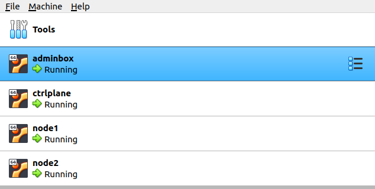
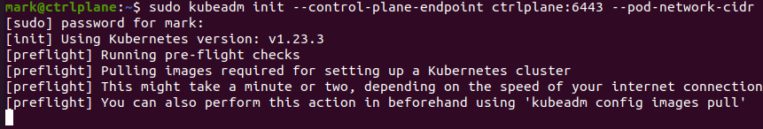
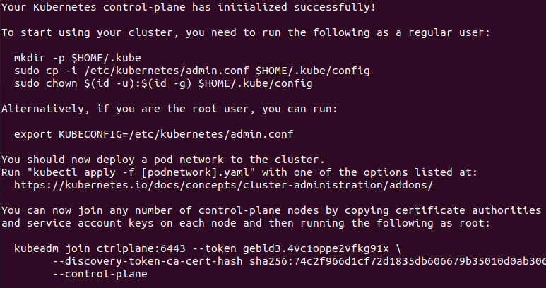
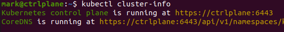
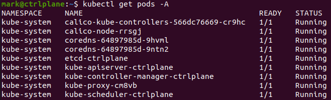
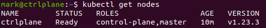
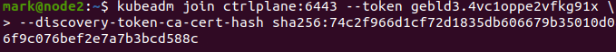
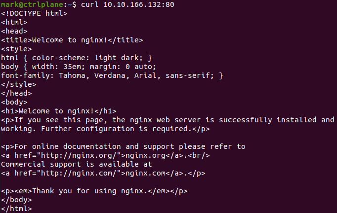
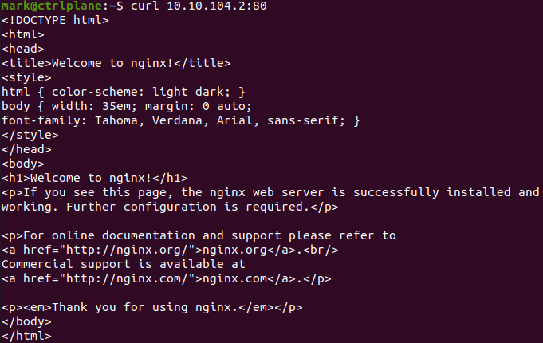

In a [previous post](https://markkerry.github.io/posts/2022/02/ubuntu-server-lab/), I created the adminbox Ubuntu VM on VirtualBox.

| server   | ip addr  | comment                                                      |
| ---------| -------- | ------------------------------------------------------------ |
| adminbox | 10.0.2.5 | Jump box from host with SSH access to all on the Nat network |

In this post will be using the same setup to build a Kubernetes cluster. I have created a further 3 VMs also connected to the KubeNatNetwork. Note: these only have one network adapter.

* network address: 10.0.2.0/24
* default gateway: 10.0.2.2

| server    | ip addr   | ram | vcpu | comment                         |
| --------- | --------- | --- | ---- | ------------------------------- |
| ctrlplane | 10.0.2.10 | 2GB | 2    | Kubernetes Control Plane server |
| node1     | 10.0.2.11 | 2GB | 2    | Kubernetes worker node 1        |
| node2     | 10.0.2.12 | 2GB | 2    | Kubernetes worker node 2        |



Each server also has an entry for each VM in the cluster, in their `/etc/hosts` file.

## Install Docker

(All hosts) The following commands to install the Docker engine

```bash
# remove old versions
sudo apt remove docker docker-engine docker.io containerd runc

# update the apt package index
sudo apt update

# install prereqs to allow apt ot install packages over https
sudo apt-get install \
    ca-certificates \
    curl \
    gnupg \
    lsb-release -y

# add Docker’s official GPG key
curl -fsSL https://download.docker.com/linux/ubuntu/gpg | sudo gpg --dearmor -o /usr/share/keyrings/docker-archive-keyring.gpg

# set up the stable repository
echo \
  "deb [arch=$(dpkg --print-architecture) signed-by=/usr/share/keyrings/docker-archive-keyring.gpg] https://download.docker.com/linux/ubuntu \
  $(lsb_release -cs) stable" | sudo tee /etc/apt/sources.list.d/docker.list > /dev/null

# install Docker engine
sudo apt-get update
sudo apt-get install docker-ce docker-ce-cli containerd.io -y

# add user to Docker group
sudo usermod -a -G docker $USER

# set Docker to start automatically
sudo systemctl enable docker.service
sudo systemctl enable containerd.service
```

(All hosts) Set the docker daemon cgroup driver to use systemd.

```bash
sudo vim /etc/docker/daemon.json
```

Add the following

```json
{
    "exec-opts": ["native.cgroupdriver=systemd"]
}
```

Restart Docker

```bash
sudo systemctl restart docker
```

That completes the docker install. You can run the same commands above using a script as below:

```bash
curl https://raw.githubusercontent.com/markkerry/ubuntu-config/main/01-k8s-installDocker.sh > installDocker.sh

sudo chmod +x ./installDocker.sh && ./installDocker.sh
```

Verify the install is complete by running

```bash
docker --version
```

Restart the server

```bash
sudo systemctl reboot
```

And ensure Docker is running by typing

```bash
docker image ls
```

## Install Kubernetes

(All hosts) Add the K8S key and repo

```bash
sudo curl -fsSLo /usr/share/keyrings/kubernetes-archive-keyring.gpg https://packages.cloud.google.com/apt/doc/apt-key.gpg

echo "deb [signed-by=/usr/share/keyrings/kubernetes-archive-keyring.gpg] https://apt.kubernetes.io/ kubernetes-xenial main" | sudo tee /etc/apt/sources.list.d/kubernetes.list
```

(All hosts) Update the package repository and install the K8s components:

```bash
sudo apt update
sudo apt install -y kubelet kubeadm kubectl
sudo apt-mark hold kubelet kubeadm kubectl
```

(All hosts) Disable the swap file

```bash
sudo swapoff -a
```

Edit `/etc/fstab` to remove the swap entry by commenting it out

```bash
sudo vim /etc/fstab

# /swap.img   none  swap  sw  0   0
```

Then restart the servers.

(Control plane only) Initiate the cluster on the control plane

```bash
sudo kubeadm init --control-plane-endpoint ctrlplane:6443 --pod-network-cidr 10.10.0.0/16
```



Ensure you copy the `kubeadm join` command from the output as will be needed to join the nodes.



Can get the name of the host the cluster is running on by typing

```bash
kubectl cluster-info
```



(Control plane only) Set the `kubectl` context auth to connect to the cluster

```bash
mkdir -p $HOME/.kube
sudo cp -i /etc/kubernetes/admin.conf $HOME/.kube/config
sudo chown $(id -u):$(id -g) $HOME/.kube/config
```

(Control plane only) Download the yaml files for the Calico pod network addon and the sample nginx deployment

```bash
curl https://raw.githubusercontent.com/markkerry/ubuntu-config/main/calico.yaml -O
curl https://raw.githubusercontent.com/markkerry/ubuntu-config/main/sample-deployment.yaml
vim calico.yaml
```

Uncomment the `CALICO_IPV4POOL_CIDR` variable in the manifest (calico.yaml) and set it to the same value as your chosen pod CIDR

```yaml
- name: CALICO_IPV4POOL_CIDR
  value: "10.10.0.0/16"
```

(Control plane only) Apply the deployment:

```bash
kubectl apply -f calico.yaml

# Ensure you copy the sudo kubeadm join --token command to be used later
```

Can put a watch on it and wait for it to complete

```bash
watch -n2 'kubectl get pods -A'
```



Once complete, check the ctrlplane node is the only node and state is ready

```bash
kubectl get nodes
```



(Worker Nodes only) Join Nodes from the command copied earlier.

> _Note: Change the $TOKEN_ID and $HASH to the appropriate values_

```bash
sudo kubeadm join --token $TOKEN_ID ctrlplane:6443 --discovery-token-ca-cert-hash sha256:$HASH
```



(Control plane only) Once complete, check the ctrlplane has the nodes added

```bash
kubectl get nodes
```


Use the sample deployment file downloaded earlier

```bash
cat sample-deployment.yaml
```

(Control plane only) Sample Deployment file with 2 replicas running nginx:

```yml
apiVersion: apps/v1
kind: Deployment
metadata:
  name: nginx-deployment
  labels:
    app: nginx
spec:
  replicas: 2
  selector:
    matchLabels:
      app: nginx
  template:
    metadata:
      labels:
        app: nginx
    spec:
      containers:
      - name: nginx
        image: nginx
        ports:
        - containerPort: 80
```

(Control plane only) Apply the deployment:

```bash
kubectl apply -f sample-deployment.yaml

kubectl get deployments

kubectl get pods -o wide
```

```termial
NAME                                READY   STATUS    RESTARTS   AGE     IP              NODE    NOMINATED NODE   READINESS GATES
nginx-deployment-74d589986c-9mhft   1/1     Running   0          62s     10.10.166.132   node1   <none>           <none>
nginx-deployment-74d589986c-gp54z   1/1     Running   0          9m35s   10.10.104.2     node2   <none>           <none>
```

(Control plane only) If you want to run workloads on Control Plane it has to be untainted. Also we can up the replica count from 2 to 4

```bash
kubectl taint nodes --all node-role.kubernetes.io/master-

# Change the replicas from 2 to 4
kubectl apply -f sample-deployment.yaml

kubctl get deployments

kubctl get pods -o wide
```

This now show 4 replicas across the 3 vms. The ctrlplane server is now running one, node2 is running one, and node1 has two.

```terminal
NAME                                READY   STATUS    RESTARTS   AGE     IP              NODE        NOMINATED NODE   READINESS GATES
nginx-deployment-74d589986c-9mhft   1/1     Running   0          4m27s   10.10.166.132   node1       <none>           <none>
nginx-deployment-74d589986c-gp54z   1/1     Running   0          13m     10.10.104.2     node2       <none>           <none>
nginx-deployment-74d589986c-lwm2s   1/1     Running   0          21s     10.10.232.4     ctrlplane   <none>           <none>
nginx-deployment-74d589986c-ndspp   1/1     Running   0          21s     10.10.166.130   node1       <none>           <none>
```

Now we can test if nginx is running on node1 by typing:

```terminal
curl 10.10.166.132:80
```



And node2:



## Generate Token For Future Nodes

(Control plane only) If you plan to add new nodes to the cluster at a later date and have lost the original token, can create a new one. Before we can use the manifest we need to be authenticated to the cluster. Generate a token to add worker Node

```bash
#Create a new Token
kubeadm token create --print-join-command
#List Tokens created
kubeadm token list
```
